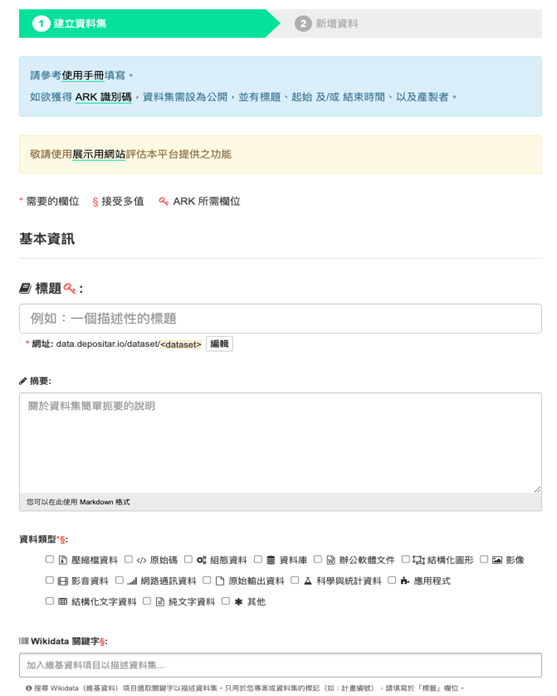

# 生態檢核資料交換參考模板

臺灣生物多樣性資訊聯盟秘書處 - tbianoti@gmail.com - version {{ git.short_commit }}, {{ git.date.strftime('%Y-%m-%d %H:%M:%S%z') }} 

## **版權說明 Colophon**
### 建議引用方式 Suggested Citation
王浥璋、劉璟儀。2025。生態檢核資料交換參考模板。第2.0版。臺灣生物多樣性資訊聯盟秘書處：臺北。

### 作者 Authors
王浥璋、劉璟儀

### 貢獻者 Contributors
TBIA聯盟夥伴單位、內政部國家公園署太魯閣國家公園管理處、經濟部水利署、經濟部水利署保育事業組、林業保育署、林業保育署集水區治理組、林業保育署嘉義分署、農田水利署、農業部農村發展及水土保持署、國立臺灣大學森林環境暨資源學系、弘益生態有限公司、洄瀾風生態有限公司、財團法人台灣水資源與農業研究院、啟宇工程顧問有限公司、野聲環境生態顧問有限公司、漢林生態顧問有限公司、觀察家生態顧問有限公司

### 授權方式 Licence
本文件《生態檢核資料交換參考模板》採用 [創用CC 姓名標示-相同方式分享 4.0 國際 (CC BY-SA 4.0)](https://creativecommons.org/licenses/by-sa/4.0/deed.zh_TW)。

### 永久統一資源標籤 Persistent URI
[https://pid.tbiadata.tw/ark:/35232/c1rww1i9](https://pid.tbiadata.tw/ark:/35232/c1rww1i9)

### 文件版本控制 Document Control
第2.0版，2025年11月。
第1.0版，2024年10月。

最初基於行政院公共工程委員會《[公共工程生態檢核資訊公開作業指引](https://www.pcc.gov.tw/content/index?eid=9010&type=C&lang=1)》。

---
## **文件修訂對照說明**
| 日期      | 版次   | 編輯者 | 變動內容                                                                                                          |
|---------|------|-----|---------------------------------------------------------------------------------------------------------------|
| 2024/10 | v1.0 | 王浥璋 | 本版次訂定 3 項資料標準如下列： 生物多樣性–生態檢核–工程基本資料 生物多樣性–生態檢核–生物出現紀錄 生物多樣性–生態檢核–生物名錄 |
| 2025/11 | v2.0 | TBIA聯盟 | 本版次配合生物多樣性領域資料標準進行修訂 |
|         |      |     | \-\-以下空白                                                                                                        |

---
## **壹、目的**
為促進我國生態檢核資料格式一致性，以有效整合散見於各政府機關、學研機構及民間團隊之資料紀錄，提升後續資料應用價值，爰訂定本生態檢核資料交換參考模板（以下稱本資料標準）。
本資料標準依據「公共工程生態檢核資訊公開作業指引」之相關規範，工程主辦機關應將各階段生態檢核資訊即時公開，其中明確建議有關生物分布資料公開於資料庫網站的做法，可參考臺灣生物多樣性資訊聯盟(Taiwan Biodiversity Information Alliance, 下稱TBIA) 夥伴單位管理之資料庫。
因此，為提升生態檢核資料的應用價值，並有效整合可供生態檢核評估參考之生物分布資料，本文件於2023年由臺灣生物多樣性資訊機構（Taiwan Biodiversity Information Facility，下稱TaiBIF）團隊進行訪談，從生態檢核執行與委託單位的需求，並依據 [Darwin Core 達爾文核心標準](https://dwc.tdwg.org/) ，歸納出適合生態檢核通用的資料欄位標準，以及資料流通方式的建議。

## **貳、適用範圍**

1. 依「公共工程生態檢核注意事項」第二點辦理之生態檢核作業。
2. 適用此資料交換標準之紀錄資料。

---
## **參、應用場合及使用限制**

本標準主要適用對象為辦理生態檢核紀錄蒐集或建置有資料庫系統做為相關資料之倉儲流通目的之相關政府部門、學術研究機構及民間組織。相關單位應依本標準，進行領域資料之生產、流通、供應與交換。各單位除遵循本標準之外，若依本身需求，擴充設計以適用於特定領域範疇，所衍生之標準文件應註明遵循本標準。本領域資料標準內容係參考引用國內外相關標準而制定，列舉如下：

| 項次 | 法律與行政法規                                                                     |
|----|-----------------------------------------------------------------------------|
| 1  | 公共工程生態檢核注意事項                                                                |
| 2  | 公共工程生態檢核資訊公開作業指引                                                            |
| **項次** | **參考文件**                                                                        |
| 1  | 數位發展部「領域資料標準訂定參考指引」                                                         |
| 2  | 數位發展部「資料集詮釋資料標準規範」                                                          |
| 3  | 公路局生態檢核執行參考手冊                                                               |
| 4  | 港埠工程生態檢核注意事項執行參考作業手冊                                                        |
| 5  | 高公局-生態檢核執行參考手冊                                                              |
| 6  | 中央氣象局生態檢核注意事項執行參考手冊                                                         |
| 7  | 交通部觀光署各國家風景區管理處觀光工程生態檢核作業方案                                                 |
| 8  | 鐵路工程生態檢核執行手冊                                                                |
| 9  | 交通部運輸研究所公共工程生態檢核作業方案                                                        |
| 10 | 中華郵政股份有限公司生態檢核注意事項執行參考手冊                                                    |
| 11 | 經濟部所屬事業-公共工程生態檢核自評表                                                         |
| 12 | 台灣中油股份有限公司生態檢核執行計畫                                                          |
| 13 | 台灣自來水股份有限公司「生態檢核落實執行計畫」                                                     |
| 14 | 台電公司新建計畫生態檢核作業執行計畫                                                          |
| 15 | 經濟部水利署河川、區域排水及海岸工程生態檢核參考手冊                                                  |
| 16 | 文化部及所屬機關(構)落實公共工程生態檢核作業規定                                                   |
| 17 | 教育部公共工程生態檢核落實執行計畫                                                           |
| 18 | 農業部農田水利署生態檢核注意事項                                                            |
| 19 | 農業部農村發展及水土保持署生態檢核標準作業書                                                      |
| 20 | 原住民族委員會公共工程生態檢核落實計畫                                                         |
| 21 | 行政院環境保護署落實公共工程生態檢核計畫                                                        |
| 22 | 農業部林業及自然保育署公共工程生態友善機制手冊修訂版                                                  |
| **項次** | **引用資料標準**                                                                       |
| 1  | 生物多樣性領域資料標準                                                                 |
| 2  | 政府資料標準平臺領域共通標準                                                              |
| 3  | 國際分類資料庫工作小組（TDWG, Taxonomic Database Working Group）達爾文核心集（DwC, Darwin Core） |

---
## **肆、專有名詞說明**

本文件中，涉及相關專有名詞引用，透過以下條列式說明進行陳述：

1. 工程生命週期（Engineering life cycle）：工程全生命週期，包括計畫核定、規劃、設計、施工及維護管理階段。
2. 生態檢核（Procedure of ecological consideration for engineering projects）：係為瞭解新建公共工程涉及之生態議題與影響，評估其可行性及妥適應對之迴避、縮小、減輕、補償方案，並依工程生命週期分為工程計畫核定、規劃、設計、施工及維護管理等作業階段。

---
## **伍、特性分析**

生態檢核整體類別資料屬性結構分析說明如下表所示：

<table>
    <tr>
        <td>第一層</td>
        <td colspan="5">生物多樣性領域資料共同訊息層</td>
    </tr>
    <tr>
        <td>第二層</td>
        <td colspan="5">生態檢核主題</td>
    </tr>
    <tr>
        <td>第三層</td>
        <td>工程基本資料</td>
        <td>生物出現紀錄</td>
        <td>生物名錄</td>
    </tr>
</table>

---

## **陸、應用綱要**

資料屬性依據特性分析以結構類別圖說明應用如下（圖 1）所示：

    
     
    圖 1 生態檢核應用綱要

---

## **柒、資料典**

資料典定義說明如下表所示：

| 名稱     | 定義                                                                                                                                            |
|--------|-----------------------------------------------------------------------------------------------------------------------------------------------|
| 項次 | 資料典之序號。 |
| 欄位中文   | 資料屬性中文名稱。                                                                                                                                     |
| 欄位英文   | 資料屬性英文名稱。                                                                                                                                     |
| 型別     | 本項目說明各屬性之資料型別，須列舉完整之型別名稱，且須於標準文件中「參考文件」一節中列舉引用標準之名稱。                                                                                          |
| 說明     | 所有類別之屬性及關係均須明確定義，引用自其他文件（含法律、規範、標準等）之定義須於「附註」欄位說明引用來源。                                                                                        |
| 值域     | 本項目說明屬性之值域範圍。                                                                                                                                 |
| 必要性    | 單一屬性之選填條件可包括「必要」（Mandatory，M）、「條件」（Conditional，C）及「選擇」（Optional，O）等三種情形：1. 必要屬性：必須提供之屬性資料，不可省略。2. 條件屬性：特定條件成立時必須提供之屬性資料。3. 選擇屬性：可選擇是否提供之屬性資料。 |
| 最多發生次數 | 屬性及關係須規定可發生次數之極大值，可以下列三種方式表示：1. 「1」：最多僅可發生一次。2. 特定數目：最多可發生特定次數。3. 「N」：最多可發生多次，數目不定。                                                           |
| 附註     | 本項目針對屬性或關係提供前述項目無法提供之額外說明，例如屬性之選填條件為「C」時，本欄位須解釋屬性之填寫條件。                                                                                       |

### 一、生物多樣性–生態檢核–工程基本資料

| **項次** | **中文名稱**      | **英文名稱**             | **說明**                                                                                    | **型別** | **值域**                                                   | **必要性** | **最多發生次數** | **附註 **                                                                                                                                                                                                                   |
|--------|---------------|----------------------|-------------------------------------------------------------------------------------------|--------|----------------------------------------------------------|---------|------------|---------------------------------------------------------------------------------------------------------------------------------------------------------------------------------------------------------------------------|
| 1      | 工程編號          | datasetID            | 工程編號唯一識別碼                                                                                 | 字串     |                                                          | M       | 1          | 系統編號                                                                                                                                                                                                                      |
| 2      | 資料集名稱         | datasetName          | 該筆紀錄所屬之資料集名稱。                                                                             | 字串     |                                                          | M       | 1          | 工程名稱。如為單一廠商協助多個工程進行生態檢核作業，請依工程分別提供對應資料。                                                                                                                                                                                   |
| 3      | 主辦機關          | organizer            | 主辦機關名稱                                                                                    | 字串     |                                                          | M       | 1          |                                                                                                                                                                                                                           |
| 4      | 承攬廠商          | contractor           | 承攬廠商單位名稱                                                                                  | 字串     |                                                          | M       | N          | 應包含生態檢核執行廠商、工程廠商等                                                                                                                                                                                                         |
| 5      | 承攬廠商主責項目      | contractorWork       | 承攬廠商負責項目                                                                                  | 字串     |                                                          | M       | N          | 生態檢核、施工廠商                                                                                                                                                                                                                 |
| 6      | 基地地點          | verbatimLocality     | 工程地點名稱，以縣市、鄉鎮市區鄰里等可供地理定位之資料。                                                              | 字串     |                                                          | M       | 1          | 填寫格式，如：地點:\_\_市\(縣\)\_區\(鄉、鎮、市\)里\(村\)\_\_\_鄰                                                                                                                                                                             |
| 7      | 工程影響範圍        | impactArea           | 用以標示範圍，使用唯一地理坐標參考系統WGS1984和十進位度單位，可以點\(Point\)、線\(LineString\)、面\(Polygon\)格式交換。          | 字串     | GeoJSON                                                  | M       | N          | 填寫格式，如：\{"type": "Point", "coordinates": \[121\.56769, 25\.07470\]\}                                                                                                                                                      |
| 8      | 十進位經度         | decimalLongitude     | 校正後十進位制經度坐標，大地基準採用 EPSG:4326 \(WGS84\)。                                                   | 字串     | \[0\-180\]                                               | M       | 1          | 工程代表點X坐標，建議以WGS84十進位制格式進行資料供應。引用自：共通性/ 地 / 地屬性基本資料/空間位置\-經度。                                                                                                                                                              |
| 9      | 十進位緯度         | decimalLatitude      | 校正後十進位制緯度坐標，大地基準採用EPSG:4326 \(WGS84\)。                                                    | 字串     | \[0\-90\]                                                | M       | 1          | 工程代表點Y坐標，建議以WGS84十進位制格式進行資料供應。引用自：共通性/ 地 / 地屬性基本資料/空間位置\-緯度。                                                                                                                                                              |
| 10     | 大地基準          | geodeticDatum        | 十進位經度與十進位緯度採用之大地基準，本領域標準均採用EPSG:4326 \(WGS84\)。若欲提供其他大地基準之坐標請使用「原始經度」、「原始緯度」、「原始大地基準」等欄位。 | 字串     |                                                          | M       | 1          |                                                                                                                                                                                                                           |
| 11     | 工程預算          | engineeringBudget    | 工程預算數值                                                                                    | 數字     | 整數                                                       | M       | 1          |                                                                                                                                                                                                                           |
| 12     | 生態檢核編列預算      | ecologyBudget        | 工程預算單價分析中，屬生態檢核相關工作。                                                                      | 數字     | 整數                                                       | C       | 1          | 當原經費編列存在生態檢核預算時，此欄必填。在計畫核定、設計等不同階段預算投入生態檢核之經費。                                                                                                                                                                            |
| 13     | 工程目的          | engineeringPurpose   | 工程目的說明                                                                                    | 字串     |                                                          | M       | N          | 建議複選清單:防洪、民眾生命財產保全對象、既有構造物損壞修補                                                                                                                                                                                            |
| 14     | 工程類型          | engineeringType      | 工程類型說明，建議優先以下列控制詞彙進行填寫：交通、港灣、水利、環保、水土保持、景觀、步道、建築、其他                                       | 字串     |                                                          | M       | 1          |                                                                                                                                                                                                                           |
| 15     | 工程概要          | engineeringAbstract  | 工程概要說明                                                                                    | 字串     |                                                          | M       | 1          |                                                                                                                                                                                                                           |
| 16     | 工程預期效益        | engineeringExpection | 工程預期效益說明                                                                                  | 字串     |                                                          | M       | 1          | 以具體效益為原則，如預計導入低衝擊開發設施，降低開發對環境之衝擊影響。                                                                                                                                                                                       |
| 17     | 生態檢核效益        | ecoExpection         | 生態檢核預期效益說明                                                                                | 字串     |                                                          | M       | 1          | 以具體效益為原則，如迴避重要棲息地等。                                                                                                                                                                                                       |
| 18     | 工程階段          | engineeringStage     | 工程階段說明，建議優先以下列控制詞彙進行填寫：核定、規劃設計、規劃、設計、施工、維護管理                                              | 字串     |                                                          | M       | 1          |                                                                                                                                                                                                                           |
| 19     | 生態關注區域圖       | ecoConcernMap        | 依生態檢核綜整資料後繪製之生態關注區域圖，以做為設計、施工參考依據。                                                        | 字串     | http\(s\)                                                | C       | 1          | 如有繪製相關圖資，須提供連結。引用共通性/事/事屬性基本資料/網址 之欄位                                                                                                                                                                                     |
| 20     | 起始時間          | startTime            | 工程階段起始時間                                                                                  | 日期     | \[0000\-9999\]\[01\-12\]\[01\-31\]                       | M       | 1          | 引用標準名稱：CNS 7648「資料元件及交換格式－資訊交換－日期及時間表示法」 \(ISO 8601 Data elements and interchange formats \- Information interchange \- Representation of dates and times\)，年月日之間可不分隔或以半形連字號\(\-\)分隔，例如2023年5月3日可寫成2023\-05\-03或20230503  |
| 21     | 結束時間          | endTime              | 工程階段結束時間                                                                                  | 日期     | \[0000\-9999\]\[01\-12\]\[01\-31\]                       | M       | 1          | 引用標準名稱：CNS 7648「資料元件及交換格式－資訊交換－日期及時間表示法」 \(ISO 8601 Data elements and interchange formats \- Information interchange \- Representation of dates and times\)，年月日之間可不分隔或以半形連字號\(\-\)分隔，例如2023年5月3日可寫成2023\-05\-03或20230503  |
| 22     | 資料授權標示或條款     | license              | 該筆紀錄資料授權標示或條款。                                                                            | 字串     |                                                          | M       | 1          | 控制詞彙詳見附錄「授權標示表」。                                                                                                                                                                                                          |
| 23     | 臺灣本地時區之資料更新時間 | modified             | 臺灣本地時區之資料更新時間。                                                                            | 字串     | \[0000\-9999\]\[01\- 12\]\[01\-31\]\[00\- 24\]\[00\-59\] | M       | 1          | 採用西元年月日8碼\+24小時制4碼格式 YYYYMMDD HHMM。引用「共通性／共通資料／日期時間」欄位。                                                                                                                                                                   |
| 24     | 第一手資料         | selfProduced         | 單位自行或委託他方獲取之第一手資料，而非介接自其他資料庫／集。                                                           | 布林     | True,False                                               | M       | 1          | True 代表資料自產，非來自外部來源； False 代表資料介接取得，來自外部來源。                                                                                                                                                                               |

### 二、生物多樣性–生態檢核–生物出現紀錄

| **項次** | **中文名稱**    | **英文名稱**                      | **說明**                                                                                        | **型別** | **值域**                                                                                        | **必要性** | **最多發生次數** | **附註 **                                                                                                                                                                                                                                                                  |
|--------|-------------|-------------------------------|-----------------------------------------------------------------------------------------------|--------|-----------------------------------------------------------------------------------------------|---------|------------|--------------------------------------------------------------------------------------------------------------------------------------------------------------------------------------------------------------------------------------------------------------------------|
| 1      | 工程編號        | datasetID                     | 工程編號唯一識別碼                                                                                     | 字串     |                                                                                               | M       | 1          |                                                                                                                                                                                                                                                                          |
| 2      | 校定物種學名      | scientificName                | 資料檢核後給予之學名。應是可確定的最精確分類階層名稱，不該包括 sp\.、spp\.等標註。建議在不影響分類階層前提下，優先依據「臺灣物種名錄（ TaiCOL ） 」。          | 字串     |                                                                                               | M       | 1          |                                                                                                                                                                                                                                                                          |
| 3      | 學名來源及版本     | scientificNameVersion         | 學名使用之來源及版本，建議以臺灣物種名錄引用格式呈現：鍾國芳、邵廣昭 \(2022\) 臺灣物種名錄 https://taicol\.tw \(於2024\-08\-31查詢\)     | 字串     |                                                                                               | O       | 1          |                                                                                                                                                                                                                                                                          |
| 4      | 俗名          | vernacularName                | 該物種或分類群的中文俗名。                                                                                 | 字串     |                                                                                               | M       | 1          | 考量有無法鑑定到物種的紀錄，因此增加說明分類群（表示不限定於物種的分類階層）。另建議提供單一俗名即可。                                                                                                                                                                                                                      |
| 5      | 記錄者／採集者     | recordedBy                    | 記錄者／採集者，該筆記錄之實際觀察／調查／記錄／採集者。                                                                  | 字串     |                                                                                               | M       | N          | 多個記錄者／採集者，以「\|」 符號分隔                                                                                                                                                                                                                                                     |
| 6      | 資料紀錄團隊      | rightsHolder                  | 紀錄原始出現紀錄的團體或組織清單\(使用標點符號「\|」分隔\)。                                                             | 字串     |                                                                                               | M       | N          | 同上                                                                                                                                                                                                                                                                       |
| 7      | 資料產生日期      | eventDate                     | 採集/觀測發生的”日期\-時間”或時間區間，對出現紀錄而言即是該筆資料被記錄的日期。                                                    | 日期     |                                                                                               | M       | 1          | 引用標準名稱：CNS 7648「資料元件及交換格式－資訊交換－日期及時間表示法」 \(ISO 8601 Data elements and interchange formats \- Information interchange \- Representation of dates and times\)，年月日之間可不分隔或以半形連字號\(\-\)分隔，例如2023年5月3日可寫成2023\-05\-03或20230503                                                 |
| 8      | 大地基準        | geodeticDatum                 | 十進位經度與十進位緯度採用之大地基準，本領域標準均採用EPSG:4326 \(WGS84\)。若欲提供其他大地基準之坐標請使用「原始經度」、「原始緯度」、「原始大地基準」等欄位。     | 字串     |                                                                                               | M       | 1          | 考量生態檢核實務較常使用 TWD97 坐標系統，故僅需依調查地點填寫 TWD97/121或 TWD97/119。另坐標參考系統生態調查實務上較常使用WGS84 經緯度，亦增列。                                                                                                                                                                                 |
| 9      | 十進位經度       | decimalLongitude              | 校正後十進位制經度坐標，大地基準採用 EPSG:4326 \(WGS84\)。                                                       | 字串     | \[0\-180\]                                                                                    | M       | 1          | 引用自：共通性/ 地 / 地屬性基本資料/空間位置\-經度                                                                                                                                                                                                                                            |
| 10     | 十進位緯度       | decimalLatitude               | 校正後十進位制緯度坐標，大地基準採用EPSG:4326 \(WGS84\)。                                                        | 字串     | \[0\-90\]                                                                                     | M       | 1          | 引用自：共通性/ 地 / 地屬性基本資料/空間位置\-緯度                                                                                                                                                                                                                                            |
| 11     | 調查方法        | samplingProtocol              | 以自由文字描述該筆記錄使用之調查方法，可填入採集/觀測方法或流程的名稱、描述，或參考文獻。                                                 | 字串     |                                                                                               | M       | 1          |                                                                                                                                                                                                                                                                          |
| 12     | 數量          | organismQuantity              | 對該筆紀錄的生物定量，須與 organismQuantityType 搭配使用。                                                      | 數字     | 整數或浮點數                                                                                        | M       | 1          | 為達生態調查之目的，數量據實填具為宜。                                                                                                                                                                                                                                                      |
| 13     | 數量單位        | organismQuantityType          | 生物定量單位，須與 organismQuantity 搭配使用。                                                              | 字串     |                                                                                               | M       | 1          |                                                                                                                                                                                                                                                                          |
| 14     | 所屬分類        | checkName                     | 分類階層名稱，用以確認資料定位，供系統比對物種名稱與生物調查資料所屬分類是否一致。                                                     | 字串     |                                                                                               | O       | 1          | 視資料庫情況，可設定為自動填寫。考量已有學名欄位，故本項為選填。                                                                                                                                                                                                                                         |
| 15     | 鑑定層級        | taxonRank                     | 用於表述校定物種學名（ scientificName）的分類位階。                                                             | 字串     |                                                                                               | M       | 1          | 視資料庫情況，可設定為自動填寫。                                                                                                                                                                                                                                                         |
| 16     | 紀錄類型        | basisOfRecord                 | 資料於記錄當下的類型，依控制詞彙填寫。其設置目的在於當資料量龐大時，可有效率地從中篩選不同類型的紀錄。                                           | 字串     |                                                                                               | M       | 1          | 依GBIF建議之清單內容:人為觀測\(HumanObservation\),機器觀測\(MachineObservation\), 保存標本\(PreservedSpecimen\), 材料樣本\(MaterialSample\), 活體標本\(LivingSpecimen\), 化石標本\(FossilSpecimen\), 文獻紀錄\(MaterialCitation\), 材料實體\(MaterialEntity\) , 分類群\(Taxon\), 出現紀錄\(Occurrence\), 調查活動\(Event\)  |
| 17     | 地點          | verbatimLocality              | 採集或觀測地點的明確描述。                                                                                 | 字串     |                                                                                               | M       | 1          | 雖已有坐標，惟為利導讀，地點名稱仍請描述。                                                                                                                                                                                                                                                    |
| 18     | 採集環境棲地描述    | habitat                       | 採集/觀測地點的棲地類型或描述。                                                                              | 字串     |                                                                                               | M       | 1          | 雖已有坐標，惟為利導讀，採集環境棲地仍請描述。                                                                                                                                                                                                                                                  |
| 19     | 以公尺為單位的坐標誤差 | coordinateUncertaintyInMeters | 以公尺為單位的坐標誤差，因儀器設備、觀測誤差造成所提供之調查點位並非實際坐標，或觀察對象的散布範圍大於實際坐標，故此數值用以給定最小圓形區域的水平半徑距離，確保涵蓋實際調查對象所在位置。 | 數字     | 整數或浮點數                                                                                        | M       | 1          | 若為實際觀測點位建議填入一般 GPS誤差（30）；若為 400公尺施工溪段的一個中央代表點建議填入距離兩端的最遠距離（200）；若為1000 公尺穿越線的起點或終點作為一個代表點建議填入離另一端最遠距離（1000）；不填入單位（公尺）。                                                                                                                                                   |
| 20     | 資料來源類型      | compilationTypes              | 說明來自實際調查活動、彙整自其他來源之資料，或兩者組合而來。                                                                | 字串     | \[samplingEvents,compilationOfExistingSources,compilationOfExistingSourcesAndSamplingEvents\] | M       | 1          | samplingEvents 代表資料來自實際調查活動； compilationOfExistingSources 代表資料來自外部來源；compilationOfExistingSourcesAndSamplingEvents 代表資料來自兩者結合。                                                                                                                                           |
| 21     | 物種出現紀錄編碼    | occurrenceID                  | 該筆紀錄的永久識別編號。                                                                                  | 字串     |                                                                                               | M       | 1          | 使用通用唯一識別碼 （UniversallyUniqueIdentifier，UUID），或其他可永久識別紀錄的編號。                                                                                                                                                                                                              |
| 22     | 原始經度        | verbatimLongitude             | 原始經度。用於標記地球表面位置之東西距離數值，以地理坐標系表示為 X 坐標 。                                                       | 字串     |                                                                                               | M       | 1          | 優先採用 EPSG:4326 \(WGS84\)十進位小數格式；若不適用， 請註明使用之坐標系統及大地基準。                                                                                                                                                                                                                   |
| 23     | 原始緯度        | verbatimLatitude              | 原始緯度。用於標記地球表面位置之南北距離數值，以地理坐標系表示為 Y 坐標 。                                                       | 字串     |                                                                                               | M       | 1          | 優先採用EPSG:4326 \(WGS84\)十進位小數格式；若不適用， 請註明使用之坐標系統及大地基準。                                                                                                                                                                                                                    |
| 24     | 原始坐標系統      | verbatimCoordinateSystem      | 原始經度及原始緯度欄位使用之坐標系統（坐標格式）。                                                                     | 字串     |                                                                                               | M       | 1          | 優先採用 DecimalDegrees（十進位度）。控制詞彙詳見附錄「坐標格式表」。                                                                                                                                                                                                                               |
| 25     | 原始大地基準      | verbatimSRS                   | 原始經度及原始緯度欄位使用之大地基準（空間參考系統）。                                                                   | 字串     |                                                                                               | M       | 1          | 優先採用 EPSG:4326 \(WGS84\)。控制詞彙詳見附錄「空間參考系統表」。                                                                                                                                                                                                                              |
| 26     | 模糊化方式說明     | dataGeneralizations           | 說明該筆紀錄經過模糊化（數值屏蔽）處理的方式，未模糊化以空值表示。                                                             | 字串     |                                                                                               | M       | 1          | True 代表是，False 代表否 。                                                                                                                                                                                                                                                     |

### 三、生物多樣性–生態檢核–生物名錄

| **項次** | **中文名稱** | **英文名稱**        | **說明**                                                                               | **型別** | **值域**  | **必要性** | **最多發生次數** | **附註 **                                                              |
|--------|----------|-----------------|--------------------------------------------------------------------------------------|--------|---------|---------|------------|----------------------------------------------------------------------|
| 1      | 工程編號     | datasetID       | 工程編號唯一識別碼                                                                            | 字串     |         | M       | 1          |                                                                      |
| 2      | 科        | family          | 生物分類單元「科」之 科學名稱。                                                                     | 字串     |         | M       | 1          | 應與 scientificName （校定物種學名）相互搭配。                                      |
| 3      | 中文名      | vernacularName  | 該物種或分類群的中文俗名。                                                                        | 字串     |         | M       | 1          |                                                                      |
| 4      | 校定物種學名   | scientificName  | 資料檢核後給予之學名。應是可確定的最精確分類階層名稱，不該包括 sp\.、spp\.等標註。建議在不影響分類階層前提下，優先依據「臺灣物種名錄（ TaiCOL ） 」。 | 字串     |         | M       | 1          |                                                                      |
| 5      | 本案關注物種   | concernedSpecie | 是否為本案關注物種紀錄                                                                          | 布林     |         | M       | 1          |                                                                      |
| 6      | 紀錄來源     | reference       | 該筆紀錄來源說明，請填寫對應文獻或計畫及工程名稱                                                             | 字串     |         | M       | 1          |                                                                      |
| 7      | 生態友善措施   | ecoFriendly     | 生態檢核作業針對該物種採用的相關友善措施建議說明。                                                            | 字串     |         | O       | N          |                                                                      |
| 8      | 友善措施範圍   | ecoFriendlyArea | 用以標示範圍，使用唯一地理坐標參考系統WGS1984和十進位度單位，可以點\(Point\)、線\(LineString\)、面\(Polygon\)格式交換。     | 字串     | GeoJSON | M       | N          | 填寫格式，如：\{"type": "Point", "coordinates": \[121\.56769, 25\.07470\]\} |

---

## **捌、編碼規則**
本標準之編碼轉換規定依循 XML Schema 之訂定原則，應用綱要為概念層次之規定，實質之資料流通須經資料之編碼，本標準僅提供資料標準欄位定義及說明，未提供相關編碼規則。

---
## **玖、標準訂定單位及維護權責**

本標準由臺灣生物多樣性資訊聯盟共同研擬，內容之維護及更新為資訊單位負責，聯絡資訊如下：

聯絡單位：臺灣生物多樣性資訊聯盟秘書處

電子郵件信箱：[tbianoti@gmail.com](tbianoti@gmail.com)

---
## **附錄、參考指引：以開放共享資料的流通建議**

### 一、流程建議

#### 1.物種名錄及原始資料
生態檢核現地調查資料之公開，優先以主管機關所規範之資料上傳流程為主，若主管機關尚無規範，則建議兩種開放方式（詳見下方流程示意圖）：

 1. 主管機關端開放：若辦理生態檢核的主管機關已建置有長期維運之生物資料庫，可將生態檢核調查資料匯入所維運的資料庫，再與臺灣生物多樣性資訊聯盟(簡稱 TBIA)秘書處聯繫 ([tbianoti@gmail.com](tbianoti@gmail.com))，以資料庫介接之方式串連至TBIA所開發之「生物多樣性資料庫共通查詢系統（簡稱 TBIA入口網）」([https://tbiadata.tw/](https://tbiadata.tw/))。
 2. 生態檢核執行端開放：若辦理生態檢核的主管機關未有長期維運之生物資料庫，則由生態檢核執行單位與TBIA夥伴單位—臺灣生物多樣性資訊機構(簡稱TaiBIF)聯繫([taibif.brcas@gmail.com](taibif.brcas@gmail.com))，將生物調查資料透過 TaiBIF 所管理之「[IPT 資料發布平台](https://ipt.taibif.tw/)」上傳，最終串接至 TBIA 入口網與 [GBIF.org](https://www.gbif.org/) (全球生物多樣性資訊平台)。
 3. 以上兩種開放方式，若執行單位人力不足，或沒有具備開放資料的相關知識或經驗的人員，可選擇與TaiBIF培訓之資料清理協作者合作（需洽談相關費用），由其協助資料的清理、上傳至資料庫或TaiBIF IPT。
註：已有固定上傳流程或建立公開資料庫之單位：林業保育署、農村水保署、台北水源特定區管理分署（水利署轄下單位）。

    
     
    附圖 1 資料開放方式流程示意圖

#### 2.非物種資料（如GIS圖資、物種關注區域圖、工程照片等）

已有固定上傳流程或建立公開資料庫之單位：按照既定流程上傳繳交。
未有固定上傳流程之單位：以新增資料集之方式，上傳至中研院研究資料寄存所([https://data.depositar.io/](https://data.depositar.io)) ，並設定關鍵字「生態檢核 / Eco-check」，亦須詳盡填寫基本資訊。

    
     
    附圖 2 中研院研究資料寄存所上傳功能

### 二、建議欄位及說明
由於生態檢核之評估，以工程區域範圍之生物名錄為主，並以關注物種、棲地資料為重點參考依據，故為使其資料能與TBIA或TaiBIF資料庫架構相對應，建議開放之資料欄位如下，原始資料將以兩種表單分開記錄，延伸資料表為有現地調查資料者才需提供：

※以下欄位僅供資料填寫參考，實際欄位以IPT工具實際呈現欄位內容為主。

#### 1.詮釋資料(Metadata)-基本詮釋資料(Basic metadata)

| 欄位名稱     | 欄位名稱(EN)                | 必填/選填 | 資料型別 | 定義                                            | 格式範例                                                           |
|----------|-------------------------|-------|------|-----------------------------------------------|----------------------------------------------------------------|
| 計畫及工程名稱  | Title                   | 必填    | 文字   | 資料集名稱可中英文並存                                   | 八仙山林道邊坡及沿線設施改善工程                                               |
| 詮釋資料使用語言 | Metadata Language       | 必填    | 文字   | 詮釋資料使用語言說明，以下拉式選單選擇。                          | Chinese                                                        |
| 發布組織     | Publishing Organization | 必填    | 文字   | 需先申請預定發布組織，代核可後即可在清單中進行選擇。                    | Taiwan Endemic Species Research Institute                      |
| 原始資料使用語言 | Data Language           | 必填    | 清單   | 原始資料使用語言說明，以下拉式選單選擇。                          | Chinese                                                        |
| 資料格式     | Type                    | 必填    | 清單   | 預計上傳資料採用格式，於建立計畫時以固定不可改動。                     | Occurence                                                      |
| 資料子類別    | Subtype                 | 建議填寫  | 清單   | 對應資料格式子類別說明，以下拉式選單選擇。                         | Observation                                                    |
| 資料集更新頻率  | Update Frequency        | 必填    |      | 依未來預計更新頻度選擇清單內定義。                             | As needed                                                      |
| 資料版權     | Data Licence            | 必填    | 清單   | 三擇一(CC-BY 姓名標示、CC-BY-NC 姓名標示-非商業性使用、CC0 公眾領域) | CC0                                                            |
| 資料集描述    | Description             | 必填    | 文字   | 可填寫工程概要內容。                                    | 本工程...                                                         |
| 資料集聯絡者   | Resource Contacts       | 必填    | 文字   | 資料集聯絡人資訊，應盡可能詳細填寫。                            | 王小明 中央研究院生物多樣性研究中心 助理研究員 test@test.com 02-12345678 |
| 資料集產生者   | Resource Creators       | 必填    | 文字   | 資料集產生者資訊，應盡可能詳細填寫。                            | 王小明 中央研究院生物多樣性研究中心 助理研究員 test@test.com 02-12345678 |
| 詮釋資料提供者  | Metadata Providers      | 必填    | 文字   | 詮釋資料建置者資訊，應盡可能詳細填寫。                           | 王小明 中央研究院生物多樣性研究中心 助理研究員 test@test.com 02-12345678 |

#### 2.詮釋資料(Metadata)-地理範圍(Geographic Coverage)

可於匯入資料後，由原始資料進行資料自動定位或自行繪製資料涵蓋範圍。

| 欄位名稱   | 欄位名稱(EN)    | 必填/選填 | 資料型別 | 定義       | 格式範例       |
|--------|-------------|-------|------|----------|------------|
| 地理範圍描述 | Description | 必填    | 文字   | 工程範圍地理描述 | 八仙山林道邊坡及沿線 |

#### 3.詮釋資料(Metadata)-分類範圍(Taxonomic Coverage)

可於匯入資料後，由原始資料進行資料自動分類範圍定義。

| 欄位名稱   | 欄位名稱(EN)       | 必填/選填 | 資料型別 | 定義                                            | 格式範例                                                                                                                                                                                                                                           |
|--------|----------------|-------|------|-----------------------------------------------|------------------------------------------------------------------------------------------------------------------------------------------------------------------------------------------------------------------------------------------------|
| 分類範圍描述 | Description    | 建議填寫  | 文字   | 原始資料包含之分類範圍描述                                 | 八仙山林道邊坡及沿線                                                                                                                                                                                                                                     |
| 學名     | Scientific Nam | 必填    | 文字   | 完整的學名，包括已知的作者和日期資訊。若是作為鑑定的一部分，應是可確定的最低分類階層的名稱 | Coleoptera (目) Vespertilionidae (科) Manis (屬) Ctenomys sociabilis (屬 + 種小名) Ambystoma tigrinum diaboli (屬 +種小名 + 亞種小名) Roptrocerus typographi (Györfi, 1952) (屬 + 種小名 + 學名命名者) Quercus agrifolia var. oxyadenia (Torr.) J.T. |
| 俗名     | Common Name    | 必填    | 文字   | 填寫中文名或俗名皆可，可允許填寫種以上階層分類，未知請填「未知」。             | 中華鱉                                                                                                                                                                                                                                            |
| 分類階層   | Rank           | 必填    | 清單   |                                               | species                                                                                                                                                                                                                                        |

#### 4.詮釋資料(Metadata)-時間範圍(Temporal Coverage)

可於匯入資料後，由原始資料進行資料自動時間範圍定義。

| 欄位名稱   | 欄位名稱(EN)               | 必填/選填 | 資料型別 | 定義                             | 格式範例       |
|--------|------------------------|-------|------|--------------------------------|------------|
| 時間範圍類型 | Temporal Coverage Type | 必填    | 清單   | 資料集時間範圍定義，建議選擇日期範圍(Date Range) | Date Range |
| 開始時間   | Start Date             | 必填    | 日期   | 資料集開始時間，以YYYY-MM-DD格式定義。       | 2024-01-01   |
| 結束時間   | End Date               | 必填    | 日期   | 資料集開始時間，以YYYY-MM-DD格式定義。       | 2024-12-31 |

#### 5.詮釋資料(Metadata)-關鍵詞(Keywords)

| 欄位名稱    | 欄位名稱(EN)              | 必填/選填 | 資料型別 | 定義                                           | 格式範例        |
|---------|-----------------------|-------|------|----------------------------------------------|-------------|
| 同義詞/詞彙表 | Thesaurus/vocabulary  | 必填    | 文字   | 自訂或官方詞彙表連結資訊，如果關鍵字不是從特定的同義詞庫或詞彙中提取的以"n/a"輸入。 | n/a         |
| 關鍵詞清單   | Keyword List          | 必填    | 文字   | 關鍵詞清單，多個詞請以逗號(,)區隔                           | 生態檢核,計畫核定階段 |

#### 6.詮釋資料(Metadata)-其他協助單位(Associated Parties)

原則上參與這個計畫的所有角色都應該被列入，應包含設計單位、監造廠商、營造廠商、生態檢核廠商等。

| 欄位名稱 | 欄位名稱(EN)     | 必填/選填 | 資料型別 | 定義      | 格式範例 |
|------|--------------|-------|------|---------|------|
| 姓    | Last Name    | 必填    | 文字   | 協作者姓    | 王    |
| 單位   | Organization | 必填    | 文字   | 協作者組織名稱 | 顧問公司 |
| 職稱   | Position     | 必填    | 文字   | 協作者職稱   | 專案經理 |

#### 7.詮釋資料(Metadata)-計畫相關資訊(Project Data)

| 欄位名稱    | 欄位名稱(EN)               | 必填/選填 | 資料型別 | 定義                                                  | 格式範例                                 |
|---------|------------------------|-------|------|-----------------------------------------------------|--------------------------------------|
| 計畫及工程名稱 | Title                  | 必填    | 文字   | 所屬計畫名稱可中英文並存                                        | 八仙山林道邊坡及沿線設施改善工程                     |
| 計畫代碼    | Identifier             | 建議填寫  | 文字   | 工程編號建議使用欄位，以方便後續資料串連應用。                             | 8fa58e08-08de-4ac1-b69c-1235340b7001 |
| 計畫描述    | Description            | 建議填寫  | 文字   | 計畫摘要說明                                              | 工程概要                                 |
| 計畫經費提供者 | Funding                | 建議填寫  | 文字   | 有關專案資金來源的資訊（例如撥款和合約編號、資金來源的名稱和地址）。 也可能包括其他與資金相關的資訊。 | 預算經費                                 |
| 調查區域描述  | Study Area Description | 建議填寫  | 文字   | 記錄與計畫項目相關的物理區域。 它可以包括研究地點的地理、時間和分類覆蓋範圍的描述。          | 基地地點、工程階段、起訖時間                       |
| 調查設計描述  | Design Description     | 建議填寫  | 文字   | 計畫設計的一般文字描述。 它可以包括目標、動機、理論、假設、策略、統計設計和實際工作的詳細說明。    | 工程目的、預期效益                            |

#### 8.詮釋資料(Metadata)-調查方法(Sampling Methods)

| 欄位名稱   | 欄位名稱(EN)             | 必填/選填 | 資料型別 | 定義                                                                                                                             | 格式範例                                                                              |
|--------|----------------------|-------|------|--------------------------------------------------------------------------------------------------------------------------------|-----------------------------------------------------------------------------------|
| 調查範圍   | Study Extent         | 必填    | 文字   | 此欄位代表特定的取樣區域和取樣頻率（時間邊界、發生頻率）。 地理研究範圍通常是「研究區域描述」中記錄的較大區域的替代(代表區域)。 項目元資料頁面的欄位。                                                  | 八仙山林道邊坡及沿線每月一次鳥類調查                                                                |
| 調查方法描述 | Sampling Description | 必填    | 文字   | 此欄位允許對研究項目中使用的採樣程序進行基於文字/人類可讀的描述。 此元素的內容類似於期刊文章方法部分中對抽樣程序的描述。                                                                  | 紅外線自動相機偵測                                                                         |
| 品質控管   | Quality Control      | 建議填寫  | 文字   | 此欄位表示為控製或評估相關方法步驟產生的資料品質而採取的操作的描述。                                                                                             | 經由系統或人工進行資料檢核                                                                     |
| 詳細步驟描述 | Step Description     | 必填    | 文字   | 此欄位允許重複的元素集，記錄研究中使用的一系列方法和程序，以及產生資料檔案的處理步驟。 其中包括程式的文字描述、相關文獻、軟體、儀器、來源資料和所採取的任何品質控制措施。 每種方法都應足夠詳細地描述，以便其他研究人員能夠解釋並重複（如果需要）進行研究。 | 生態調查法、本計畫由本團隊進行現場的生態調查，主要為空拍及繞行陂塘及到附近300公尺內進行生物資料調查，現地調查物種及其數量，報告內將檢附現場調查現況及物種照片。 |

#### 9.詮釋資料(Metadata)-引用方式(Citations)

單一資料集引用時系統可自動生成。

| 欄位名稱  | 欄位名稱(EN)                      | 必填/選填 | 資料型別 | 定義                                                                                                 | 格式範例                                   |
|-------|-------------------------------|-------|------|----------------------------------------------------------------------------------------------------|----------------------------------------|
| 引用格式  | Resource Citation             | 必填    | 文字   | 希望他人引用資料之呈現方式說明。                                                                                   | 林業保育署。2023。八仙山林道邊坡及沿線設施改善工程。施工中生態檢核資料。 |
| 引用標識符 | Resource Citation Identifier | 必填    | 文字   | DOI、URI 或解析為線上資料集的其他持久標識符。 建議將標識符包含在引文中。 請注意，如果資源已分配 DOI（使用 IPT），則 IPT 會將 DOI 設為引文標識符，並且無法再對其進行編輯。 |                                        |

#### 10.核心資料表 (core)- 物種名錄 Taxon

| 欄位名稱   | 欄位名稱(EN)            | 必填/選填 | 資料型別 | 定義                                                                      | 格式範例                                 |
|--------|---------------------|-------|------|-------------------------------------------------------------------------|--------------------------------------|
| 物種分類ID | taxonID             | 必填    | 文字   | 物種識別碼，可設定有意義的組合格式，或使用全球唯一辨識碼(GUID)或通用唯一辨識碼(UUID)，但要跟eventID 有所區隔，且不能重複。 | 8fa58e08-08de-4ac1-b69c-1235340b7001 |
| 中文名    | vernacularName      | 必填    | 文字   | 填寫中文名或俗名皆可，可允許填寫種以上階層分類，未知請填「未知」。                                       | 中華鱉                                  |
| 學名     | scientificName      | 必填    | 文字   | 完整的學名，包括已知的作者和日期資訊。若是作為鑑定的一部分，應是可確定的最低分類階層的名稱                           | Ctenomys sociabilis (屬 + 種小名)        |
| 分類位階   | taxonRank           | 必填    | 清單   | 與dwc:scientificName欄位搭配，填上該筆紀錄的最低分類位階                                   | species                              |
| 界      | kingdom             | 必填    | 文字   | 界                                                                       | Animalia                             |
| 物種受脅狀態 | threatStatus        | 建議填寫  | 清單   | 依據IUCN紅皮書所列的時鞋平估指標資訊，或政府公告之保育類名錄，建議使用控制詞彙。                              | EX 滅絕                                |
| 有效學名ID | acceptedNameUsageID | 建議填寫  | 文字   | 物種學名所屬代碼，請填上參照的物種名錄資料庫上（如                                               | tsn:41107 (ITIS)                     |
| 門      | phylum              | 選填    | 文字   | 門                                                                       | Chordata (phylum)                    |
| 綱      | class               | 選填    | 文字   | 綱                                                                       | Mammalia                             |
| 目      | order               | 選填    | 文字   | 目                                                                       | Carnivora                            |
| 科      | family              | 選填    | 文字   | 科                                                                       | Felidae                              |
| 屬      | genus               | 選填    | 文字   | 屬                                                                       | Puma                                 |
| 物種註記   | taxonRemarks        | 選填    | 文字   | 任何需要備註的描述文字                                                             |                                      |

#### 11.延伸資料表 (extension)- 物種出現紀錄 Occurrence

| 欄位名稱      | 欄位名稱(EN)                      | 必填/選填 | 資料型別 | 定義                                                                                                                                                                                                                                         | 格式範例                                                                                                                              |
|-----------|-------------------------------|-------|------|--------------------------------------------------------------------------------------------------------------------------------------------------------------------------------------------------------------------------------------------|-----------------------------------------------------------------------------------------------------------------------------------|
| 物種分類ID    | taxonID                       | 必填    | 文字   | 將核心資料表的taxonID對應過來。                                                                                                                                                                                                                        | 8fa58e08-08de-4ac1-b69c-1235340b7001                                                                                              |
| 出現紀錄ID    | occurrenceID                  | 必填    | 文字   | 每次調查中所記錄的每筆物種資料的獨立編碼，可規定統一格式，但要跟eventID、taxonID 有所區隔，且不能重複，如：occ_樣區名+流水號                                                                                                                                                                   | occ_A_001                                                                                                                         |
| 紀錄類型      | basisOfRecord                 | 必填    | 清單   | 資料紀錄的特定性質、類型。建議使用 Darwin Core 的控制詞彙。舉例：若為野外調查，則選擇”HumanObservation”(人為觀測)，若為自動相機調查，則選擇”MachineObservation”(機器觀測)，若為二手資料來源，則選擇”MaterialCitation”(文獻紀錄)。                                                                                     | HumanObservation                                                                                                                  |
| 調查日期      | eventDate                     | 必填    | 日期   | 該筆資料被記錄的日期。通用格式為yyyy-mm-dd，詳見範例。                                                                                                                                                                                                           | 「1994-11-05」代表單日；「1996-06」代表 1996 年 6 月；「2022-01/02」代表2022年1-2月(以 ""/"" 區分)；「2023-05-06/12」代表2023年5月6-12日；「1989/1993」代表1989-1993年 |
| 記錄者       | recordedBy                    | 必填    | 文字   | 記錄此資料的人或最初的觀察者，可以是個人、一份名單、一個群體、一個組織                                                                                                                                                                                                        | 劉大明 | XXX生態顧問公司                                                                                                                   |
| 縣市        | county                        | 必填    | 文字   | 縣市                                                                                                                                                                                                                                         | 南投縣                                                                                                                               |
| 地區        | locality                      | 必填    | 文字   | 該筆紀錄的最小地點描述                                                                                                                                                                                                                                | 日月潭                                                                                                                               |
| 國家代碼      | countryCode                   | 必填    | 文字   | 國家標準代碼                                                                                                                                                                                                                                     | TW                                                                                                                                |
| 棲地        | habitat                       | 必填    | 清單   | 調查樣區的棲地類型，建議使用控制詞彙（可自訂）。                                                                                                                                                                                                                   | 森林 Forest                                                                                                                         |
| 生物體數量     | organismQuantity              | 建議填寫  | 數值   | 該筆紀錄所包含的生物體的量，若非正整數時可用此欄位記錄。須與dwc: organismQuantityType 搭配使用。                                                                                                                                                                              | 12.5 (organismQuantity) with % biomass (organismQuantityType)                                                                     |
| 生物體數量單位   | organismQuantityType          | 建議填寫  | 文字   | 生物體數量的單位，若非正整數時可用此欄位記錄。                                                                                                                                                                                                                    | 12.5 (organismQuantity) with % biomass (organismQuantityType)                                                                     |
| 十進位緯度     | decimalLatitude               | 建議填寫  | 數值   | 十進位緯度。若無該物種之詳細點位，請提供工程區域坐標。                                                                                                                                                                                                                | 23.0983423                                                                                                                        |
| 十進位經度     | decimalLongitude              | 建議填寫  | 數值   | 十進位經度。若無該物種之詳細點位，請提供工程區域坐標。                                                                                                                                                                                                                | 121.1761111                                                                                                                       |
| 大地基準      | geodeticDatum                 | 建議填寫  | 文字   | 坐標的大地基準/參考系統。建議使用控制詞彙；若全未知，則填入「未知 (unknown)」                                                                                                                                                                                               | WGS84                                                                                                                             |
| 坐標誤差（公尺）  | coordinateUncertaintyInMeters | 建議填寫  | 數值   | 因儀器設備、觀測所造成之空間誤差範圍,或觀察對象的散布範圍大於實際坐標,以公尺為單位。此數值用以給定最小圓形區域的水平半徑距離,確保涵蓋實際調查對象所在位置。生態檢核實務操作時較可能填寫的數值包含工區範圍、GPS儀器誤差範圍等。註：若為實際觀測點位建議填入一般 GPS誤差(30);若為 400公尺施工溪段的一個中央代表點建議填入距離兩端的最遠距離(200);若為1000 公尺穿越線的起點或終點作為一個代表點建議填入離另一端最遠距離(1000);不填入單位(公尺)。 | 30、200、1000                                                                                                                       |
| 調查方法      | samplingProtocol              | 建議填寫  | 文字   | 調查方法或流程的名稱、描述，或其參考文獻。同一筆調查活動最好不要包含超過一個調查方法，如果超過則建議分為不同筆的調查活動。                                                                                                                                                                              | 如「目視法」、「掃網法」、「自動相機監測」、「紫外光誘蟲燈」、「霧網」、「底拖網」等。                                                                                       |
| 原生或引入定義評估 | establishmentMeans            | 建議填寫  | 清單   | 關於一種或多種生物是否藉由現代人類的直接或間接活動引入特定地點和時間的聲明或評估，須使用DwC規範之控制詞彙。                                                                                                                                                                                    | native (原生)                                                                                                                       |
| 原生或引入階段評估 | degreeOfEstablishment         | 建議填寫  | 清單   | 生物在特定地點和時間的生存、繁殖和擴大範圍的程度                                                                                                                                                                                                                   | endemic(特有)                                                                                                                       |
| 個體數量      | individualCount               | 選填    | 數值   | 出現紀錄被記錄時存在的個體數量，只能為正整數。 若所記錄之物種無法以個體數量記錄，則以”organismQuantity” 和”organismQuantityType”欄位代替                                                                                                                                                  | 5                                                                                                                                 |
| 行政區       | municipality                  | 選填    | 文字   | 行政區                                                                                                                                                                                                                                        | 南港區                                                                                                                               |
| 來源計畫名稱    | datasetName                   | 選填    | 文字   | 此筆紀錄來源的計畫名稱，或工程名稱，若此資料及包含不同計畫之物種紀錄，則應填寫。                                                                                                                                                                                                   | 六股溪福興段治理工程                                                                                                                        |
| 生活史階段     | lifeStage                     | 選填    | 清單   | 該筆紀錄中生物的生活史階段。                                                                                                                                                                                                                             | zygote                                                                                                                            |
| 調查類群      | taxonGroup                    | 選填    | 文字   | 填入目標調查類群，建議自訂控制詞彙。                                                                                                                                                                                                                         | 鳥類                                                                                                                                |
| 出現紀錄註記    | occurrenceRemarks             | 選填    | 文字   | 此筆資料的補充描述內容。                                                                                                                                                                                                                               | 植株有被啃食痕跡                                                                                                                          |
