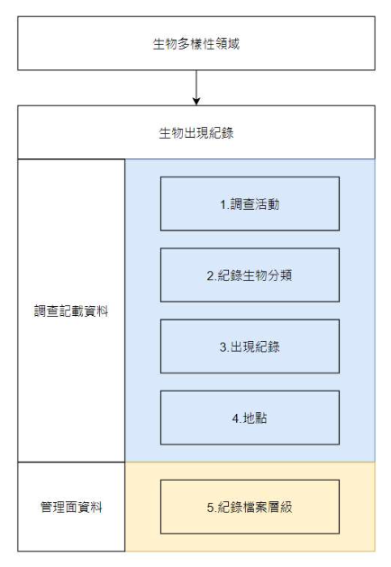
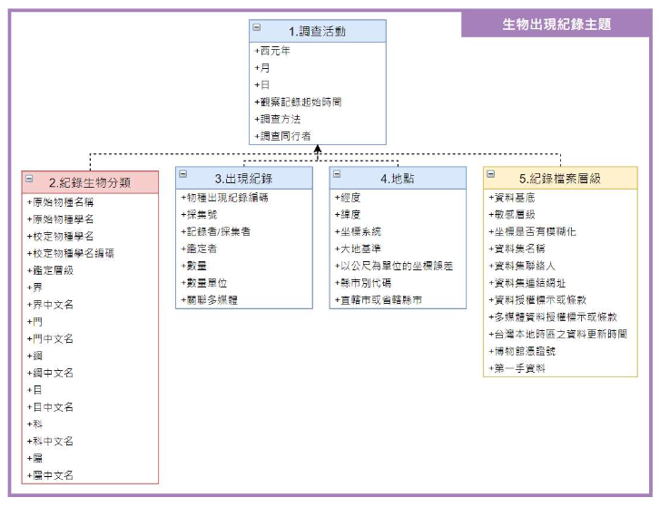

# 生物多樣性領域資料標準

作者一 - communication@tbiadata.tw | 作者二 - 版本 {{ git.short_commit }}, {{ git.date.strftime('%Y-%m-%d %H:%M:%S%z') }}

本文件亦有[PDF版本](https://tbiadata.tw/media/resources/%E7%94%9F%E7%89%A9%E5%A4%9A%E6%A8%A3%E6%80%A7%E9%A0%98%E5%9F%9F%E8%B3%87%E6%96%99%E6%A8%99%E6%BA%96.pdf)。

## **版權說明 Colophon**
### 建議引用方式 Suggested Citation
中央研究院生物多樣性研究中心、內政部營建署、行政院農業委員會林務局、行政院農業委員會林業試驗所、行政院農業委員會特有生物研究保育中心、海洋委員會海洋保育署。生物多樣性領域資料標準。第1.0版。臺灣生物多樣性資訊聯盟秘書處：臺北。

### 作者 Authors
中央研究院生物多樣性研究中心、內政部營建署、行政院農業委員會林務局、行政院農業委員會林業試驗所、行政院農業委員會特有生物研究保育中心、海洋委員會海洋保育署

### 貢獻者 Contributors
臺灣生物多樣性資訊聯盟的資料庫串連與資料發佈工作小組為本文件的這個版本做出了貢獻。該工作小組的召集人為行政院農業委員會特有生物研究保育中心的吳世鴻；副召集人為中央研究院生物多樣性研究中心的劉璟儀；工作小組成員包括：王浥璋、李思賢、沈玉婷、俞佑錚、柯智仁、倪旻萱、許鈺琇、郭貴嵐、陳冠伃、楊蕙禎、鍾惠名（依筆劃排序）。

### 授權方式 Licence
本文件《生物多樣性領域資料標準》採用 [創用CC 姓名標示-相同方式分享 4.0 國際 (CC BY-SA 4.0)](https://creativecommons.org/licenses/by-sa/4.0/deed.zh_TW)。

### 永久統一資源標籤 Persistent URI
本文件尚待建立此版本的永久統一資源標籤。

### 文件版本控制 Document Control
第1.0版，2022年7月。

最初基於資料庫串連與資料發佈工作小組的《[生物出現紀錄資料共享指引](https://hackmd.io/@oOKtv9CNRuKvI6IqXZGf9w/BJNm-7XNv)》。

### 封面圖片
小啄木（*Yungipicus canicapillus*），高雄市，臺灣。2023年 redbirdwu 通過 [iNaturalist研究等級觀察](https://www.inaturalist.org/observations/145477232) 所拍攝的照片，採用 [CC BY 4.0](https://creativecommons.org/licenses/by/4.0/) 授權。

---
## **前言 Preface**

### 引言 Epigraph（選填）

### 摘要 Abstract（必填）

### 前言 Preface（選填）

### 致謝 Acknowledgements（建議必填）

### 獻詞 Dedication（選填）

---
## 文件修訂對照說明
| 日期      | 版次   | 編輯者 | 變動內容                                                                                                          |
|---------|------|-----|---------------------------------------------------------------------------------------------------------------|
| 2021/01 | v1.0 | 沈玉婷 | 本版次訂定 8 項資料標準如下列： 生物多樣性–生物出現紀錄–調查活動 生物多樣性–生物出現紀錄–紀錄生物分類 生物多樣性–生物出現紀錄–出現紀錄 生物多樣性–生物出現紀錄–地點 生物多樣性–生物出現紀錄–紀錄檔案層級 |
|         |      |     | \-\-以下空白                                                                                                        |

---
## **壹、目的**
為促進我國在生物多樣性領域資料格式的統一，有效率地整合散見於政府機關、學研機構及民間團隊間經由人為觀察、自動化儀器紀錄及人為採集等不同管道蒐集累積的生物調查資料，提供未來使用者可透過統一、標準化之格式取用資料，並提升資料整合應用的品質，爰訂定本生物多樣性領域資料標準（以下稱本領域資料標準）。

本領域資料標準之主要目的係作為國內跨公私部門間生物多樣性資料共享基礎，透過統一標準格式相互流通，加速國內生物多樣性資訊發展，支持國家生物多樣性大數據建立及開放共享，並使相關資訊成為推動生物多樣性主流化（mainstreaming biodiversity）的一大助力。

### 一、 資料來源系統

為支持國內保育政策擬定及推動，需進行生物多樣性基礎資料的蒐集以掌握特定區域內生物多樣性現況及變化趨勢。在各相關政府單位，包含中央及地方，均持續配合各項公務預算，各依權責辦理相關現地調查及委託、補助研究計畫；不僅政府單位，國內各學術研究機構長年自行辦理之研究調查作業，加以近年公民科學計畫的盛行，生物資料量在資訊科技快速發展的輔助下大量累積。而因資料擁有者較分散、調查紀錄未完整數位化、不同調查目的下所取得之調查資料內容格式各異或資料擁有者資料開放的意願等因素，目前生物資料從取得到整合應用仍存在一定程度的障礙。

為能達到跨公私部門間資料連結及整合，目前已由公部門間，包含中央研究院生物多樣性研究中心、內政部營建署、行政院農業委員會林務局林業試驗所、特有生物研究保育中心、海洋委員會海洋保育署及國家海洋研究院等單位初步建立合作共識及溝通平台；透過本資料標準的建立，目標藉由應用程式介面（Application Programming Interface, API）標準化串接各分散資料庫資訊成果，以資料開放為方向，推動未來相關生物多樣性資料之資料服務及決策應用發展上能有共同的資訊基礎，逐步建構國家級的生物多樣性資訊網絡（圖 1）。預期將可含括之資料來源系統包含：臺灣生物多樣性資訊機構（TaiBIF）、臺灣物種名錄（TaiCoL）（中央研究院生物多樣性研究中心）、海洋保育網（海洋委員會海洋保育署）、臺灣國家公園生物多樣性資料庫（內政部營建署）、濕地環境資料庫（內政部營建署城鄉發展分署）、植物標本館（林業試驗所）、臺灣生物多樣性網絡（特有生物研究保育中心）、生態調查資料庫（林務局）等，並期能更進一步廣納經濟部水利署的河川情勢調查、各政府機關公共工程生態檢核資料、環境保護署原始數據共享倉儲收納之環境影響評估生態調查資料及公民科學資料（如 BBS Taiwan、eBird）等來源。

圖 1 國家級生物多樣性網絡建構之未來願景

### 二、 資料產製模式

生物多樣性調查因應調查目的、物種類群及地理維度（尺度）不同，調查方法及內容格式各異，使得不同調查專案間之成果常不易整合應用。其中，屬於最核心共通性的生物出現紀錄（物種、時間及空間資訊），即成為資料整合運用最基礎的項目。

生物出現紀錄資訊整合，首先面臨的是學名議題。受到分類學派及分類學研究沿革發展，針對同一物種會有不同的學名描述，為能讓不同學名、但屬同一物種的資料後續可整合分析，經由物種名錄建立學名資訊間的聯結（同物異名），在跨專案及跨資料庫間的資料整合作業都相當重要。

而透過整合不同資料來源涉及物種的時空分布資訊，持續累積資料量，再藉由資料演算分析及分布預測，將有助於國內發展建立能夠反映時空變遷之生物分布圖資，使生物多樣性保育執行及決策者快速接收更直覺且精確的基礎背景資訊。同時，因應保育議題，部分生物出現紀錄之空間資訊需透過適當屏蔽，避免因資訊釋出後反造成物種受害（如有獵捕壓力之物種），相關資料提供時將考量其空間資訊可能存在的敏感程度分層級進行處理。透過名錄服務的整合，連帶才能就物種資訊做有效的分析，達到整合資料研究的基礎。

本標準以國內較具整合共識、資料相對完整之「生物出現紀錄」資訊為第一步進行標準化推動；未來基礎於此標準化推動經驗，或可從分子生物 DNA 序列（GenBank）、生態照片、動物聲音和生態系等資訊逐步擴充，促進各類型生物多樣性資訊交流。

## **貳、範圍**

生物多樣性相關調查研究相當廣泛，或針對分類學、個體生態、族群生態、生態系統、（微）棲地環境等不同範疇，現階段無論在國內或全球性生物多樣性組織，以物種個體為對象之分布調查所產生的「生物出現紀錄（Occurence）」資訊，是最普遍進行、資料累積速度快且相對易於整合的資料項目，亦為本標準訂定的主要範圍。

調查過程中，因應不同的調查目的、方法設計，蒐集的資料欄位內容格式也各不相同。隨著全球生物多樣性資訊機構（GBIF）快速發展，其成立宗旨為提供大眾不限時間、地點均能公開且自由存取生物資料，目前已彙集了全球上億萬筆的生物出現紀錄，其採用的達爾文核心集（Darwin Core）標準格式，連帶影響了各界在資料調查蒐集內容的共通性設計。本標準在生物分布資訊上，即大量參考達爾文核心集的設計，透過國際標準的引用讓資料整合成果不僅提供國內跨界運用，也能與國際相連結，發揮我國地球公民一員的貢獻。惟在資料公開部分，仍須考量國內生物資源利用性及內含的地點資訊釋出反而造成物種受害之可能性（如：採集、獵捕棲地破壞或人為干擾等），相關坐標資訊將視個別物種情形進行必要之屏蔽後公開。

針對資料整合工作，預期可納入範圍內的生物出現紀錄資料來源系統包含：臺灣生物多樣性資訊機構、海洋保育網、臺灣國家公園生物多樣性資料庫、濕地環境資料庫、植物標本館、臺灣生物多樣性網絡、生態調查資料庫等，涵蓋了海域、陸域、特定關注區域及棲地範圍的調查成果，過去由各機關因應權責主管業務需要分別進行資料保存蒐集，將可望透過一致性標準的提出達到實質的資料整合應用。

本標準範圍不限於上開系統使用，各單位如有辦理生態調查作業，涉及物種調查部分均可參照本標準項目做為共通性調查格式規範。又因物種名錄在跨資料庫的資料整合過程扮演關鍵角色，中央研究院生物多樣性研究中心於 2003 年建立了「臺灣物種名錄（TaiCoL）系統」，近二十年來的發展已成為台灣最具權威性的物種名錄資訊來源。本標準涉及分類資訊即以臺灣物種名錄為主要核心，做為資料整合交換的基礎。

本版次提報之生物多樣性（Biodiversity）領域資料標準其「領域–主題–類別」描述範疇包含 1 項主題與 5 項類別如下說明，未來文件將會配合實際推動過程、各單位資料調查蒐集及實際應用現況滾動修正，並適時擴增資料標準項目。

1. 生物出現紀錄（Occurrence）主題：調查活動（Event）、紀錄生物分類（Record Taxon）、出現紀錄（Occurence）、地點（Location）、紀錄檔案層級（Record-level）。

---
## **參、應用場合及使用限制**

本標準主要適用對象為生物領域相關政府部門、學術研究機構及民間組織，其辦理生物出現紀錄蒐集或建置有資料庫系統做為相關資料之倉儲流通目的者。相關單位應依本標準，進行領域資料之生產、流通、供應與交換。各單位除遵循本標準之外，若依本身需求，擴充設計以適用於特定領域範疇，所衍生之標準文件應註明遵循本標準。本領域資料標準內容係參考引用國內外相關標準而制定，列舉如下：

| 項次 | 法律與行政法規 |
|:---|:---|
| 1 | 野生動物保育法 |
| 2 | 文化資產保存法 |
| **項次** | **參考文件** |
| 1 | 國家發展委員會「領域資料標準訂定參考指引」 |
| 2 | 國家發展委員會「資料集詮釋資料標準規範」 |
| **項次** | **引用資料標準** |
| 1 | 引用政府資料標準平臺領域共通標準 |
| 2 | 引用國際分類資料庫工作小組（TDWG, Taxonomic Database Working Group）達爾文核心集（DwC, Darwin Core） |

---
## **肆、專有名詞說明**

本文件中，涉及相關專有名詞引用，透過以下條列式說明進行陳述：

1. 生物出現紀錄（occurrence）：指生物於特定時間及特定空間之出現資訊a；包含但不限於由人為觀察、自動化儀器紀錄、人為採集之生物本體與痕跡。
2. 學名（scientific name）：依據國際生物命名法規對於各特定物種使用的科學名稱，統一使用拉丁文或拉丁化文字b。
3. 俗名（vernacular name）：針對各物種於特定地域內通俗傳用的名稱c，通常使用當地語言，如臺灣主要使用中文俗名。
4. 分類（taxon）：在生物學指由分類學家依相同特徵之生物群體分類的階層單元d，包含如界、門、綱、目科、屬、種、亞種等層級類別。
5. 敏感資料（sensitive data）：資料內含的物種紀錄地點相關資訊釋出後，可能造成該物種受害，或其他相關的環境損害，而有屏蔽資訊之必要者。前述受害，包括蓄意的傷害，如採集、獵捕、棲地破壞；或非蓄意的傷害，如干擾e。
6. 敏感層級（sensitive category）：建立敏感資料清單時，針對個別物種設定之地點資訊屏蔽程度f。

a. 名詞說明為譯文，引用自[達爾文核心集](https://dwc.tdwg.org/terms/#occurrence) 
b. 名詞說明參考[維基百科](https://zh.wikipedia.org/wiki/學名)。 
c. 名詞說明參考教育部重編國語詞典修訂本。 
d. 名詞說明為譯文，引用自[達爾文核心集](https://dwc.tdwg.org/terms/#taxon)。 
e. 名詞說明引用自「生物多樣性敏感資料開放作業原則」。 
f. 名詞說明引用自「生物多樣性敏感資料開放作業原則」。 

---
## **伍、特性分析**

生物多樣性領域（Biodiversity）整體類別資料屬性結構分析說明如下表所示：

<table>
    <tr>
        <td>第一層</td>
        <td colspan="5">生物多樣性領域資料共同訊息層</td>
    </tr>
    <tr>
        <td>第二層</td>
        <td colspan="5">生物出現紀錄主題</td>
    </tr>
    <tr>
        <td>第三層</td>
        <td>調查活動類別</td>
        <td>紀錄生物分類類別</td>
        <td>出現紀錄類別</td>
        <td>地點類別</td>
        <td>紀錄檔案層級類別</td>
    </tr>
</table>

為能達到後續資料可整合利用性，針對各類別應具備之核心資訊分列 及說明如下（特性分析類別圖詳見圖 2）：

一、生物出現紀錄（Occurrence）主題：
 

1. 調查活動（Event）類別：描述紀錄所屬的調查活動資訊，包含西元年、月、日、觀察記錄起迄時間、調查方法、調查同行者等。
2. 紀錄生物分類（Record Taxon）類別：描述該筆紀錄所對應的物種， 考量學名變動特性及後續物種識別及檢核需求，包含資料原始提供者所記錄之學名、資料檢核現有名錄後給予之校正學名及其物種編碼、鑑定層級、資料原始提供者提供的物種名稱（俗名或學名）等 。
3. 出現紀錄（Occurrence）類別：針對單筆紀錄所記錄的特定事項，包含該筆出現紀錄之永久識別編號、物種數量、物種數量單位、紀錄者（採集者）、採集號及多媒體連結等。
4. 地點（Location）類別：包含經度、緯度、坐標格式、坐標參考系統及坐標誤差等。本項資料主要以單個坐標點的方式記錄。
5. 紀錄檔案（Record-level）層級：指該筆紀錄調查作業以外，在資料儲存管理面的關聯資訊，包含資料集名稱、資料集聯絡人、資料授權標示、資料來源（是否為第一手資料）及資料發布單位等，並因應生物存在敏感資料，提供坐標是否有模糊化、敏感層級等資訊。

圖 2 特性分析類別圖

---

## **陸、應用綱要**

資料屬性依據特性分析以結構類別圖說明應用如下（圖 3）所示：

圖 3 應用綱要結構類別

---

## **柒、資料典**

資料典定義說明如下表所示：

| 名稱      | 定義                                                                          |
|---------|-----------------------------------------------------------------------------|
| 項次      | 資料典之序號。                                                                     |
| 中英文名稱   | 資料屬性列舉於資料典中。                                                                |
| 說明      | 提供屬性之意義，以淺顯易懂的文字介紹該項資料，協助使用者了解屬性之內容，避免誤解使用。                                 |
| 型別      | 說明屬性之資料型態填列 String、Number、Boolean、Date、Time、DateTime。                       |
| 值域      | 說明該欄位之資料型別值域，為資料內容是否正確的判斷方式。                                                |
| 必要性     | 說明該屬性描述之必要性，區分為「必要屬性」 （Mandatory）、及「選擇屬性」（Optional），本文說明方式將以簡寫之（M）與（O）表示之。  |
| 最多發生次數  | 依實際需求，至多出現一次（1）、只出現特定次數（特定次數）或出現多次（N）。                                      |
| 附註      | 針對屬性或關係提供前述項目無法提供之額外說明，例如代碼表、編碼規則。                                          |

### 一、生物多樣性–生物出現紀錄–調查活動

| 項次  | 中文名稱      | 英文名稱              | 說明                                 | 型別      | 值域              | 必要性  | 最多發生次數  | 附註               |
|-----|-----------|-------------------|------------------------------------|---------|-----------------|------|---------|------------------|
| 1   | 西元年       | year              | 台灣本地時區之觀察記錄起始日期之西元年。               | String  | [0000-9999]     | M    | 1       |                  |
| 2   | 月         | month             | 台灣本地時區之觀察記錄起始日期之月。                 | String  | [01-12]         | O    | 1       |                  |
| 3   | 日         | day               | 台灣本地時區之觀察記錄起始日期之日。                 | String  | [01-31]         | O    | 1       |                  |
| 4   | 觀察記錄起始時間  | eventTime         | 觀察記錄起始時間。                          | Time    | [00-24][00-59]  | O    | 1       | 24小時制4碼格式 HHMM   |
| 5   | 調查方法      | samplingProtocol  | 該筆紀錄取得之調查方法描述。                     | String  |                 | O    | 1       |                  |
| 6   | 調查同行者     | partner           | 調查同行者，該筆紀錄所屬調查活動「紀錄者／採集者」以外的同行人員。  | String  |                 | O    | 1       | 多個調查同行者，以「\|」符號分隔 |

### 二、生物多樣性–生物出現紀錄–紀錄生物分類

| 項次  | 中文名稱      | 英文名稱                    | 說明                             | 型別      | 值域  | 必要性  | 最多發生次數  | 附註                                        |
|-----|-----------|-------------------------|--------------------------------|---------|-----|------|---------|-------------------------------------------|
| 1   | 原始物種名稱    | originalVernacularName  | 資料原始觀察或採集者所提供的該物種的名稱，可以是俗名或學名。 | String  |     | M    | 1       |                                           |
| 2   | 原始物種學名    | originalScientificName  | 資料原始提供者所輸入之物種學名。               | String  |     | O    | 1       | 依據國際命名規則對於各物種及其所屬類群使用的科學名稱，統一使用拉丁文或拉丁化文字。 |
| 3   | 校定物種學名    | scientificName          | 資料檢核後給予之物種學名。                  | String  |     | O    | 1       | 於臺灣物種名錄（TaiCoL）對應的學名。                     |
| 4   | 校定物種學名編碼  | scientificNameID        | 校定物種學名於台灣物種名錄（TaiCoL）對應的學名編碼。  | String  |     | O    | 1       | https://taicol.tw/                        |
| 5   | 鑑定層級      | taxonRank               | 原始紀錄內物種鑑定（分類）上被歸屬的最小生物分類單元。    | String  |     | M    | 1       | 控制詞彙詳見附錄「鑑定（分類）層級表」。                      |
| 6   | 界         | kingdom                 | 生物分類單元「界」之科學名稱。                | String  |     | O    | 1       |                                           |
| 7   | 界中文名      | kingdomChinese          | 界中文名。                          | String  |     | O    | 1       |                                           |
| 8   | 門         | phylum                  | 生物分類單元「門」之科學名稱。                | String  |     | O    | 1       |                                           |
| 9   | 門中文名      | phylumChinese           | 門中文名。                          | String  |     | O    | 1       |                                           |
| 10  | 綱         | class                   | 生物分類單元「綱」之科學名稱。                | String  |     | O    | 1       |                                           |
| 11  | 綱中文名      | classChinese            | 綱中文名。                          | String  |     | O    | 1       |                                           |
| 12  | 目         | order                   | 生物分類單元「目」之科學名稱。                | String  |     | O    | 1       |                                           |
| 13  | 目中文名      | orderChinese            | 目中文名。                          | String  |     | O    | 1       |                                           |
| 14  | 科         | family                  | 生物分類單元「科」之 科學名稱。               | String  |     | O    | 1       |                                           |
| 15  | 科中文名      | familyChinese           | 科中文名。                          | String  |     | O    | 1       |                                           |
| 16  | 屬         | genus                   | 生物分類單元「屬」之科學名稱。                | String  |     | O    | 1       |                                           |
| 17  | 屬中文名      | genusChinese            | 屬中文名。                          | String  |     | O    | 1       |

### 三、生物多樣性–生物出現紀錄–出現紀錄

| 項次 | 中文名稱      | 英文名稱             | 說明                              | 型別      | 值域          | 必要性 | 最多發生次數 | 附註                                                           |
|----|-----------|------------------|---------------------------------|---------|-------------|-----|--------|--------------------------------------------------------------|
| 1  | 物種出現紀錄編碼  | occurrenceID     | 該筆紀錄的永久識別編號。                    | String  |             | M   | 1      | 使用通用唯一識別碼 （UniversallyUniqueIdentifier，UUID），或其他可永久識別紀錄的編號。  |
| 2  | 採集號       | recordNumber     | 採集號，該筆紀錄的識別編號，在單一調查活動內編號不重複。    | String  |             | O   | 1      |                                                              |
| 3  | 記錄者／採集者   | recordedBy       | 記錄者／採集者，該筆記錄之實際觀察／調查／記錄／採集者。    | String  |             | O   | 1      | 多個記錄者／採集者，以「\|」 符號分隔                                         |
| 4  | 鑑定者       | identifiedBy     | 鑑定者，該筆調查上傳後的鑑定人員／該筆紀錄的物種鑑定負責人。  | String  |             | O   | 1      |                                                              |
| 5  | 數量        | organismQuantity | 該筆紀錄代表的物種數量。                    | Number  | float (0,∞) | M   | 1      | 依「數量單位」記錄，可為正整數或帶小數。                                         |

### 四、生物多樣性–生物出現紀錄–地點

| 項次 | 中文名稱         | 英文名稱                          | 說明                                                                                            | 型別      | 值域            | 必要性 | 最多發生次數 | 附註                                                                                                |
|----|--------------|-------------------------------|-----------------------------------------------------------------------------------------------|---------|---------------|-----|--------|---------------------------------------------------------------------------------------------------|
| 1  | 經度           | verbatimLongitude             | 用於標記地球表面位置之東西距離數值，以地理坐標系表示為 X 坐標 。                                                            | String  |               | M   | 1      | 優先採用 EPSG:4326 十進位小數格式；若不適用， 請註明使用之坐標系統及大地基準。                                                     |
| 2  | 緯度           | verbatimLatitude              | 用於標記地球表面位置之南北距離數值，以地理坐標系表示為 Y 坐標 。                                                            | String  |               | M   | 1      | 優先採用 EPSG:4326 十進位小數格式；若不適用， 請註明使用之坐標系統及大地基準。                                                     |
| 3  | 坐標系統         | verbatimCoordinateSystem      | 該筆紀錄經度及緯度使用之坐標格式。                                                                             | String  |               | M   | 1      | 優先採用 DecimalDegrees（十進位度）。控制詞彙詳見附錄「坐標格式表」。                                                        |
| 4  | 大地基準         | verbatimSRS                   | 該筆紀錄經度及緯度使用之空間參考系統。                                                                           | String  |               | M   | 1      | 優先採用 EPSG:4326。控制詞彙詳見附錄「空間參考系統表」。                                                                 |
| 5  | 以公尺為單位的坐標誤差  | coordinateUncertaintyInMeters | 以公尺為單位的坐標誤差，因儀器設備、觀測誤差造成所提供之調查點位並非實際坐標，或觀察對象的散布範圍大於實際坐標，故此數值用以給定最小圓形區域的水平半徑距離，確保涵蓋實際調查對象所在位置。 | Number  | float (0,∞)   | O   | 1      |                                                                                                   |
| 6  | 縣市別代碼        | countyCode                    | 該筆紀錄地點所在的直轄市或省轄縣市之代碼。                                                                         | String  | [00000-99999] | O   | 1      | 引用「共通性／共通資料／縣市別代碼」欄位。代碼檔詳見附件「戶役政資訊代碼（https://www.ris.gov.tw/documents/data/5/1/ RSCD0101.txt） 」。 |
| 7  | 直轄市或省轄縣市     | county                        | 該筆紀錄地點所在的直轄市或省轄縣市，以中文描述。                                                                      | String  |               | O   | 1      | 控制詞彙詳見附錄「行政區域表」。                                                                                  |

### 五、生物多樣性–生物出現紀錄–紀錄檔案層級

| 項次 | 中文名稱          | 英文名稱                       | 說明                                 | 型別      | 值域                                         | 必要性 | 最多發生次數 | 附註                                                       |
|----|---------------|----------------------------|------------------------------------|---------|--------------------------------------------|-----|--------|----------------------------------------------------------|
| 1  | 資料基底          | basisOfRecord              | 資料基底，資料於記錄當下的類型。                   | String  |                                            | O   | 1      | 控制詞彙詳見附錄「資料基底」。                                          |
| 2  | 敏感層級          | sensitiveCategory          | 依據生物多樣性敏感資料開放作業原則標準所列之敏感層級類別。      | String  |                                            | O   | 1      | 控制詞彙詳見附錄「敏感層級表」。                                         |
| 3  | 坐標是否有模糊化      | dataGeneralizations        | 該筆紀錄提供的經度、 緯度坐標數值是否經過模糊化（數值屏蔽）處理。  | Boolean | True,False                                 | M   | 1      | True 代表是，False 代表否 。                                     |
| 4  | 資料集名稱         | datasetName                | 該筆紀錄所屬之資料集名稱。                      | String  |                                            | M   | 1      |                                                          |
| 5  | 資料集聯絡人        | resourceContacts           | 該筆紀錄所屬之資料集聯絡人。                     | String  |                                            | O   | 1      |                                                          |
| 6  | 資料集連結網址       | resourceCitationIdentifier | 該筆紀錄所屬資料集的連結網址（URL）。               | String  | url                                        | O   | 1      |                                                          |
| 7  | 資料授權標示或條款     | license                    | 該筆紀錄資料授權標示或條款。                     | String  |                                            | M   | 1      | 控制詞彙詳見附錄「授權標示表」。                                         |
| 8  | 多媒體資料授權標示或條款  | mediaLicense               | 該筆資料關聯之多媒體資料其授權標示或條款。              | String  |                                            | O   | 1      | 控制詞彙詳見附錄「授權標示表」。引用「生物多樣性／生物出現紀錄／紀錄檔案層級／資料授權標示或條款」之欄位。 |
| 9  | 台灣本地時區之資料更新時間 | modified                   | 台灣本地時區之資料更新時間。                     | String  | [0000-9999][01- 12][01-31][00- 24][00-59]  | M   | 1      | 採用西元年月日8碼+24小時制4碼格式 YYYYMMDD HHMM。引用「共通性／共通資料／日期時間」欄位。   |
| 10 | 博物館憑證號        | collectionID               | 標本資料之博物館（voucher）憑證號。             | String  |                                            | O   | 1      |                                                          |
| 11 | 第一手資料         | selfProduced               | 單位自行或委託他方獲取之第一手資料，而非介接自其他資料庫／集。    | Boolean | True,False                                 | M   | 1      | True 代表資料自產，非來自外部來源； False 代表資料介接取得，來自外部來源。              |

---

## **捌、編碼規則**
本標準之編碼轉換規定依循 XML Schema 之訂定原則，應用綱要為概念層次之規定，實質之資料流通須經資料之編碼，本標準僅提供資料標準欄位定義及說明，未提供相關編碼規則。

---
## **玖、標準訂定單位及維護權責**

本標準由臺灣生物多樣性資訊聯盟（中央研究院生物多樣性研究中心、內政部營建署、行政院農業委員會林務局、行政院農業委員會林業試驗所、行政院農業委員會特有生物研究保育中心、海洋委員會海洋保育署）共同研擬，內容之維護及更新為資訊單位負責，聯絡資訊如下：

聯絡單位：行政院農業委員會林務局

地址：台北市杭州南路一段 2 號

電話：02-23515441

電子郵件信箱：eml@forest.gov.tw 或 tbianoti@gmail.com

官方網站：臺灣生物多樣性資訊聯盟網站籌備中，各單位官網如下：

- [臺灣生物多樣性資訊機構](https://portal.taibif.tw/)
- [臺灣物種名錄](https://taicol.tw)
- [海洋保育網](https://iocean.oca.gov.tw/)
- [臺灣國家公園生物多樣性資料庫](https://npgis.cpami.gov.tw/)
- [濕地環境資料庫](https://wetland-db.tcd.gov.tw/)
- [植物標本館](https://taif.tfri.gov.tw/)
- [臺灣生物多樣性網絡](https://www.tbn.org.tw/)
- [生態調查資料庫](https://ecollect.forest.gov.tw)

---
## **附錄一：資料欄位代碼表及控制詞彙表**
### 一、資料欄位代碼表及控制詞彙表

#### （一）鑑定（分類）層級表

| 控制詞彙 | 中文名稱 |
|---|---|
| Kingdom | 界 |
| Phylum | 門 |
| Class | 綱 |
| Order | 目 |
| Family | 科 |
| Genus | 屬 |
| Species | 種 |
| Subspecies | 亞種 |
| Variety | 變種 |

#### （二） 坐標格式表

| 控制詞彙                   | 說明                                                                                                            | 使用範例            |
|------------------------|---------------------------------------------------------------------------------------------------------------|-----------------|
| DecimalDegrees         | 經緯度系統，以度為單位之十進位數，建議優先採用本項。註：如採用本格式紀錄，因每度約 100 公里，數值表示如為小數位下 2 位，精度約為 1 公里；又敏感物種會進行座標資訊屏蔽，如有座標屏蔽處理，誤差應回歸原始數據。  | 23.760556       |
| DegreesDecimalMinutes  | 經緯度系統，以度及分為單位，度為整數，分為小數。                                                                                      | 23°45.633333’   |
| DegreesMinutesSeconds  | 經緯度系統，以度、分及秒為單位，均為整數。                                                                                         | 23°45’38"       |
| TM2                    | 橫麥卡托二度分帶系統，單位為公尺，X 軸為 6 位正整數，Y 軸為 7 位正整數。                                                                     | 247342, 2652336 |

#### （三） 空間參考系統表

| 控制詞彙       | 大地基準              | 坐標系統    |
|------------|-------------------|---------|
| EPSG:4326  | WGS84，建議優先採用本項    | 經緯度系統   |
| EPSG:3824  | TWD97             | 經緯度系統   |
| EPSG:3825  | TWD97，中央經線 119 度  | TM2 系統  |
| EPSG:3826  | TWD97，中央經線 121 度  | TM2 系統  |
| EPSG:3827  | TWD67，中央經線 119 度  | TM2 系統  |
| EPSG:3828  | TWD67，中央經線 121 度  | TM2 系統  |
| EPSG:4236  | 虎子山 Hu Tzu Shan   | 經緯度系統   |

#### （四） 行政區域表

| 控制詞彙  | 戶政資料代碼  | 地政司縣市代碼  | ISO 3166-2:TW 縣市代碼 | 英文名稱              |
|-------|---------|----------|--------------------|-------------------|
| 臺北市   | 63000   | A        | TPE                | Taipei City       |
| 臺中市   | 66000   | B        | TXG                | Taichung City     |
| 基隆市   | 10017   | C        | KEE                | Keelung City      |
| 臺南市   | 67000   | D        | TNN                | Tainan City       |
| 高雄市   | 64000   | E        | KHH                | Kaohsiung City    |
| 新北市   | 65000   | F        | NWT                | New Taipei City   |
| 宜蘭縣   | 10002   | G        | ILA                | Yilan County      |
| 桃園市   | 68000   | H        | TAO                | Taoyuan City      |
| 嘉義市   | 10020   | I        | CYI                | Chiayi City       |
| 新竹縣   | 10004   | J        | HSQ                | Hsinchu County    |
| 苗栗縣   | 10005   | K        | MIA                | Miaoli County     |
| 南投縣   | 10008   | M        | NAN                | Nantou County     |
| 彰化縣   | 10007   | N        | CHA                | Changhua County   |
| 新竹市   | 10018   | O        | HSZ                | Hsinchu City      |
| 雲林縣   | 10009   | P        | YUN                | Yunlin County     |
| 嘉義縣   | 10010   | Q        | CYQ                | Chiayi County     |
| 屏東縣   | 10013   | T        | PIF                | Pingtung County   |
| 花蓮縣   | 10015   | U        | HUA                | Hualien County    |
| 臺東縣   | 10014   | V        | TTT                | Taitung County    |
| 金門縣   | 9020    | W        | KIN                | Kinmen County     |
| 澎湖縣   | 10016   | X        | PEN                | Penghu County     |
| 連江縣   | 9007    | Z        | LIE                | Lienchiang County |

#### （五） 授權標示表

| 控制詞彙        | 來源                                                  |
|-------------|-----------------------------------------------------|
| CC0         | [https://creativecommons.org/publicdomain/zero/1.0/](https://creativecommons.org/publicdomain/zero/1.0/)  |
| CC-BY       | [https://creativecommons.org/licenses/by/4.0/](https://creativecommons.org/licenses/by/4.0/)        |
| CC-BY-NC    | [https://creativecommons.org/licenses/by-nc/4.0/](https://creativecommons.org/licenses/by-nc/4.0/)     |
| 政府資料開放授權條款  | [https://data.gov.tw/license](https://data.gov.tw/license)                         |

#### （六） 資料基底表

| 控制詞彙                | 中文名稱 |
|---------------------|-------|
| PreservedSpecimen   | 保存標本 |
| FossilSpecimen      | 化石標本 |
| LivingSpecimen      | 活體標本 |
| MaterialSample      | 組織樣本 |
| Event               | 調查活動 |
| HumanObservation    | 人為觀測 |
| MachineObservation  | 機器觀測 |
| Taxon               | 分類資訊 |
| Occurrence          | 出現記錄 |

#### （七） 敏感層級表

| 控制詞彙   | 說明                                 |
|--------|------------------------------------|
| 輕度     | 點位坐標應屏蔽至精度高於經緯度小數點後 2 位（約 1 公里）。   |
| 重度     | 點位坐標應屏蔽至精度高於經緯度小數點後 1 位（約 10 公里）。  |
| 縣市     | 點位坐標屏蔽到只顯示地理區的縣市，不顯示坐標。            |
| 坐標不開放  | 點位坐標應完全屏蔽，但仍可查詢到該物種存在。             |
| 物種不開放  | 點位、物種存在資訊都應完全屏蔽。                   |
| 無      | 地點資訊依據資料提供之原始精度開放。                 |

### 二、初審意見回覆表

依循領域資料標準訂定流程參考指引，資料標準訂定及作業規範提供暢通意見回饋機制，蒐集生物多樣性領域主題相關資料供應單位、領域專家學者、資料使用者之建議，依據各界回饋意見以逐步滾動修正及提升資料標準之完整性。

#### （一）業務單位意見

| 章節 | 意見 |
|---|---|
| 壹、目的 | 無 |
| 貳、範圍 | 1. 生物出現紀錄主題之「紀錄分類」更名為「紀錄生物分類 」；「名錄分類」更名為「名錄生物分類」。以下章節併同調整（中央研究院）。 回覆：已依建議修正。 |
| 參、應用場合及使用限制 | 無 |
| 肆、專有名詞說明 | 無 |
| 伍、特性分析 | 1. 有關特性分析中，物種特性類別，例如雜交種、入侵種、 化石種等相關備註，建議不需在資料調查階段就備註，此資料應該有全國統一的註記。（內政部營建署） 回覆：納入「物種名錄」主題統一註記，資料調查階段毋需填寫。 2. 特性分析中應該要有針對有機物及無機物分別設計的填報資料，其中針對無機物的部分內政部營建署有相關設計，建議可以參考。（內政部營建署）  回覆：現階段以生物資料為優先，無機物部分另行研議。 3. 有關未來針對氣候變遷的變化應該要有更密切的關注，因此環境屬性的參數，建議應該設計相關的資料填列欄位， 例如氣溫等。（內政部營建署）  回覆：現階段以生物資料為優先，環境資料另行研議。 |
| 陸、應用綱要 | 無 |
| 柒、資料典 | 1. 依草案資料典內容「五、生物多樣性-生物出現紀錄紀錄檔案層級」-「項次 11 第一手資料」，似允許將介接取得資料上傳，是否會造成資料重複上傳問題，建議可納入評估。（內政部營建署）  回覆：考量國內現況，部分資料庫同時整合其他來源資料共同發布服務，此欄位可取得資料整合應用時參考，評估後保留本項欄位。 2. 本署城鄉發展分署於 108 年 3 月 15 日訂有「濕地調查資料及成果報告上傳暨使用作業須知」（詳附件），提供參酌。（內政部營建署）  回覆：感謝提供。  3. 有關「三、生物多樣性-生物出現紀錄-出現紀錄」項次 3 記錄者／採集者」及「項次 4 鑑定者」，建議評估納入 「一、生物多樣性-生物出現紀錄-調查活動」。（內政部營建署）  回覆：目前分類係參考國際標準達爾文核心集（Darwin Core），又同一個調查活動中，各筆物種出現紀錄資料「紀錄者／採集者」及「鑑定者」可能不同，爰評估後仍維持列於「出現紀錄」類別內。 4. 調查方法、鑑定層級、記錄者／採集者、數量、數量 單位、資料集名稱、資料集聯絡人等，建議可納入必填欄位。（內政部營建署）  回覆：「鑑定層級」、「數量」、「數量單位」及「資料集名稱」改列必填；「調查方法」及「資料集聯絡人」屬於詮釋資料性質，可透過「資料集名稱」連結，「記錄者／採集者」在部分自動化調查方法不適用，爰維持「選填 」。  5. 建議評估將計畫主持人、計畫執行團隊、計畫受託單位／申請補助機關、計畫委辦單位、分類名稱（用以確認資料定位，供系統比對物種名稱與生物調查資料所屬分類是否一致。包含門、綱、目、科、屬。植物類需填寫科名以下層級）等資訊納入資料蒐集項目，並評估列為必填欄位。（內政部營建署）  回覆：計畫主持人、計畫執行團隊、計畫受託單位／申請補助機關、計畫委辦單位等項目屬於詮釋資料性質，可透過「資料集名稱」連結，且對於自辦調查不適用；分類名稱係供系統內品質檢核使用，且可物種學名資訊連結，評估後暫不納入標準欄位。  6. 建議請於生物多樣性-物種名錄-物種特性之說明欄加註各項次判定之參考依據（海洋保育署）。  回覆：已補充說明。 7. 為何不與其他 boolean 資料相同，採用 Yes／No？（ 中央研究院生物多樣性研究中心）  回覆：已統一標準文件，一致採用 True／False。 8. 修正「生物多樣性–生物出現紀錄–紀錄檔案層級」 之「台灣本地時區之資料更新時間」值域表示式。（中央研究院生物多樣性研究中心） 回覆：已修正。 9. 建議欄位名稱不要有年代，以免未來名錄更新後欄位名稱不適用。可以改為「臺灣紅皮書評估類別」。（中央研究院生物多樣性研究中心）  回覆：已修正。  10. 是否改為「是否為分布於台灣的物種」？雖然對資料使用上沒有差別，但標示是否為台灣物種似乎更直觀？（中央研究院生物多樣性研究中心）  回覆：已修正。 |
| 捌、編碼規則 | 無 |
| 玖、標準訂定單位及維護權責 | 無 |
| 拾、附錄 | 無 |

#### （二）資訊單位意見

| 章節 | 意見 |
|---|---|
| 壹、目的 | 無 |
| 貳、範圍 | 無 |
| 參、應用場合及使用限制 | 無 |
| 肆、專有名詞說明 | 無 |
| 伍、特性分析 | 無 |
| 陸、應用綱要 | 無 |
| 柒、資料典 | 無 |
| 捌、編碼規則 | 無 |
| 玖、標準訂定單位及維護權責 | 無 |
| 拾、附錄 | 無 |

#### （三）領域專家學者意見

| 章節 | 意見 |
|---|---|
| 壹、目的 |  |
| 貳、範圍 |  |
| 參、應用場合及使用限制 |  |
| 肆、專有名詞說明 |  |
| 伍、特性分析 |  |
| 陸、應用綱要 |  |
| 柒、資料典 |  |
| 捌、編碼規則 |  |
| 玖、標準訂定單位及維護權責 |  |
| 拾、附錄 |  |

---

