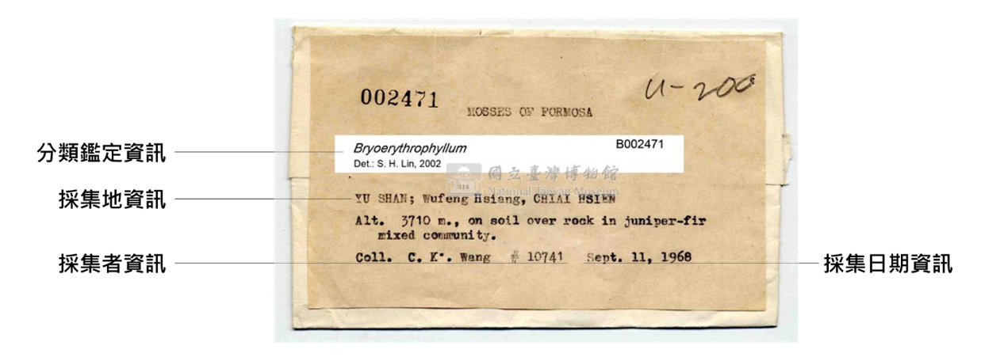
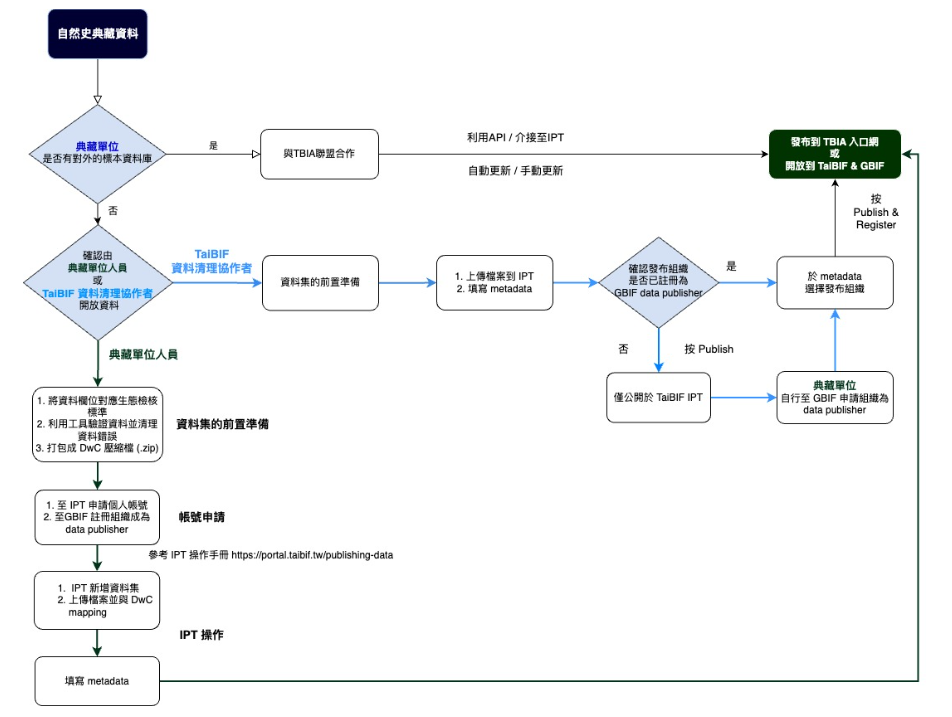

# TBIA 自然史典藏資料交換標準指引
作者 - 臺灣生物多樣性資訊聯盟典藏資料標準工作小組 - tbianoti@gmail.com - version {{ git.short_commit }}, {{ git.date.strftime('%Y-%m-%d %H:%M:%S%z') }} 

---
## **版權說明 Colophon**
### 建議引用方式 Suggested Citation
楊富鈞、劉璟儀、王浥璋。2024。自然史典藏資料交換標準指引。第一版。臺灣生物多樣性資訊聯盟秘書處：臺北。

### 作者 Authors
楊富鈞、劉璟儀、王浥璋

### 貢獻者 Contributors
TBIA 典藏資料標準工作小組為本文件的這個版本做出了貢獻。小組成員：王浥璋、吳佳奇、李金穎、李思賢、卓義揚、林展蔚、俞佑錚、柯智仁、張俊怡、張筑竣、張慧玲、章晨玫、許正德、陳建文、黃俞菱、楊富鈞、廖鎮磐、劉璟儀、蔡佩玲、蔡經甫、鄭明倫、賴保成（依姓氏筆劃排序）

### 授權方式 Licence
本文件《自然史典藏資料交換標準指引》採用 [創用CC 姓名標示-相同方式分享 4.0 國際 (CC BY-SA 4.0)](https://creativecommons.org/licenses/by-sa/4.0/deed.zh_TW)。

### 永久統一資源標籤 Persistent URI
本文件尚待建立此版本的永久統一資源標籤。

### 文件版本控制 Document Control
第一版，2024年9月

---
## **壹、目的**
自然史典藏做為一類出現紀錄，其本身帶有各種屬性。數位典藏核心業務之一，即是將這些屬性分門別類轉錄或載錄至相應的表單欄位。有些屬性在資料生命週期進入管理、使用與分享階段時，可借助早已發展成熟的標準化方案將其標準化，以確保資料交換時的品質。本文件始於 2023 年由臺灣生物多樣性資訊聯盟（Taiwan Biodiversity Information Alliance，簡稱 TBIA）典藏資料標準工作小組不定期討論，由來自自然史典藏單位的小組成員討論各自典藏單位的欄位需求，並依據 [Darwin Core 達爾文核心標準](<https://dwc.tdwg.org>)，從中整理共通可用的欄位標準，期望能提供為數位化典藏資料交換與管理時的參考。
本資料交換標準指引為基於[生物多樣性領域資料標準](<https://tbia.github.io/docs/biodiversity_data_standard/>)架構之延伸資料模板，而針對各欄位填寫方式及建議可參考[臺灣生物多樣性資訊聯盟自然史典藏「資料交換標準欄位」控制詞彙指引](<https://hackmd.io/@PxTmoqeOTYCc0cMVfSNB9A/HJgGIROr6/https%3A%2F%2Fhackmd.io%2F%40PxTmoqeOTYCc0cMVfSNB9A%2Fr1vFj1qBp>)。

## **貳、資料開放流程建議**

### 一、數位化典藏文字資料

    
     
    圖 1 自然史典藏數位化文字資料

自然史典藏數位化文字資料（如採集標籤上的資訊，可參考上圖），主要有兩種開放方式（詳見下方流程示意圖）：

1. 已有建置開放的標本典藏資料庫：若典藏單位已有自己的數位化資料庫且可供對外介接，可與臺灣生物多樣性資訊聯盟（簡稱 TBIA）秘書處聯繫 (tbianoti@gmail.com)，以資料庫介接之方式串連至 TBIA 所開發之「生物多樣性資料庫共通查詢系統（簡稱[TBIA 入口網](<https://tbiadata.tw/>)）」。
2. 尚未建置標本典藏資料庫：可與 TBIA 夥伴單位 — 臺灣生物多樣性資訊機構（簡稱TaiBIF）聯繫 (taibif.brcas@gmail.com)，將物種資料透過 TaiBIF 所管理之「IPT 資料發布平台」上傳資料，最終串接至 TBIA 入口網與 GBIF.org（全球生物多樣性資訊平台）。
3. 以上兩種開放方式，若典藏單位人力不足，或沒有具備開放資料的相關知識或經驗的人員，可選擇與 TaiBIF 培訓之資料清理協作者合作（需洽談相關費用），由其協助資料的清理和上傳。

    
     
    圖 2 自然史典藏資料開放方式

### 二、多媒體資料
自然史典藏多媒體資料可能包括數位圖檔、影音檔等。由於 TaiBIF IPT 及 TBIA 入口網本身尚無法提供諸如標本照片等多媒體檔案的倉儲服務，建議可自選擇下列三種資料庫中擇一上傳多媒體檔案，並將個別檔案的開放連結填入資料集內的相應欄位：

1. depositar 研究資料寄存所(<https://data.depositar.io/>) ：以新增資料集或專案方式，上傳至中研院研究資料寄存所，並設定關鍵字「自然史典藏 / Collection」及詳盡填寫基本資訊。
2. Zenodo (<https://zenodo.org/>)：為國際開放資料平台，一樣可以新增資料集方式上傳多媒體檔案。
3. Flickr (<https://www.flickr.com/>)：專為圖檔設計的開放平台，有強大的展示及圖片標籤功能，惟該平台僅提供免費上傳 1000 張圖檔，超出此額度須付費。

## 參、建議欄位及說明
由於不同生物種群、學門對典藏資料欄位的需求也不盡相同，本標準以能與其他資料使用者共享資料為優先考量，以資料管理目的為輔，將典藏資料以數張相互關聯的表單分開記錄，主表用於收納與典藏原則為一對一關係的核心資訊，並盡可能採用各單位、各學門可通用之欄位；延伸表單則用於收納與典藏本身易存在一對多關係的重要資訊，或用於補充不同學門需求，並視未來發展持續新增擴充。

定義說明如下表所示：

| 名稱      | 定義                                                                          |
|---------|-----------------------------------------------------------------------------|
| 項次      | 資料典之序號。                                                                     |
| 中英文名稱   | 資料屬性列舉於資料典中。                                                                |
| 說明      | 提供屬性之意義，以淺顯易懂的文字介紹該項資料，協助使用者了解屬性之內容，避免誤解使用。                                 |
| 型別      | 說明屬性之資料型態填列 String、Number、Boolean、Date、Time、DateTime。                       |
| 值域      | 說明該欄位之資料型別值域，為資料內容是否正確的判斷方式。                                                |
| 必要性     | 說明該屬性描述之必要性，區分為「必要屬性」 （Mandatory）、「條件」（Conditional）及「選擇屬性」（Optional），本文說明方式將以簡寫之（M）、（C）與（O）表示之。  |
| 最多發生次數  | 依實際需求，至多出現一次（1）、只出現特定次數（特定次數）或出現多次（N）。                                      |
| 附註      | 針對屬性或關係提供前述項目無法提供之額外說明，例如代碼表、編碼規則。                                          |

### 一、核心資料表 (core)- 物種出現紀錄 Occurrence

| 項次 | 中文名稱      | 英文名稱                     | 說明                                                                                                                                                                                                                                                                                              | 型別 | 值域 | 必要性 | 最多發生次數 | 範例                                                                 | 附註 |
|----|-----------|--------------------------|-------------------------------------------------------------------------------------------------------------------------------------------------------------------------------------------------------------------------------------------------------------------------------------------------|----|----|-----|--------|--------------------------------------------------------------------|----|
| 1  | 出現紀錄ID    | occurrenceID             | 每筆典藏資料的唯一且獨立編碼，可規定統一格式，如館代號+館藏號+流水號，亦可使用全球唯一辨識碼 (GUID) 或通用唯一辨識碼 (UUID)），但應與 catalogNumber 裡載錄的編碼有所區隔。                                                                                                                                                                                           | 文字 |    | M   | 1      | NTM_TMMA0046.01_001                                                |    |
| 2  | 紀錄類型      | basisOfRecord            | 出現紀錄的特定性質、類型，如一般標本、化石標本或活體標本等。其設置目的在於當資料量龐大時，可有效率地從中篩選不同類型的紀錄。欄位值建議遵循 Darwin Core 的控制詞彙。以典藏標本舉例：除化石及其複製品以外的生物類典藏標本，建議使用 “PreservedSpecimen”；複製品以外的化石標本，建議使用 “FossilSpecimen”；動物園、植物園、水族館等飼養之活體典藏則為 “LivingSpecimen”。若無合適之控制詞彙（如化石複製品），建議選擇 “Occurrence”。                                        | 文字 |    | M   | 1      | PreservedSpecimen                                                  |    |
| 3  | 館號/編目號    | catalogNumber            | 典藏被納入特定典藏機構典藏時所獲得的正式編碼，該編碼應存在完善且穩定的維護機制，以利使用者在引證典藏時有所依據。                                                                                                                                                                                                                                        | 文字 |    | M   | 1      | TMMA0046.01                                                     |    |
| 4  | 中文名/俗名    | vernacularName           | 用於填寫中文名/俗名，可允許填寫種以上階層之俗名，未知請填「NA」。                                                                                                                                                                                                                                                              | 文字 |    | M   | 1      | 細角管葉蘚                                                               |    |
| 5  | 學名        | scientificName           | 鑑定者可確定的最細分類階層學名。若爲種階層，建議填入包括命名者與發表日期在內的完整學名組合。未知請填「NA」。                                                                                                                                                                                                                                         | 文字 |    | M   | 1      | Colura tenuicornis (A.Evans) Steph.                                                    |    |
| 6  | 分類位階      | taxonRank                | 應與 scientificName 相互搭配，用於表述該學名的分類位階。                                                                                                                                                                                                                                                            | 文字 |    | M   | 1      | species                                                            |    |
| 7  | 界         | kingdom                  | 生物系統分類學上的「界」學名。                                                                                                                                                                                                                                                                                 | 文字 |    | M   | 1      | Plantae                                                           |    |
| 8  | 採集日期      | eventDate                | 該典藏被採集的日期。表述格式應遵循 ISO 8601，基本型式為 yyyy-mm-dd，詳見範例。允許僅以 yyyy 或 yyyy-mm 型式填寫至年或月，或以 yyyy-mm-dd/yyyy-mm-dd 型式表述日期範圍。當數位化工作者本身並非該典藏採集者，本欄內容必須根源於 verbatimEventDate。「1994-11-05」代表單日；「1996-06」代表 1996 年 6 月；「2022-01/02」代表2022年1-2月(以 ""/"" 區分)；「2023-05-06/12」代表2023年5月6-12日；「1989/1993」代表1989-1993年 | 文字 |    | M   | 1      | 2016-10-06                                                         |    |
| 9  | 採集者       | recordedBy               | 典藏的採集者，可以是個人、一份人員名單、一個群體或一個組織。若有多位採集者，應以 “&#124;” 分隔。                                                                                                                                                                                                                                                | 文字 |    | M   | 1      | Alfons Schäfer-Verwimp                                                 |    |
| 10 | 採集地       | locality                 | 對典藏採集地點的最細描述。本欄位用於載錄數位化工作者所掌握最詳盡且已充分消化後的描述性採集地資訊。當數位化工作者本身並非該典藏採集者時，本欄內容必須根源於 verbatimLocality；在有充分證據支持前提下，詳細程度得超越原始資料內容範疇，或加入帶有推測性質的描述。                                                                                                                                                        | 文字 |    | M   | 1      | 溪頭國家森林遊樂區                                                                |    |
| 11 | 國家代碼      | countryCode              | 國家標準代碼，建議遵循 ISO 3166-1 alpha-2 裡的二位字母代碼。                                                                                                                                                                                                                                                        | 文字 |    | M   | 1      | TW                                                                 |    |
| 12 | 縣市        | county                   | 採集地當前所屬的行政區劃。當採集地從屬於臺灣，此定義所謂「縣市」為不包括「省」在內的一與二級行政區，包括六座直轄市與所有縣、市。注意，當採集地位處兩個以上行政區交界，或其地理邊界無法被單一行政區完整包覆時，本欄建議留白。                                                                                                                                                                                  | 文字 |    | C   | 1      | 南投縣                                                                |    |
| 13 | 典藏模式/引證類型 | typeStatus               | 典藏被引證的類型；若為模式引證，其類型建議控制詞彙請參考附錄。除模式標本外，本欄位亦可用於載錄其他一般性的引證 (voucher specimen)。當一典藏存在多項引證紀錄，彼此應以 “&#124;” 分隔，載錄順序應以各類模式為先、一般性引證為後，兩類目內部則依引證年代做排序；當未知有任何引證紀錄，應以空值表示。                                                                                                                                      | 文字 |    | C   | 1      | HOLOTYPE                                                           |    |
| 14 | 典藏保存方式    | preparations             | 本欄位用於載錄典藏的前處理、製作和保存方式。當存在一種以上相關資訊，彼此應以 “&#124;” 分隔。                                                                                                                                                                                                                                                  | 文字 |    | C   | 1      | 臘葉標本                                                               |    |
| 15 | 個體數量      | individualCount          | 一份典藏裡涵蓋的生物個體數，只能為正整數，預設值為 1。數值不等於 1 的可能情境：多條被鑑定為同種的魚類標本，被統一收納進單罐浸液標本，並給予單一組館號/編目號。注意，當典藏所屬物種不適合以個體計量，應改以 “organismQuantity” 和 “organismQuantityType” 載錄其生物量。                                                                                                                                    | 數值 |    | C   | 1      | 1                                                                  |    |
| 16 | 原始採集日期    | verbatimEventDate        | 尚未經轉譯、清理或任何標準化程序的採集日期原始資訊。當原始資訊存在一個以上版本，彼此應以 “&#124;” 分隔；原則上，被書寫於不同標籤紙上的資訊（不包括複印版），應視作不同版本。                                                                                                                                                                                                          | 文字 |    | C   | 1      | 6. Oct. 2016                                          |    |
| 17 | 採集號       | recordNumber             | 由採集者賦予該典藏的採集序號。當一典藏對應多個採集號，各採集號之間應以 “&#124;” 分隔。若確認該筆採集無採集號，應以 “s.n.” 表示。                                                                                                                                                                                                                            | 文字 |    | C   | 1      | A. Schäfer-Verwimp XT-72/C                                    |    |
| 18 | 原始採集地資訊   | verbatimLocality         | 尚未經轉譯、清理或任何標準化程序的採集地資訊。                                                                                                                                                                                                                                                                         | 文字 |    | C   | 1      | BRYOFLORA OF TAIWAN. NANTOU COUNTY. LUGU TOWNSHIP, ALISHAN RANGE, XITOU FOREST RECREATION AREA, road from Villa 6628 via nursery to Ginkgo plantation; 1180 m; 23°40.1' N, 120°47.9' E; on branchlets of Michelia compressa, exposed to sunlight                                                                 |    |
| 19 | 十進位緯度     | decimalLatitude          | 採集地座標緯度，以十進制表述。若無該典藏採集地之詳細點位，請提供工程區域座標。                                                                                                                                                                                                                                                         | 數值 |    | C   | 1      | 23.6683                                                         |    |
| 20 | 十進位經度     | decimalLongitude         | 採集地座標經度，以十進制表述。若無該典藏採集地之詳細點位，請提供工程區域座標。                                                                                                                                                                                                                                                         | 數值 |    | C   | 1      | 120.7983                                                        |    |
| 21 | 大地基準      | geodeticDatum            | 採集地座標所參照的大地基準/參考系統。建議使用控制詞彙；若未知，則填入「NA」。                                                                                                                                                                                                                                                        | 文字 |    | C   | 1      | WGS84                                                              |    |
| 22 | 原始地理座標資訊  | verbatimCoordinates      | 尚未經轉譯、清理或任何標準化程序的採集地座標資訊。當原始資訊存在一個以上版本，彼此應以 “&#124;” 分隔；原則上，被書寫於不同標籤紙上的資訊（不包括複印版），應視作不同版本。                                                                                                                                                                                                           | 文字 |    | C   | 1      |23°40.1' N, 120°47.9' E                                                 |    |
| 23 | 鑑定者       | identifiedBy             | 此典藏的鑑定者，可以是個人、一個群體或一個組織；若有多位採集者，應以 “&#124;” 分隔。須與 scientificName 相互搭配。當數位化工作者本身並非鑑定者，本欄內容必須根源於 verbatimIdentification；當數位化工作者本身即鑑定者，本欄可直接取代 verbatimIdentification 用於載錄鑑定者原始資料的功能。                                                                                                                   | 文字 |    | C   | 1      | Alfons Schäfer-Verwimp                                                 |    |
| 24 | 鑑定日期      | dateIdentified           | 此典藏的鑑定日期，表述格式應遵循 ISO 8601，基本型式為 yyyy-mm-dd。須與 scientificName 相互搭配。當數位化工作者本身並非鑑定者，本欄內容必須根源於 verbatimIdentification；當數位化工作者本身即鑑定者者，本欄可直接取代 verbatimIdentification 用於載錄鑑定日期原始資料的功能。                                                                                                                | 日期 |    | C   | 1      | 2016-11                                                              |    |
| 25 | 出現紀錄註記    | occurrenceRemarks        | 無法歸類於當前標準欄位之其他與此筆出現紀錄有關的描述性補充說明或文字註記，可統一存放於此欄位中。                                                                                                                                                                                                                                                | 文字 |    | C   | 1      | variable population in height, branching and fruit production; common.               |    |
| 26 | 母館號       | parentCatalogNumber      | 當典藏機構正式編列的館號/編目號之間存在特定樹狀從屬關係，或曰部分館號/編目號（對應本標準 catalogNumber）存在「母館號」時，本欄可用於填入其母館號。常見使用時機為：1. 一典藏藉助後續研究，被發現內含多個物種。2. 典藏存在部件，且各部件存在獨立編號，如組成一具骨架標本的多份骨骼。                                                                                                                                            | 文字 |    | O   | 1      | TMMA0046                                                        |    |
| 27 | 其他目錄號     | otherCatalogNumbers      | 本欄位用於載錄典藏除 catalogNumber 所載錄編碼以外的重要編碼。當一典藏同時存在多種目錄號，彼此應以 “&#124;” 分隔。常見使用時機為：1. 載錄該標本於前典藏機構的館號。2. 載錄不同採集者針對同批採集，各別採用的採集號。                                                                                                                                                                            | 文字 |    | O   | 1      | MA.0046                                                              |    |
| 28 | 門         | phylum                   | 生物系統分類學上的「門」學名。                                                                                                                                                                                                                                                                                 | 文字 |    | O   | 1      | Marchantiophyta                                                  |    |
| 29 | 綱         | class                    | 生物系統分類學上的「綱」學名。                                                                                                                                                                                                                                                                                 | 文字 |    | O   | 1      | Jungermanniopsida                                                           |    |
| 30 | 目         | order                    | 生物系統分類學上的「目」學名。                                                                                                                                                                                                                                                                                 | 文字 |    | O   | 1      | Cetacea                                                          |    |
| 31 | 科         | family                   | 生物系統分類學上的「科」學名。                                                                                                                                                                                                                                                                                 | 文字 |    | O   | 1      | Porellales                                                            |    |
| 32 | 屬         | genus                    | 生物系統分類學上的「屬」學名。                                                                                                                                                                                                                                                                                 | 文字 |    | O   | 1      | Lejeuneaceae                                                               |    |
| 33 | 生活史階段     | lifeStage                | 生物體生活史階段，建議使用控制詞彙。                                                                                                                                                                                                                                                                              | 文字 |    | O   | 1      | juvenile                                                           |    |
| 34 | 性別        | sex                      | 對典藏所屬生物個體或族群的性別（或交配型）描述，建議使用控制詞彙。                                                                                                                                                                                                                                                               | 文字 |    | O   | 1      | Male                                                               |    |
| 35 | 存放狀態      | disposition              | 典藏做為特定典藏機構管理對象的管理現狀，如正收納於典藏庫房、正外借給其他單位、已佚失、已銷毀、於他處有複份或複製品等，建議使用控制詞彙。當存在一種以上相關資訊，彼此應以 “&#124;” 分隔。                                                                                                                                                                                                    | 文字 |    | O   | 1      | in collection                                                      |    |
| 36 | 定量        | organismQuantity         | 對該筆紀錄的生物定量，須與 organismQuantityType 搭配使用。本欄可用於定量數值非正整數或基本單位非個體時，若定量數值為正整數且基本單位為個體，建議使用 individualCount。                                                                                                                                                                                          | 數值 |    | O   | 1      | 1                                                                  |    |
| 37 | 定量單位      | organismQuantityType     | 生物定量單位，須與 organismQuantity 搭配使用。                                                                                                                                                                                                                                                                | 文字 |    | O   | 1      | 塊                                                                  |    |
| 38 | 棲地        | habitat                  | 採集樣區的棲地類型，建議使用控制詞彙（可自訂）。                                                                                                                                                                                                                                                                        | 文字 |    | O   | 1      | on bark                                                          |    |
| 39 | 行政區       | municipality             | 層級上次於且被完整包覆於 county，同時可完整包覆 locality 的行政區。注意，當採集地位處兩個以上行政區交界，或其地理邊界無法被單一行政區完整包覆時，本欄建議留白。不建議填入與 locality 僅是相鄰關係的行政區。                                                                                                                                                                             | 文字 |    | O   | 1      | 鹿谷鄉                                                                |    |
| 40 | 原始海拔資訊    | verbatimElevation        | 尚未經轉譯、清理或任何標準化程序的採集地海拔資訊。                                                                                                                                                                                                                                                                       | 文字 |    | O   | 1      | 1180 m                              |    |
| 41 | 最低海拔(m)   | minimumElevationInMeters | 採集地所處的最低海拔高度，以公尺計。應與 maximumElevationInMeters、verbatimElevation 相互搭配。當原始海拔資料係單一值而非範圍，應於本欄及 maximumElevationInMeters 填入相同數值。                                                                                                                                                                     | 數值 |    | O   | 1      | 1180                                                               |    |
| 42 | 最高海拔(m)   | maximumElevationInMeters | 採集地所處的最高海拔高度，以公尺計。應與 minimumElevationInMeters、verbatimElevation 相互搭配。當原始海拔資料係單一值而非範圍，應於本欄及 minimumElevationInMeters 填入相同數值。                                                                                                                                                                     | 數值 |    | O   | 1      | 1180                                                               |    |
| 43 | 原始深度資訊    | verbatimDepth            | 尚未經轉譯、清理或任何標準化程序的採集地深度資訊。                                                                                                                                                                                                                                                                       | 文字 |    | O   | 1      | 15-20 m depth                                                      |    |
| 44 | 最小深度(m)   | minimumDepthInMeters     | 採集地所處的最小深度，以公尺計。應與 maximumDepthInMeters、verbatimDepth 相互搭配。當原始深度資料係單一值而非範圍，應於本欄及 maximumElevationInMeters 填入相同數值。                                                                                                                                                                               | 數值 |    | O   | 1      | 15                                                                 |    |
| 45 | 最大深度(m)   | maximumDepthInMeters     | 採集地所處的最大深度，以公尺計。應與 minimumDepthInMeters、verbatimDepth 相互搭配。當原始深度資料係單一值而非範圍，應於本欄及 maximumElevationInMeters 填入相同數值。                                                                                                                                                                               | 數值 |    | O   | 1      | 20                                                                 |    |
| 46 | 鑑定結果原始內容  | verbatimIdentification   | 本欄位可用於載錄所有與鑑定相關的原始資訊（鑑定者、鑑定日期、學名、鑑定依據、參考文獻等）。當原始內容在書寫上過份無序、不利載錄，可視情況改以下列格式載錄：A idet. by B at YYYY-MM-DD (Ref.[1]&#124;Ref.[2]&#124;…)；A = 學名；B = 鑑定者；YYYY-MM-DD = 鑑定日期；Ref.[1]&#124;Ref.[2]&#124;… = 參考文獻（彼此以 “&#124;” 分隔）。                                                                                              | 文字 |    | O   | 1      | Cololejeunea longifolia (MITT.) BENEDIX, Feddes Repert. Spec. Nov. Regni Veg. Beih. 134: 15, 1953. mixed with Colura tenuicornis (A.EVANS) STEPH., det. A. SCHÄFER-VERWIMP (11/2016) |    |
| 47 | 相關分類群   | associatedTaxa        | 與該典藏存在關聯性的分類群（如透過實地觀察發現存在交互作用的物種），若有多個則以 "&#124;" 分隔。       | 文字 |     | O   | 1      | "on branchlets of": "Michelia compressa"                                                                         | "與此筆紀錄的關係": "相關URL或ID" |
| 48 | 相關出現紀錄  | associatedOccurrences | 與該典藏存在關聯性的其他出現紀錄，以該紀錄的 occurrenceID 表述之，若有多個則以 "&#124;" 分隔。 | 文字 |     | O   | 1      | NTM_TMMA0046_001&#124;NTM_TMMA0046.02_001                                                       |     |
| 49 | 相關多媒體資訊 | associatedMedia       | 與該典藏存在關聯性的多媒體檔案，建議以該檔案所在的 URL 表述之，若有多個則以 "&#124;" 分隔。       | 文字 | url | O   | 1      | https://collections.culture.tw/ntm_collectionsweb/image.aspx?Size=640&FileName=5EKP5YMR0IM60OKAM7KP0GM6MS0AME0V0G5K5B595YK50N555ZKGM75IK75C |     |

### 二、延伸資料表 (extension)- 物種鑑定歷史 Identification History
此資料表為支援標本多重鑑定的紀錄。所有的鑑定（包括最新的鑑定）都應該被列出，而最新的鑑定也應該在核心資料表(core)- 物種出現紀錄 Occurrence中重複列出。

| 項次 | 中文名稱      | 英文名稱                             | 說明                                                                                                                                                                                                | 型別 | 值域         | 必要性 | 最多發生次數 | 範例                                                                                          | 附註 |
|----|-----------|----------------------------------|---------------------------------------------------------------------------------------------------------------------------------------------------------------------------------------------------|----|------------|-----|--------|---------------------------------------------------------------------------------------------|----|
| 1  | 出現紀錄ID    | occurrenceID                     | 將核心資料表(core)- 物種出現紀錄 Occurrence中的occurrenceID對應於此表。                                                                                                                                               | 文字 |            | M   | 1      | NTM_TAIMB006993_001                                                                         |    |
| 2  | 鑑定事件ID    | identificationID                 | 每筆鑑定事件的唯一且獨立編碼，可規定統一格式，亦可使用全球唯一辨識碼 (GUID) 或通用唯一辨識碼 (UUID)），但應與 occurrenceID、catalogNumber  等有所區隔，且不能重複。                                                                                           | 文字 |            | M   | 1      | TAIMB006993_raw_00102                                                                       |    |
| 3  | 學名        | scientificName                   | 鑑定者可確定的最細分類階層學名。若爲種階層，建議填入包括命名者與發表日期在內的完整學名組合。                                                                                                                                                    | 文字 |            | M   | 1      | Frullania dasyueshanensis Schäf.-Verw. & Gerh.Winter                                                                              |    |
| 4  | 中文名/俗名    | vernacularName                   | 用於填寫中文名/俗名，可允許填寫種以上階層之俗名分類，未知請填「NA」。                                                                                                                                                              | 文字 |            | M   | 1      | 大雪山耳葉蘚                                                                                        |    |
| 5  | 分類位階      | taxonRank                        | 應與 scientificName 相互搭配，用於表述該學名的分類位階。                                                                                                                                                              | 文字 |            | M   | 1      | species                                                                                       |    |
| 6  | 界         | kingdom                          | 生物系統分類學上的「界」學名。                                                                                                                                                                                   | 文字 |            | M   | 1      | Plantae                                                                                    |    |
| 7  | 鑑定結果原始內容  | verbatimIdentification           | 本欄位可用於載錄所有與鑑定相關的原始資訊（鑑定者、鑑定日期、學名、鑑定依據、參考文獻等）。當原始內容在書寫上過份無序、不利載錄，可視情況改以下列格式載錄：A idet. by B at YYYY-MM-DD (Ref.[1]&#124;Ref.[2]&#124;…),A = 學名,B = 鑑定者,YYYY-MM-DD = 鑑定日期,Ref.[1]&#124;Ref.[2]&#124;… = 參考文獻（彼此以 “&#124;” 分隔） | 文字 |            | M   | 1      | Frullania dasyueshanensis Schäf.-Verw. & G.Winter bis, sp. nov., Frullania, subgen. Trachycolea (Lima et al. 2020, subgen. Trachycolea reinstated)                         |    |
| 8  | 鑑定者       | identifiedBy                     | 此典藏的鑑定者，可以是個人、一個群體或一個組織；若有多位採集者，應以 “&#124;” 分隔。須與 scientificName 相互搭配。當數位化工作者本身並非鑑定者，本欄內容必須根源於 verbatimIdentification；當數位化工作者本身即鑑定者，本欄可直接取代 verbatimIdentification 用於載錄鑑定者原始資料的功能。                     | 文字 |            | M   | 1      | Alfons Schäfer-Verwimp                                                                          |    |
| 9  | 鑑定日期      | dateIdentified                   | 此典藏的鑑定日期，表述格式應遵循 ISO 8601，基本型式為 yyyy-mm-dd。須與 scientificName 相互搭配。當數位化工作者本身並非鑑定者，本欄內容必須根源於 verbatimIdentification；當數位化工作者本身即鑑定者者，本欄可直接取代 verbatimIdentification 用於載錄鑑定日期原始資料的功能。                  | 日期 | YYYY-MM-DD | M   | 1      | 2020                                                                               |    |
| 10 | 學名鑑定驗證狀態  | identificationVerificationStatus | 為表示此紀錄的分類資訊驗證狀態的指標，來判斷是否需要驗證或修正。建議使用控制詞彙。                                                                                                                                                         | 文字 |            | M   | 1      | verified                                                             |    |
| 11 | 有效學名ID    | acceptedNameUsageID              | 物種學名所屬代碼，請填上參照的物種名錄資料庫上（如臺灣物種名錄）的物種編號                                                                                                                                                             | 文字 |            | C   | 1      | 12243962 (GBIF)                                                                            |    |
| 12 | 典藏模式/引證類型 | typeStatus                       | 典藏被引證的類型；若為模式引證，其類型最好能使用控制詞彙。除模式標本外，本欄位亦可用於載錄其他一般性的引證 (voucher specimen)。當一典藏存在多項引證紀錄，彼此應以 “&#124;” 分隔，載錄順序應以各類模式為先、一般性引證為後，兩類目內部則依引證年代做排序；當未知有任何引證紀錄，應以空值表示。                                          | 文字 |            | C   | 1      | HOLOTYPE                                                                                    |    |
| 13 | 原始分類位階資訊  | verbatimTaxonRank                | 與dwc:scientificName、taxonRank欄位搭配，填上標本標籤或最初始的最低分類位階                                                                                                                                               | 文字 |            | O   | 1      | species                                                                                  |    |
| 14 | 門         | phylum                           | 門                                                                                                                                                                                                 | 文字 |            | O   | 1      | Marchantiophyta                                                                          |    |
| 15 | 綱         | class                            | 綱                                                                                                                                                                                                 | 文字 |            | O   | 1      | Jungermanniopsida                                                                                    |    |
| 16 | 目         | order                            | 目                                                                                                                                                                                                 | 文字 |            | O   | 1      | Porellales                                                                                   |    |
| 17 | 科         | family                           | 科                                                                                                                                                                                                 | 文字 |            | O   | 1      | Frullaniaceae                                                                                     |    |
| 18 | 屬         | genus                            | 屬                                                                                                                                                                                                 | 文字 |            | O   | 1      | Frullania                                                                                        |    |
| 19 | 物種註記      | taxonRemarks                     | 任何需要備註的物種分類描述文字                                                                                                                                                                                   | 文字 |            | O   | 1      |                                                                                             |    |
| 20 | 鑑定者ID     | identifiedByID                   | 該鑑定者的個人資訊連結，如orcid，有多人則以 “&#124;” 分隔。                                                                                                                                                                  | 文字 | url        | O   | 1      | https://orcid.org/0000-0002-2720-6055&#124;https://orcid.org/0000-0001-5045-6215                                                       |    |
| 21 | 鑑定參考文獻    | identificationReferences         | 應與 scientificName 相互搭配。當數位化工作者本身並非該標本採集者，本欄內容必須根源於 verbatimIdentification；當數位化工作者本身即該標本採集者，本欄可直接取代 verbatimIdentification 用於載錄鑑定參考文獻的功能。（以上定義遵照 https://dwc.tdwg.org/terms/）                      | 文字 |            | O   | 1      | Schäfer-Verwimp, A., & Winter, G. (2020). Frullania dasyueshanensis, a new species with terete perianth from Taiwan (Marchantiophyta: Frullaniaceae). Frahmia, 20, 1-14. |    |
| 22 | 分類鑑定備註    | identificationRemarks            | 分類鑑定雜項備註。                                                                                                                                                                                         | 文字 |            | O   | 1      |                                                                                             |    |

### 三、延伸資料表 (extension)- 典藏量測紀錄 MeasurementOrFact

| 項次 | 中文名稱   | 英文名稱                      | 說明                                           | 型別 | 值域 | 必要性 | 最多發生次數 | 範例                                   | 附註 |
|----|--------|---------------------------|----------------------------------------------|----|----|-----|--------|--------------------------------------|----|
| 1  | 出現紀錄ID | occurrenceID              | 量測記錄對應之典藏紀錄唯一識別編號                            | 文字 |    | M   | 1      | NTM_TMCD003316_001                  |    |
| 2  | 量測ID   | measurementID             | 每筆量測記錄唯一識別編號，可使用GUID之方式。                     | 文字 |    | M   | 1      | 9c752d22-b09a-11e8-96f8-529269fb1459 |    |
| 3  | 關聯量測ID | parentMeasurementID       | 關聯之量測記錄對應ID，請輸入對應之measurementID，如有多筆請以"&#124;"區隔。 | 文字 |    | M   | 1      | 9c752d22-b09a-11e8-96f8-529269fb1459 |    |
| 4  | 量測類型   | measurementType           | 建議使用控制詞彙定義量測的類型。                             | 文字 |    | M   | 1      | WithOnLineScheme:Crustaceans: total body length                       |    |
| 5  | 量測值    | measurementValue          | 量測之數值。                                       | 數值 |    | M   | 1      | 245.8                                   |    |
| 6  | 量測精度   | measurementAccuracy       | 量測工具之準確值。                                    | 數值 |    | M   | 1      | 0.1                                  |    |
| 7  | 量測單位   | measurementUnit           | 量測數值對應單位。                                    | 文字 |    | M   | 1      | mm                               |    |
| 8  | 量測者    | measurementDeterminedBy   | 量測記錄者。                                       | 文字 |    | M   | 1      | Huang, M.-C. et al.                   |    |
| 9  | 量測日期   | measurementDeterminedDate | 量測的時間記錄，建議以YYYY-MM-DD為主要交換類型。                | 文字 |    | M   | 1      | 2020                           |    |
| 10 | 量測方法   | measurementMethod         | 量測使用之方法或工具                                   | 文字 |    | M   | 1      | The scheme of morphological measurement based on Szaniawska, A. N. N. A., Normant, M., Michalowska, M., & Kaminska, A. (2005). Morphometric characters of the freshwater American crayfish, Orconectes limosus Raf., from the Vistula Lagoon (Poland). Oceanological and Hydrobiological Studies, 34 (suppl. 1).                                  |    |
| 11 | 量測備註   | measurementRemarks        | 量測相關備註資訊                                     | 文字 |    | O   | 1      |                              |    |

## **附錄：資料欄位代碼表及控制詞彙表**

### （一）典藏模式/引證類型（typeStatus）控制詞彙表

| 控制詞彙         | 中文名稱     |
|------------------|--------------|
| HOLOTYPE         | 正模標本     |
| PARATYPE         | 副模標本     |
| ISOTYPE          | 複模標本     |
| ALLOTYPE         | 配模標本     |
| SYNTYPE          | 總模標本     |
| LECTOTYPE        | 選模標本     |
| PARALECTOTYPE    | 副選模標本   |
| NEOTYPE          | 新模標本     |
| TOPOTYPE         | 模式地標本   |

### （二）典藏保存方式（preparations）控制詞彙表

| 控制詞彙                     | 中文名稱    | 說明                                                                          |
|--------------------------|---------|-----------------------------------------------------------------------------|
| Cast                     | 翻模標本    | 以任何翻模技術製作成的生物體或其衍生物（如活動痕跡）複本。                                               |
| ETOH                     | 酒精浸液標本  | 以酒精製作之浸液標本。                                                                 |
| Formalin                 | 福馬林浸液標本 | 以福馬林製作之浸液標本。                                                                |
| Silicone                 | 矽膠標本    | 以矽膠製作之包埋標本。                                                                 |
| Original color embedded  | 原色包埋標本  | 以環氧樹酯製作之包埋標本。                                                               |
| Other immersion specimen | 其他浸液標本  | 以其他浸液製作之包埋標本。若一時難判定標本浸液類型，建議可先填入此控制詞彙，待確認後再更新為對應之浸液或包埋類型。                   |
| Fossil                   | 化石標本    | 經各類化石化作用形成之化石標本。                                                            |
| Herbarium                | 腊葉標本    | 植物、藻類、真菌、地衣等經乾燥後製成之標本，製程可包括或不包含壓製動作（有包括者常稱 Press specimen），乾燥方式可為自然風乾或機器烘乾。 |
| Wood specimen            | 木材標本    | 以木本植物（特別是喬木）木質部為主要保存對象之標本，包括木材切片、林鑑、年輪標本等。                                  |
| Life-size                | 實體標本    | 以特定生物屍體之整體或局部為材料，並以盡可能還原該生物真實生活樣態為製作目的之標本，如立姿標本等。                           |
| Living                   | 活體標本    | 以活體狀態保存之標本，如動物園、植物園、保種中心所收納生物活體。                                            |
| Slide                    | 玻片標本    | 以永久玻片型式保存之標本，包括石蠟或塑膠切片、血液抹片，以及其他一般性的玻片標本等。                                  |
| Re-creation              | 再製標本    | 以非生物或源自某物種之生物性材料對另一物種進行仿製的成品，其物理組成一般不含所欲仿製的物種成份，如生物模型，或將Ａ物種毛皮改裝成Ｂ物種標本。      |
| Rug or skin              | 毛皮標本    | 以動物毛皮、羽毛、皮膚之整體或局部為材料，製作目的偏向典藏與研究導向之標本，如臥姿標本等。                               |
| Skeleton                 | 骨骼標本    | 以動物內骨骼保存之標本，包括完整與局部骨骼。本項專指源自現生個體的骨骼，不含源自化石化作用之骨骼化石。                         |
| Exoskeleton              | 外骨骼標本   | 以動物外骨骼保存之標本，包括螺貝類、甲殼類、昆蟲等類群之外骨骼。                                            |
| DNA extraction           | DNA萃取標本 | 經任何萃取或純化流程，以DNA型式保存之標本。                                                     |
| Nest                     | 巢標本     | 動物棲息用建造物，包含鳥巢、鼠巢、蜂巢、蟻巢等。                                                    |
| Others                   | 其他標本    | 不符合上述類型之標本型態，皆可先對應此控制詞彙。                                                    |
