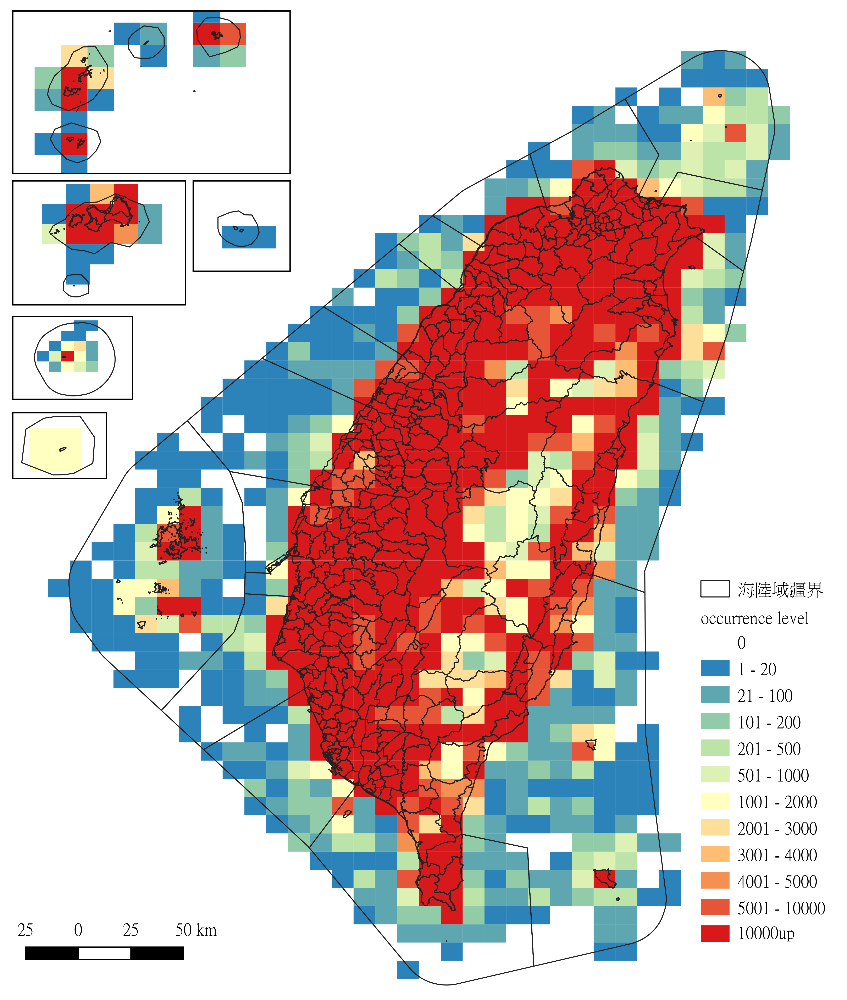
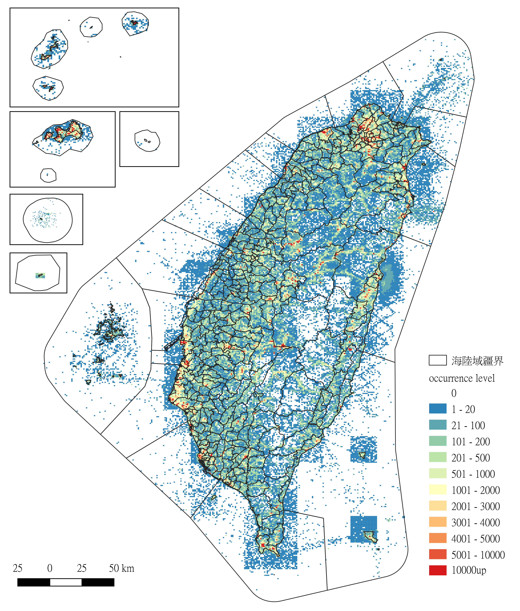
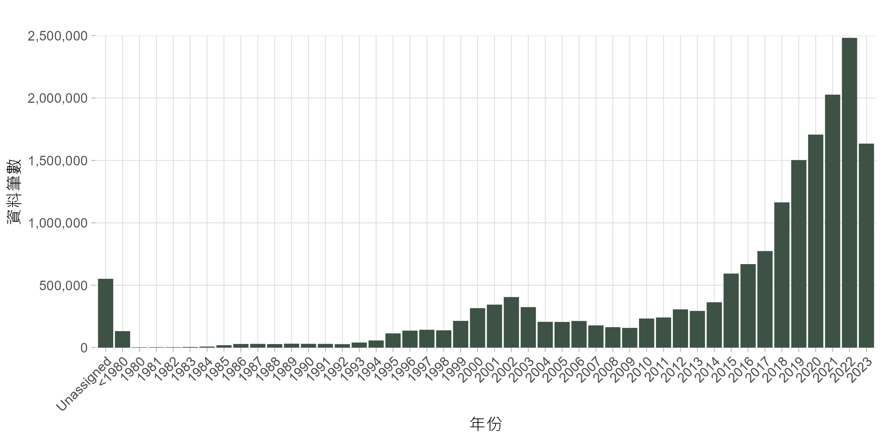
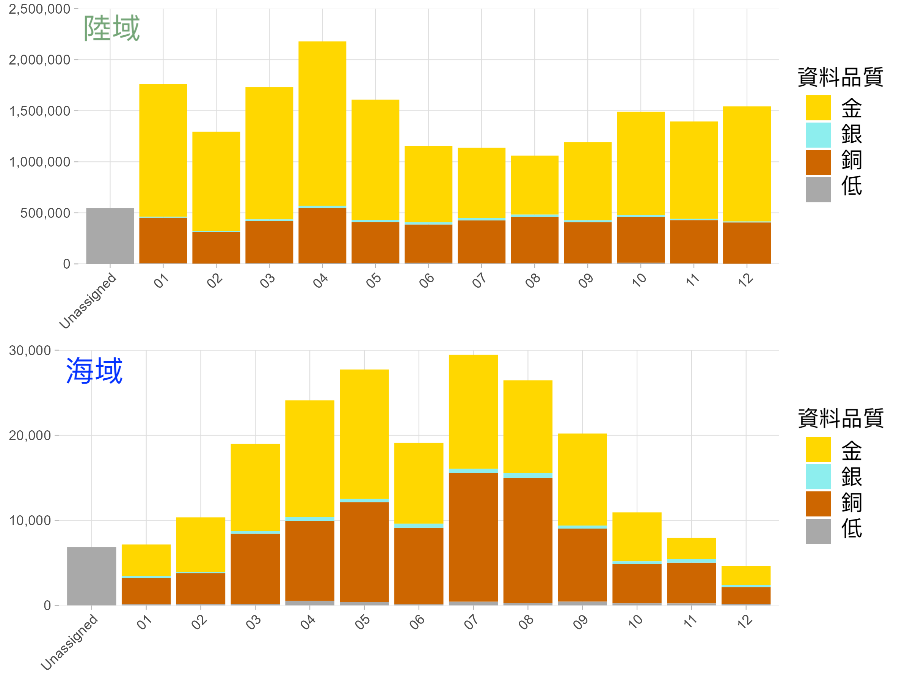
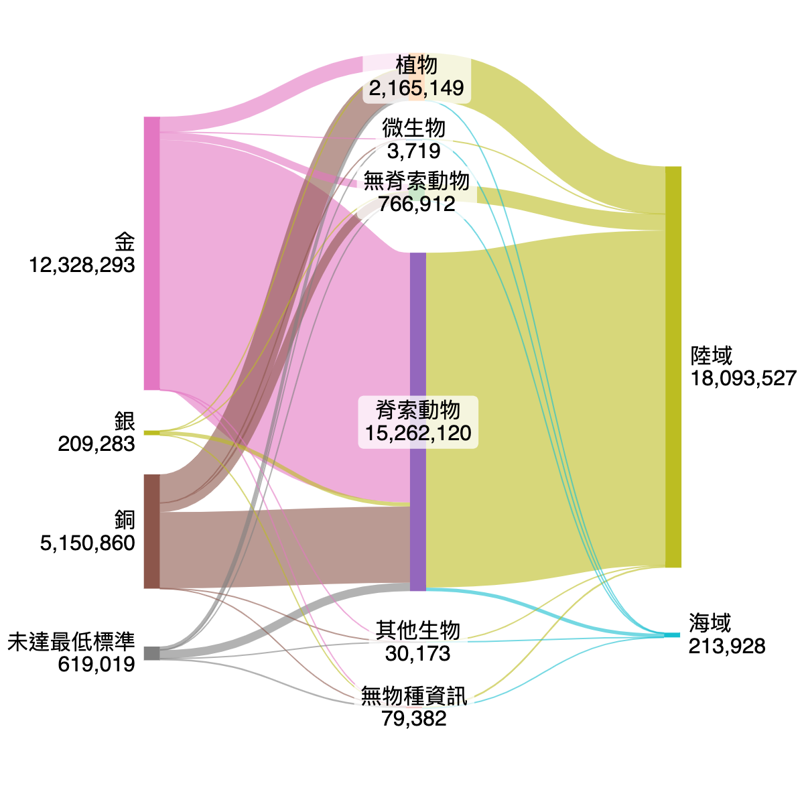
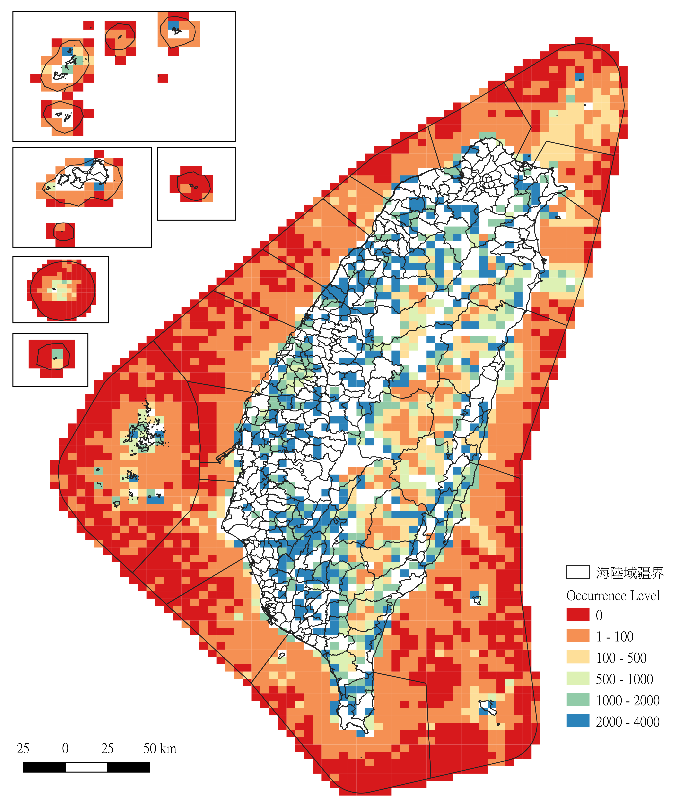
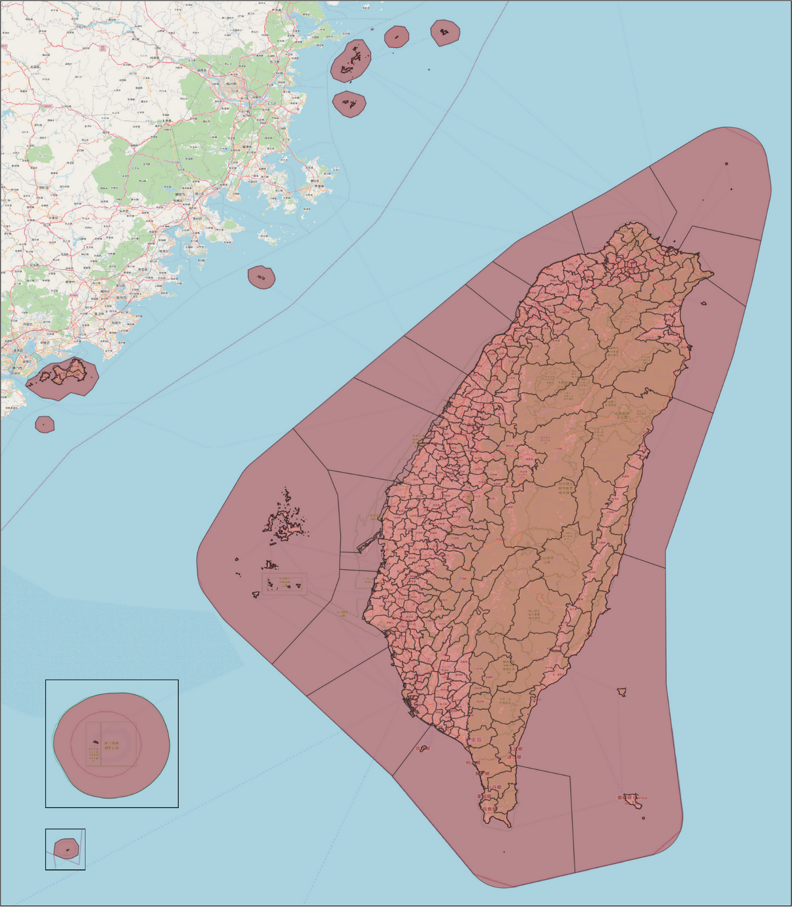
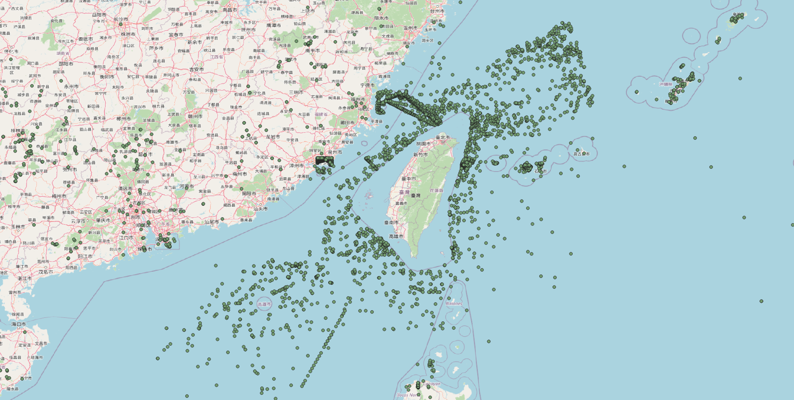

# TBIA資料空缺概況整理文件

何芷蔚 - daphnehohzhiwei[@]gmail.com | 吳俊毅 - jaredswu[@]gmail.com<br>
version {{ git.short_commit }}, {{ git.date.strftime('%Y-%m-%d %H:%M:%S%z') }}

~~TODO本文件亦有[PDF版本](我是超連結)。~~

<center>

</center>
<center>(｡･ω･｡)ﾉ 海鞘的空缺不需要填補。</center>

---
## 版權說明 Colophon
### 建議引用方式 Suggested Citation
何芷蔚、吳俊毅。2024。TBIA資料空缺概況整理文件。第一版。臺灣生物多樣性資訊聯盟：臺北。

### 作者 Authors
何芷蔚、吳俊毅

### 授權方式 Licence
本文件《TBIA資料空缺概況整理文件》採用 [創用CC 姓名標示-相同方式分享 4.0 國際 (CC BY-SA 4.0)](https://creativecommons.org/licenses/by-sa/4.0/deed.zh_TW)。

### 永久統一資源標籤 Persistent URI
本文件尚待建立此版本的永久統一資源標籤。

### 文件版本控制 Document Control
第 :one: 版，2024年2月。


---
## **前言 Preface**

### 摘要 Abstract
此文件為TBIA資料空缺工作小組討論、分析並呈現出TBIA入口網 **20231212版本** 整合資料的《TBIA資料空缺概況整理文件》。這次的資料概況與空缺分析包含了台灣陸地及海域範圍，希望可以為TBIA夥伴單位、其他資料產出與提供者給予填補資料空缺的指引方向。作者兼分析人員首先將資料做了敘述性統計，也歸類出不同品質層級的金、銀、銅與未達最低標準資料，希望在不同品質階層的資料下可以幫助思考未來資料應用的方向。資料空缺的部分主要呈現了台灣範圍內的空間、時間以及物種類群資料，也包括了海陸資料分布的概況。空間上，我們分別呈現了10、5與1公里網格的資料空缺，並產出了5公里網格的Google我的地圖以呈現建議優先填補的網格以及空缺網格的中間點座標表單。時間上，我們目前呈現了年與月份上的空缺，未來在填補的方向希望以月份為主。物種類群上，我們首先手動歸類出32大類群裡，資料量佔最多的排名，然後結合地型、月份以及資料品質的分析與圖表呈現當作資料填補方向的參考。讀者如有想要客製化針對某物種類群或某空間等資料做更詳細的分析以取得更符合您需求的資料空缺填補指引，歡迎直接聯繫本文件作者。


### 致謝 Acknowledgements
TBIA資料空缺工作小組團隊成員在2024年2月為此文件的第一版給出了修正建議。


---
## **1. 資料統計**
這個章節主要描述TBIA入口網裡，尤其是針對台灣範圍內的資料概況做了一些統計。

### 1.1 空間
此文件所使用的台灣陸地與海域範圍及網格包含了所有台灣縣市、離島東沙及太平島的海陸範圍（不包含釣魚台）。更多資訊請見附錄一。TBIA入口網裡也包含了不在台灣海陸範圍內的資料，分布圖請見附錄二。

#### 1.1.1 空間上的資料統計

**表一：TBIA入口網資料在空間上的分布筆數佔比**

| 座標在範圍 | 筆數  | %     |
|----------------|------------|-------|
| 台灣         | 18,307,455 | 93.99 |
| 台灣外     | 128,044    | 0.66  |
| 無座標點位資訊     | 1,041,906  | 5.35  |
| **Total**        | **19,477,405** | **100**   |

**表二：台灣範圍內的資料在地型上的分布筆數佔比**

| 地型 | 筆數  | %      |
|-----------|------------|--------|
| 陸域      | 18,093,527 | 98.83  |
| 海域       | 213,928    | 1.17   |
| **Total**     | **18,307,455** | **100**    |


#### 1.1.2 網格10km^2^空間資料分布概況
**圖一：網格10km^2^空間資料分布概況**

資料涵蓋：942 格至少一筆資料 / 1,142 網格數 (82.4%)
<br>10,000筆以上的佔了327格，都分布在陸地網格。

<br>
#### 1.1.3 網格5km^2^空間資料分布概況
**圖二：網格5km^2^空間資料分布概況**

資料涵蓋：3,129 格至少一筆資料 / 4,232 網格數 (73.9%)
<br>10,000筆以上的佔了385格。

<br>
#### 1.1.4 網格1km^2^空間資料分布概況 
**圖三：網格1km^2^空間資料分布概況**

資料涵蓋：
45,352格至少一筆資料 / 100,612 網格數 (45%)
<br>10,000筆以上的佔了275格。


!!!note
	以下分析以台灣海陸範圍資料為主


### 1.2 時間

#### 1.2.1 年度分布
Unassigned = 無年份資訊<br>
**圖四：台灣範圍資料年度分布**


**圖五：台灣範圍資料地型的年度分布**


<br>

#### 1.2.2 月份分布

**圖六：資料月份分布**


**圖七：資料在地型上的月份分布**


<br>

#### 1.2.3 月份與資料品質
**圖八：資料在地型上的月份與資料品質**



### 1.3 物種類群
我們目前先手動挑選了共32個[大類群](https://docs.google.com/spreadsheets/d/1kUkW5CF79zjJmXgb6fz7jGrt1A0JxzC-S1enRVK0bQU/edit?usp=sharing)，先統計出各類群的資料筆數和佔比。


#### 1.3.1 界與筆數統計
所有界階層在入口網裡都有資料，雖然古菌只有一筆。

**表三：界階層的資料筆數與佔比**

| 界             | 筆數      | %      |
|---------------|----------------|----------|
| 動物界        | 16,029,032     | 87.55    | 
| 植物界        | 2,165,149      | 11.83    | 
| NA（無物種資訊）| 79,382         | 0.43     | 
| 原藻界        | 21,909         | 0.12     | 
| 真菌界        | 8,264          | 0.05     | 
| 細菌界        | 3,193          | 0.02     |
| 原生生物界     | 525            | 0.003    |
| 古菌界			| 1 			| 0.000    |
| **Total**     | **18,307,455** | **100.00** |


#### 1.3.2 類群筆數統計

**表四：物種類群的資料筆數與佔比，從最高開始排序。**

| 界 | 類群   | 筆數        | %   |
|------------------|----------------|----------|--------|
| 動物界           | 鳥綱           | 13,560,337 | 74.07  |
| 植物界           | 被子植物       | 1,802,659  | 9.85   |
| 動物界           | 哺乳綱         | 754,737    | 4.12   |
| 動物界           | 兩生綱         | 669,157    | 3.66   |
| 動物界           | 鱗翅目         | 292,434    | 1.60   |
| 植物界           | 蕨類植物       | 288,221    | 1.57   |
| 動物界           | 其他昆蟲       | 242,495    | 1.32   |
| 動物界           | 其他動物       | 215,964    | 1.18   |
| NA（無物種資訊）  | NA（無物種資訊） | 79,382     | 0.43   |
| 動物界           | 軟甲綱         | 73,243     | 0.40   |
| 動物界           | 爬蟲綱         | 60,891     | 0.33   |
| 動物界           | 鞘翅目         | 51,969     | 0.28   |
| 動物界           | 腹足綱         | 44,017     | 0.24   |
| 動物界           | 蛛形綱         | 33,467     | 0.18   |
| 植物界           | 苔蘚植物       | 32,823     | 0.18   |
| 植物界           | 其他植物       | 23,154     | 0.13   |
| 原藻界           | 原藻界         | 21,909     | 0.12   |
| 植物界           | 裸子植物       | 10,930     | 0.06   |
| 動物界           | 雙殼綱         | 7,985      | 0.04   |
| 植物界           | 藻類植物       | 7,362      | 0.04   |
| 動物界           | 其他節肢動物   | 7,201      | 0.04   |
| 動物界           | 魚類           | 5,940      | 0.03   |
| 真菌界           | 子囊菌門       | 4,882      | 0.03   |
| 動物界           | 棘皮動物門     | 4,018      | 0.02   |
| 真菌界           | 擔子菌門       | 3,249      | 0.02   |
| 古菌與細菌界     | 古菌與細菌界   | 3,194      | 0.02   |
| 動物界           | 刺胞動物門     | 2,809      | 0.02   |
| 動物界           | 其他脊索動物   | 1,394      | 0.01   |
| 原生生物界       | 原生生物界     | 525        | 0.00   |
| 動物界           | 投足綱         | 416        | 0.00   |
| 真菌界           | 其他真菌       | 133        | 0.00   |
|                  | **Total**      | **18,307,455** | **100.00** |

#### 1.3.3 類群在海陸的分布統計

**表五：類群在海陸地型的資料筆數與佔比**

| ==陸地== 類群   | 筆數    | %   | ==海域== 類群   | 筆數    | %   |
|------------|-------------|---------|------------|-------------|---------|
| 鳥綱       | 13,472,102  | 74.46   | 鳥綱       | 88,235      | 41.25   |
| 被子植物   | 1,782,555   | 9.85    | 其他動物   | 58,064      | 27.14   |
| 哺乳綱     | 743,248     | 4.11    | 被子植物   | 20,104      | 9.40    |
| 兩生綱     | 668,802     | 3.70    | 哺乳綱     | 11,489      | 5.37    |
| 鱗翅目     | 291,283     | 1.61    | 軟甲綱     | 6,278       | 2.93    |
| 蕨類植物   | 286,808     | 1.59    | 腹足綱     | 5,041       | 2.36    |
| 其他昆蟲   | 241,215     | 1.33    | NA（無物種資訊）| 3,629       | 1.70    |
| 其他動物   | 157,900     | 0.87    | 棘皮動物門 | 2,805       | 1.31    |
| NA（無物種資訊）    | 75,753      | 0.42    | 魚類       | 2,627       | 1.23    |
| 軟甲綱     | 66,965      | 0.37    | 其他節肢動物| 2,622      | 1.23    |
| 爬蟲綱     | 59,202      | 0.33    | 雙殼綱     | 2,163       | 1.01    |
| 鞘翅目     | 51,710      | 0.29    | 爬蟲綱     | 1,689       | 0.79    |
| 腹足綱     | 38,976      | 0.22    | 原藻界     | 1,479       | 0.69    |
| 蛛形綱     | 33,307      | 0.18    | 蕨類植物   | 1,413       | 0.66    |
| 苔蘚植物   | 32,297      | 0.18    | 其他昆蟲   | 1,280       | 0.60    |
| 其他植物   | 23,113      | 0.13    | 鱗翅目     | 1,151       | 0.54    |
| 原藻界     | 20,430      | 0.11    | 刺胞動物門 | 1,036       | 0.48    |
| 裸子植物   | 10,901      | 0.06    | 藻類植物   | 790         | 0.37    |
| 藻類植物   | 6,572       | 0.04    | 苔蘚植物   | 526         | 0.25    |
| 雙殼綱     | 5,822       | 0.03    | 兩生綱     | 355         | 0.17    |
| 子囊菌門   | 4,869       | 0.03    | 投足綱     | 260         | 0.12    |
| 其他節肢動物| 4,579       | 0.03    | 鞘翅目     | 259         | 0.12    |
| 魚類       | 3,313       | 0.02    | 其他軟體動物| 168        | 0.08    |
| 擔子菌門   | 3,182       | 0.02    | 蛛形綱     | 160         | 0.07    |
| 古菌與細菌界| 3,080       | 0.02    | 古菌與細菌界| 114         | 0.05    |
| 刺胞動物門 | 1,773       | 0.01    | 擔子菌門   | 67          | 0.03    |
| 其他脊索動物| 1,394       | 0.01    | 其他植物   | 41          | 0.02    |
| 棘皮動物門 | 1,213       | 0.01    | 原生生物界 | 41          | 0.02    |
| 原生生物界 | 484         | 0.003   | 裸子植物   | 29          | 0.01    |
| 其他軟體動物| 390         | 0.002   | 子囊菌門   | 13          | 0.01    |
| 投足綱     | 156         | 0.001   |            |             |         |
| 其他真菌   | 133         | 0.001   |            |             |         |
| ==**陸域 Total**== | **18,093,527**  | **100.00**  | ==**海域 Total**==  | **213,928** | **100.00** |


### 1.4 資料品質
資料應用的過程中會因不同品質等級的資料而影響其適用性。為了呈現出入口網現有的資料品質，我們將資料根據條件歸類出不同品質層級，包括金、銀、銅與未達最低標準資料。表三為資料品質標準定義與該資料筆數。

#### 1.4.1 資料品質定義

**表六：資料品質標準定義與資料筆數**

| 資料品質定義 | TBIA所有資料 | 台灣範圍內資料 | 台灣陸地 | 台灣海域 |
|--------------|--------------|----------------|---------|---------|
| ==**未達最低標準**== | 1,684,097 (8.65%) | 619,019 (3.38%) | 608,851 (3.36%) | 10,168 (4.75%) |
| ==**銅**== —「最低標準」要有： <br>● scientificName<br>● latitude + longitude<br>● year | 5,233,438 (26.87%) | 5,150,860 (28.14%) | 5,055,979 (27.94%) | 94,881 (44.4%) |
| ==**銀**== — 要有：<br>● scientificName<br>● latitude + longitude<br>● year<br>● coordinatesUncertaintyInMeters / coordinatePrecision 其一 | 209,756 (1.14%) | 209,283 (1.14%) | 204,794 (1.13%) | 4,489 (2.1%) |
| ==**金**== —「好資料」要有： <br>● scientificName<br>● latitude + longitude<br>● year + month<br>● coordinatesUncertaintyInMeters / coordinatePrecision 其一<br>● basisOfRecord | 12,350,114 (67.34%) | 12,328,293 (67.34%) | 12,223,903 (67.56%) | 104,390 (48.8%) |

```
以上所挑選的資料標準說明：

- scientificName: 學名
- latitude + longitude: 標準化（或標準化未模糊化）緯、經度，從standard(Raw)Latitude與standard(Raw)Longitude取得
- year: 年份，從standardDate取得
- month: 月份，從standardDate取得
- coordinatesUncertaintyInMeters: 座標誤差（公尺）
- coordinatePrecision: 座標模糊化程度
- basisOfRecord: 紀錄類型
```

#### 1.4.2 資料品質與類群筆數佔比
**圖九：資料品質、類群與地型筆數佔比**
{:width="500px"}

#### 1.4.3 資料品質與類群
**圖十：資料品質與前六大資料量的物種類群筆數佔比**

先挑選前六大資料量的物種類群來比較品質，看除了鳥類以外有沒有別的類群也有不錯的品質適合應用？

- 植物類大多都在bronze，i.e. 少了 coordinatesUncertaintyInMeters / coordinatePrecision 資料
- 哺乳、兩生、鱗翅目類接近一半都有gold，好像還不錯？


## 1.5 其他資料統計

**圖十一：記錄類型與其資料品質**
{:width="500px"}

**圖十二：資料量前六大物種類群在月份上的分布**


## **2. 空缺填補指引**
### 2.1 空間上的資料空缺
此文件先優先專注於空間上的空缺，列出無資料與資料筆數少於平均值的5km^2^網格。提供大家作為未來調查方向的參考。平均值的計算方法為，台灣目前1,800萬筆觀測紀錄平均分布於5km^2^網格，每一格則需要有4,000筆以上的觀測紀錄。目前低於4,000筆觀測紀錄的網格總共3,451格，作為優先填補的方向參考。

**圖十三：TBIA入口網在5公里網格空間上的資料空缺。紅色網格表示0筆資料，建議優先做資料填補。白色網格為資料量高於觀測紀錄平均值4,000筆。**



### 2.2 其他建議

bronze to gold difficult
silver to gold easy


٩(˃̶͈̀௰˂̶͈́)و 空缺龍填起來！

---
## **附錄一：此文件中所使用的台灣圖層介紹**
● 我們將以下兩個圖層進行套疊，分出皆有縣市區域資訊的polygon：

1. 台灣海域範圍圖層(來源：[內政部海域資訊整合平台所頒佈之限制水域範圍](https://ocean.moi.gov.tw/Map/Achievement/LayerInfo/905))
2. 台灣陸域範圍圖層(來源：@junyi）

	| 地型 | 總平方公里(km²) |
	|------------|----|
	| 陸 | 36,853 | 
	| 海 | 56,015 |
	| **Total**  | **92,868** |

{:width="500px"}

● @junyi 我們將 ... WGS84 1、5、10km^2^網格
計算方式採用[紅鳩的TWGrid-WGS84](https://github.com/RedbirdTaiwan/TWGrid-WGS84)

- 起始經緯度：(116,20)
- 繪製經緯度範圍 (104,10) - (124, 26°40')
- 網格單位：
	- 經度6分, 緯度5分（~10x10km網格）
	- 經度3分, 緯度2分30秒（~5x5km網格）
	- 經度36秒, 緯度30秒（~1x1km網格）
- 網格數：
	- ~10km；共1,142格
	- ~5km；共4,232格
	- ~1km；共100,612格

網格分布在台灣疆界內示意圖。藍、紫與黃色分別代表10、5與1平方公里網格：
{:width="500px"}

上圖放大版，右上為一部分的澎湖縣：
{:width="500px"}


## **附錄二：TBIA入口網在台灣海陸範圍外的資料分布**
TBIA入口網在全球的資料分布：

TBIA入口網在台灣周圍與疆界外的資料分布：



---
## **封面圖片**
海鞘（*Clavelina sp.*)，臺東縣綠島鄉，臺灣。2021年djscho在[iNaturalist](https://www.inaturalist.org/observations/74609623)的紀錄，採用[CC BY 4.0](https://creativecommons.org/licenses/by/4.0/)授權。