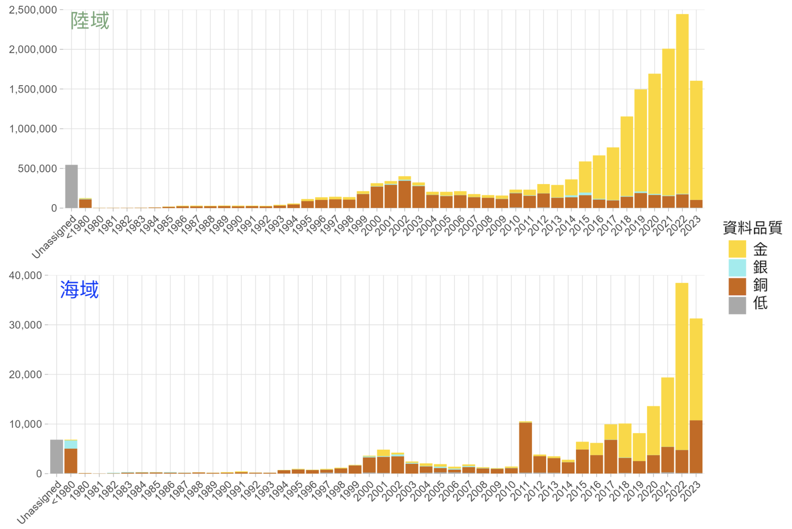
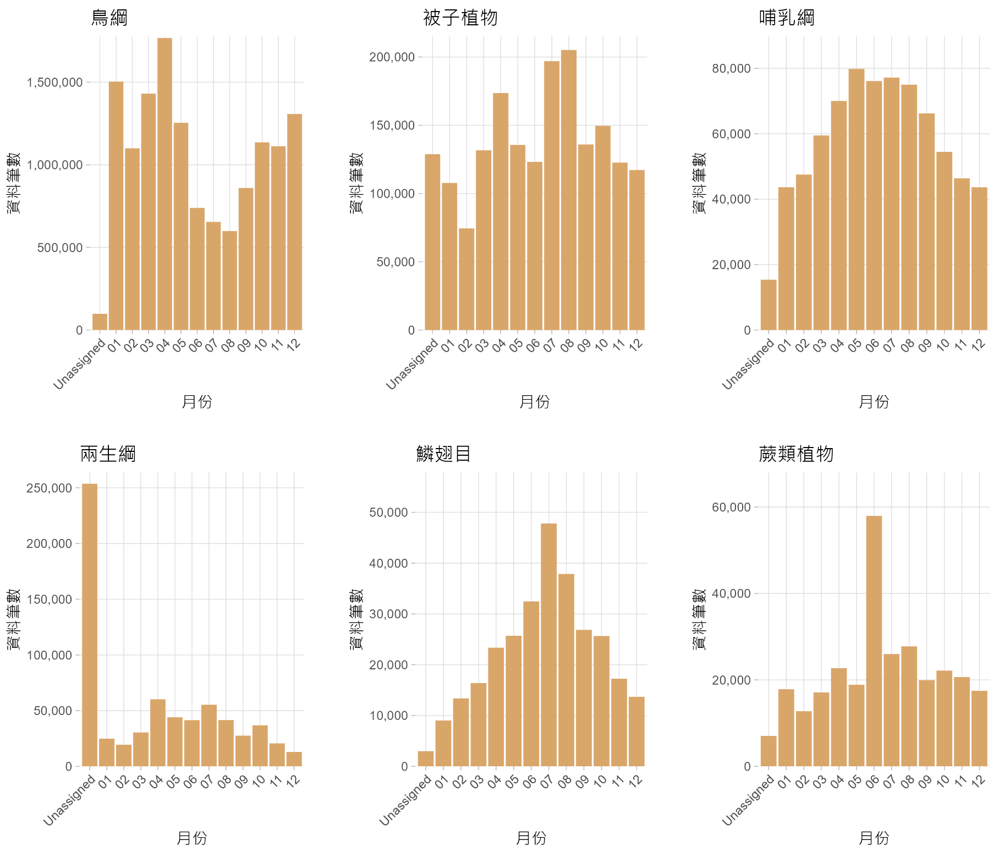

# TBIA資料空缺概況整理文件

何芷蔚 Daphne Hoh - daphnehohzhiwei[@]gmail.com | 吳俊毅 Jun-yi Wu - jaredswu[@]gmail.com 
version {{ git.short_commit }}, {{ git.date.strftime('%Y-%m-%d %H:%M:%S%z') }}

---
## 版權說明 Colophon
### 建議引用方式 Suggested Citation
何芷蔚、吳俊毅。2024。TBIA資料空缺概況整理文件。第一版。臺灣生物多樣性資訊聯盟：臺北。

### 作者 Authors
何芷蔚、吳俊毅

### 授權方式 Licence
本文件《TBIA資料空缺概況整理文件》採用[創用CC姓名標示-相同方式分享4.0國際(CC BY-SA 4.0)](https://creativecommons.org/licenses/by-sa/4.0/deed.zh_TW)。

### 永久統一資源標籤 Persistent URI
本文件尚待建立此版本的永久統一資源標籤。

### 文件版本控制 Document Control
第一版，2024年2月。

---
## **前言 Preface**

### 摘要 Abstract
此文件為臺灣生物多樣性資訊聯盟（以下簡稱TBIA）資料空缺工作小組討論、分析並呈現出TBIA入口網**20231212版本**整合資料的《TBIA資料空缺概況整理文件》。本資料概況與空缺分析包含了台灣陸地及海域範圍，提供TBIA夥伴單位和其他資料產出、提供者，填補資料空缺的方向。我們首先將資料做了空間、時間與分類群的敘述性統計，同時將資料歸類出金、銀、銅與未達最低標準，4個資料品質層級，呈現不同品質階層的資料量。資料空缺的部分主要呈現了台灣範圍內的空間、時間以及物種類群資料，也包括了海域、陸域資料分布的概況。空間上，我們分別呈現了10x10公里、5x5公里與1x1公里，3個不同空間解析度的網格資料空缺。同時，我們列出需要優先填補的5x5公里網格，匯入Google我的地圖，同時產生這些網格的中心點位經緯度座標，提供實際填補資料空缺的輔助資訊。時間上，我們目前呈現了年份與月份上的空缺，時間空缺填補的方向建議以月份為主。物種類群上，我們歸類出32個生物類群，依據資料量排名，然後結合海陸域、月份以及資料品質的分析，同時用圖表呈現當作資料填補方向的參考。

### 致謝 Acknowledgements
TBIA資料空缺工作小組團隊成員、TaiBIF團隊成員在2024年2月為此文件的第一版給出了修正建議。TaiCOL資料管理人蔡思怡和TaiBIF工程師張筑竣提供在物種類群上的協助。

---
## **1\. 方法流程**
**資料來源：** 
我們使用[TBIA入口網](https://tbiadata.tw/)裡**20231212版本**，含去模糊化敏感資料的整合資料。

**資料清理：** 
資料清理皆使用R（版本4.3.2）進行操作。

1. 移除重複資料： 
我們檢視來自不同資料發布單位且擁有相同資料集名稱的資料集，找出了共4個重複資料集。我們手動保留了擁有較多資料筆數的資料集，且移除了共731筆重複資料（重複資料已在後續入口網資料的更新版本（即20231212之後）做了移除）。

2. 時間： 
為了簡化年月份在資料視覺化上的呈現，我們將1980年之前與無年或月份的資料分別歸類成 “<1980” 與 “Unassigned”。

3. 物種類群分類： 
為了簡化物種類群在資料視覺化上的呈現，我們總共歸類出32大類群，類群分類請看（附錄一）。

4. 結合座標點位資訊： 
敏感資料在座標上有著不同程度的模糊化。為了利於後續資料空缺概況的分析與呈現，我們將資料的座標欄位進行合併。在敏感資料上，我們使用該原始座標點位standardRawLatitude和standardRawLongitude，與非敏感資料的standardLatitude和standardLongitude進行合併，生成latitude和longitude欄位給後續分析使用。

**資料品質定義：** 
我們將資料依特定欄位的有無條件來歸類出金(gold)、銀(silver)、銅(bronze)與未達最低標準(low)的品質層級，來檢視入口網裡的資料，作為未來資料應用前的參考。我們針對各品質層級的資料與在海陸域上的分布、各大物種類群、年月份與記錄類型做了敘述性統計。我們定義的標準如下：

「**金**」— 定義為“好”的資料必須要有： 
scientificName、latitude、longitude、year、month、coordinatesUncertaintyInMeters / coordinatePrecision 其一，以及 basisOfRecord。

「**銀**」— 要有： 
scientificName、latitude、longitude、year 和 coordinatesUncertaintyInMeters / coordinatePrecision 其一。

「**銅**」— 最低標準，要有： 
scientificName、latitude、longitude 和 year。

以及「**未達最低標準**」。

以上所挑選的資料欄位說明：
>
	scientificName: 學名
	latitude & longitude: 模糊（敏感資料）與未模糊化緯、經度，從standard(Raw)Latitude與standard(Raw)Longitude取得
	year: 年份，從standardDate取得
	month: 月份，從standardDate取得
	coordinatesUncertaintyInMeters: 座標誤差（公尺）
	coordinatePrecision: 座標模糊化程度
	basisOfRecord: 紀錄類型

**網格生成：** 
為了建立一個統一標準的網格系統，我們套疊出臺灣海域和陸域的行政區範圍圖層（後續簡稱為台灣疆界網格），並在此圖層上生成出空間位置統一的網格以便後續分析。我們所使用的臺灣陸域行政區範圍圖層來自台灣政府開放資料平臺上的[鄉鎮市區界線](https://data.gov.tw/dataset/7441)圖層作為陸域範圍，而海域範圍圖層來自多維度海域資訊服務平臺所頒佈之[限制水域範圍](https://ocean.moi.gov.tw/Map/Achievement/LayerInfo/905)。使用QGIS（版本3.28.9）將兩個圖層進行套疊後（附錄二），我們按照並參考吳世鴻副研究員[TWGrid-WGS84](https://github.com/RedbirdTaiwan/TWGrid-WGS84)台灣經緯網格系統的製作方法，製作出三種尺度（大小分別為 10x10km、5x5km、1x1km）的網格範圍（台灣疆界網格示意圖請見附錄三、四）。網格生成的起始經緯度是 (116,20)，所繪製的經緯度範圍從 (104,10) 至 (124, 26°40')。網格的單位則是經度6分，緯度5分（產出～10x10km網格）、經度3分，緯度2分30秒（產出～5x5km網格）、以及經度36秒，緯度30秒（產出～1x1km網格），個別佔了1,142、4,232以及100,612網格數。以網格範圍來做計算，台灣海域與陸地各佔了36,853與56,015平方公里（km²）。此文件最後產出的臺灣陸地與海域範圍及網格包含了所有台灣縣市、離島東沙及太平島的海陸範圍（不包含釣魚台）。

**觀測紀錄與空間的對應：** 
我們將資料按照latitude與longitude欄位與圖層做對應，分別計算了臺灣海、陸域範圍內與外的資料筆數以及三種尺度網格的觀測紀錄分布情況。針對資料在三種尺度的網格上的對應，我們也計算了每個網格內的觀測紀錄數量並生成了數量化網格圖。上述的觀測紀錄資料空間對應操作均使用R（版本4.1.3）進行資料處理；視覺化部分則使用QGIS（版本3.28.9）進行網格分色和地圖繪製。

**資料空缺：** 
我們以5x5km網格圖層挑選出觀測紀錄數量低於4000筆的網格，將其視為空間上的資料空缺。TBIA在臺灣海陸域範圍內的觀測紀錄筆數接近1,800萬筆，假設這些資料均勻分布在臺灣的5x5km網格內，那麼一個網格應該至少有4,000筆的觀測紀錄。因此，我們挑選了觀測紀錄數量低於4000筆以及沒有任何觀測紀錄的網格作為建議優先填補的網格，並標示出建議填補優先順序的分級。沒有資料的網格已標示為最優先填補的網格，其餘網格則按觀測紀錄數量從少到多進行分級。

**文件公開：** 
此文件中所使用的入口網20231212版本資料因包含去模糊化敏感資料，所以不開放下載。若有興趣使用此資料請洽[TBIA秘書處](mailto:tbianoti@gmail.com)。我們已將此次分析所使用的R程式碼與此分析中所生成的圖與圖層開放在[GitHub](https://github.com/daphnehoh/TBIA-dataReview20231212)中。

我們將資料在空間上的空缺填補指引以[我的Google地圖](https://www.google.com/maps/d/embed?mid=14Jc2whR7JVU-EqFHqSGaed-EksSxFGs&ehbc=2E312F)和優先填補網格中中間點經緯度座標點位輸出成[CSV表](../assets/gap/data_gap_5km_centerpoint.csv)的方式呈現，提供大家直接在安排調查時做瀏覽與參考。

## **2\. 資料統計**
這個章節主要描述TBIA入口網裡**20231212版本**的整合資料，尤其是針對台灣範圍內的資料概況做了一些敘述性統計。

### 2.1 空間
此文件所使用的台灣陸地與海域範圍及網格包含了所有台灣縣市、離島東沙及太平島的海陸範圍（不包含釣魚台；附錄二）。TBIA入口網裡也包含了不在台灣海陸範圍內的資料，分布圖請見附錄五。

#### 2.1.1 空間上的資料統計

**表一：TBIA入口網資料在空間範圍資料筆數百分比**

| 座標在範圍 | 筆數  | %     |
|----------------|------------|-------|
| 台灣         | 18,307,455 | 93.99 |
| 台灣外     | 128,044    | 0.66  |
| 無座標點位資訊     | 1,041,906  | 5.35  |
| **Total**        | **19,477,405** | **100**   |

**表二：台灣範圍內的資料在海陸域資料筆數百分比**

| 地型 | 筆數  | %      |
|-----------|------------|--------|
| 陸域      | 18,093,527 | 98.83  |
| 海域       | 213,928    | 1.17   |
| **Total**     | **18,307,455** | **100**    |

#### 2.1.2 網格10km^2^空間資料分布概況
**圖一：網格10km^2^空間資料分布概況**

資料涵蓋：942 格至少一筆資料 / 1,142 總網格數 (82.4%)
 10,000筆以上的佔了327格，都分布在陸地網格。

 
#### 2.1.3 網格5km^2^空間資料分布概況
**圖二：網格5km^2^空間資料分布概況**

資料涵蓋：3,129 格至少一筆資料 / 4,232 總網格數 (73.9%)
 10,000筆以上的佔了385格。

 
#### 2.1.4 網格1km^2^空間資料分布概況 
**圖三：網格1km^2^空間資料分布概況**

資料涵蓋：
45,352格至少一筆資料 / 100,612 總網格數 (45%)
 10,000筆以上的佔了275格。

!!!note
	以下分析以台灣海陸範圍資料為主（表二）

### 2.2 時間

#### 2.2.1 年度分布
**圖四：台灣範圍資料年度分布**

**圖五：台灣範圍資料海陸域的年度分布**

 

#### 2.2.2 月份分布

**圖六：資料月份分布**

**圖七：資料在海陸域的月份分布**

### 2.3 物種類群
我們目前先手動挑選了共32個[類群](https://docs.google.com/spreadsheets/d/1kUkW5CF79zjJmXgb6fz7jGrt1A0JxzC-S1enRVK0bQU/edit?usp=sharing)，先統計出各類群的資料筆數和百分比。

#### 2.3.1 界與筆數統計
所有界階層在入口網裡都有資料，雖然古菌界只有一筆。

**表三：界階層的資料筆數與佔比**

| 界             | 筆數      | %      |
|---------------|----------------|----------|
| 動物界        | 16,029,032     | 87.55    | 
| 植物界        | 2,165,149      | 11.83    | 
| NA（無物種資訊）| 79,382         | 0.43     | 
| 原藻界        | 21,909         | 0.12     | 
| 真菌界        | 8,264          | 0.05     | 
| 細菌界        | 3,193          | 0.02     |
| 原生生物界     | 525            | 0.003    |
| 古菌界			| 1 			| 0.000    |
| **Total**     | **18,307,455** | **100.00** |

#### 2.3.2 類群筆數統計

**表四：物種類群的資料筆數與百分比，從最高開始排序。**

| 界 | 類群   | 筆數        | %   |
|------------------|----------------|----------|--------|
| 動物界           | 鳥綱           | 13,560,337 | 74.07  |
| 植物界           | 被子植物       | 1,802,659  | 9.85   |
| 動物界           | 哺乳綱         | 754,737    | 4.12   |
| 動物界           | 兩生綱         | 669,157    | 3.66   |
| 動物界           | 鱗翅目         | 292,434    | 1.60   |
| 植物界           | 蕨類植物       | 288,221    | 1.57   |
| 動物界           | 其他昆蟲       | 242,495    | 1.32   |
| 動物界           | 其他動物       | 215,964    | 1.18   |
| NA（無物種資訊）  | NA（無物種資訊） | 79,382     | 0.43   |
| 動物界           | 軟甲綱         | 73,243     | 0.40   |
| 動物界           | 爬蟲綱         | 60,891     | 0.33   |
| 動物界           | 鞘翅目         | 51,969     | 0.28   |
| 動物界           | 腹足綱         | 44,017     | 0.24   |
| 動物界           | 蛛形綱         | 33,467     | 0.18   |
| 植物界           | 苔蘚植物       | 32,823     | 0.18   |
| 植物界           | 其他植物       | 23,154     | 0.13   |
| 原藻界           | 原藻界         | 21,909     | 0.12   |
| 植物界           | 裸子植物       | 10,930     | 0.06   |
| 動物界           | 雙殼綱         | 7,985      | 0.04   |
| 植物界           | 藻類植物       | 7,362      | 0.04   |
| 動物界           | 其他節肢動物   | 7,201      | 0.04   |
| 動物界           | 魚類           | 5,940      | 0.03   |
| 真菌界           | 子囊菌門       | 4,882      | 0.03   |
| 動物界           | 棘皮動物門     | 4,018      | 0.02   |
| 真菌界           | 擔子菌門       | 3,249      | 0.02   |
| 古菌與細菌界     | 古菌與細菌界   | 3,194      | 0.02   |
| 動物界           | 刺胞動物門     | 2,809      | 0.02   |
| 動物界           | 其他脊索動物   | 1,394      | 0.01   |
| 原生生物界       | 原生生物界     | 525        | 0.00   |
| 動物界           | 投足綱         | 416        | 0.00   |
| 真菌界           | 其他真菌       | 133        | 0.00   |
|                  | **Total**      | **18,307,455** | **100.00** |

#### 2.3.3 類群在海陸的分布統計

**表五：類群在海陸域資料筆數與百分比**

| ==陸地== 類群   | 筆數    | %   | ==海域== 類群   | 筆數    | %   |
|------------|-------------|---------|------------|-------------|---------|
| 鳥綱       | 13,472,102  | 74.46   | 鳥綱       | 88,235      | 41.25   |
| 被子植物   | 1,782,555   | 9.85    | 其他動物   | 58,064      | 27.14   |
| 哺乳綱     | 743,248     | 4.11    | 被子植物   | 20,104      | 9.40    |
| 兩生綱     | 668,802     | 3.70    | 哺乳綱     | 11,489      | 5.37    |
| 鱗翅目     | 291,283     | 1.61    | 軟甲綱     | 6,278       | 2.93    |
| 蕨類植物   | 286,808     | 1.59    | 腹足綱     | 5,041       | 2.36    |
| 其他昆蟲   | 241,215     | 1.33    | NA（無物種資訊）| 3,629       | 1.70    |
| 其他動物   | 157,900     | 0.87    | 棘皮動物門 | 2,805       | 1.31    |
| NA（無物種資訊）    | 75,753      | 0.42    | 魚類       | 2,627       | 1.23    |
| 軟甲綱     | 66,965      | 0.37    | 其他節肢動物| 2,622      | 1.23    |
| 爬蟲綱     | 59,202      | 0.33    | 雙殼綱     | 2,163       | 1.01    |
| 鞘翅目     | 51,710      | 0.29    | 爬蟲綱     | 1,689       | 0.79    |
| 腹足綱     | 38,976      | 0.22    | 原藻界     | 1,479       | 0.69    |
| 蛛形綱     | 33,307      | 0.18    | 蕨類植物   | 1,413       | 0.66    |
| 苔蘚植物   | 32,297      | 0.18    | 其他昆蟲   | 1,280       | 0.60    |
| 其他植物   | 23,113      | 0.13    | 鱗翅目     | 1,151       | 0.54    |
| 原藻界     | 20,430      | 0.11    | 刺胞動物門 | 1,036       | 0.48    |
| 裸子植物   | 10,901      | 0.06    | 藻類植物   | 790         | 0.37    |
| 藻類植物   | 6,572       | 0.04    | 苔蘚植物   | 526         | 0.25    |
| 雙殼綱     | 5,822       | 0.03    | 兩生綱     | 355         | 0.17    |
| 子囊菌門   | 4,869       | 0.03    | 投足綱     | 260         | 0.12    |
| 其他節肢動物| 4,579       | 0.03    | 鞘翅目     | 259         | 0.12    |
| 魚類       | 3,313       | 0.02    | 其他軟體動物| 168        | 0.08    |
| 擔子菌門   | 3,182       | 0.02    | 蛛形綱     | 160         | 0.07    |
| 古菌與細菌界| 3,080       | 0.02    | 古菌與細菌界| 114         | 0.05    |
| 刺胞動物門 | 1,773       | 0.01    | 擔子菌門   | 67          | 0.03    |
| 其他脊索動物| 1,394       | 0.01    | 其他植物   | 41          | 0.02    |
| 棘皮動物門 | 1,213       | 0.01    | 原生生物界 | 41          | 0.02    |
| 原生生物界 | 484         | 0.003   | 裸子植物   | 29          | 0.01    |
| 其他軟體動物| 390         | 0.002   | 子囊菌門   | 13          | 0.01    |
| 投足綱     | 156         | 0.001   |            |             |         |
| 其他真菌   | 133         | 0.001   |            |             |         |
| ==**陸域 Total**== | **18,093,527**  | **100.00**  | ==**海域 Total**==  | **213,928** | **100.00** |

### 2.4 資料品質
資料應用的過程中會因不同品質等級的資料而影響其適用性。為了呈現出入口網現有的資料品質，我們將資料根據條件歸類出不同品質層級，包括金、銀、銅與未達最低標準資料。表六為資料品質標準定義與該資料筆數。

#### 2.4.1 資料品質定義

**表六：資料品質標準定義與資料筆數**

| 資料品質定義 | TBIA所有資料 | 台灣範圍內資料 | 台灣陸地 | 台灣海域 |
|--------------|--------------|----------------|---------|---------|
| ==**金(gold)**== —「好資料」要有：  ● scientificName ● latitude + longitude ● year + month ● coordinatesUncertaintyInMeters / coordinatePrecision 其一 ● basisOfRecord | 12,350,114 (67.34%) | 12,328,293 (67.34%) | 12,223,903 (67.56%) | 104,390 (48.8%) |
| ==**銀(silver)**== — 要有： ● scientificName ● latitude + longitude ● year ● coordinatesUncertaintyInMeters / coordinatePrecision 其一 | 209,756 (1.14%) | 209,283 (1.14%) | 204,794 (1.13%) | 4,489 (2.1%) |
| ==**銅(bronze)**== —「最低標準」要有：  ● scientificName ● latitude + longitude ● year | 5,233,438 (26.87%) | 5,150,860 (28.14%) | 5,055,979 (27.94%) | 94,881 (44.4%) |
| ==**未達最低標準(low)**== | 1,684,097 (8.65%) | 619,019 (3.38%) | 608,851 (3.36%) | 10,168 (4.75%) |

#### 2.4.2 資料品質與年份筆數百分比
**圖八：資料在海陸域的年份與資料品質**

 

#### 2.4.3 資料品質與月份筆數百分比
**圖九：資料在海陸域的月份與資料品質**

 

#### 2.4.4 資料品質與類群筆數百分比
**圖十：資料品質、類群與海陸域筆數百分比**
{:width="500px"}
 

#### 2.4.5 資料品質與類群
**圖十一：資料品質與前六大資料量的物種類群筆數百分比**

### 2.5 其他資料統計
**圖十二：記錄類型與其資料品質** 
{:width="500px"}
 

**圖十三：資料量前6名的物種類群在月份上的分布**

## **3\. 空缺填補指引**
### 3.1 空間上的資料空缺
TBIA在台灣境內的資料筆數接近1,800萬筆觀測紀錄，假設這些資料平均分布於台灣的5x5km網格內，則一個網格應該要有4,000筆的觀測紀錄。此網格地圖，列出資料筆數未達4,000筆觀測紀錄的網格總共3,451格，作為優先填補的方向參考。
 

**圖十四：TBIA入口網在5公里網格空間上的資料空缺。紅色網格表示0筆資料，建議優先做資料填補。白色網格為資料量高於觀測紀錄平均值4,000筆。**

 

我們以上圖資訊準備了[我的Google地圖](https://www.google.com/maps/d/embed?mid=14Jc2whR7JVU-EqFHqSGaed-EksSxFGs&ehbc=2E312F)，也在這些優先填補網格中中間點經緯度座標點位輸出成[CSV表](../assets/gap/data_gap_5km_centerpoint.csv)，方便大家直接在安排調查時做瀏覽與參考。

<iframe src="https://www.google.com/maps/d/embed?mid=14Jc2whR7JVU-EqFHqSGaed-EksSxFGs&ehbc=2E312F" width="800" height="800"></iframe>

### 3.1.1 空間空缺資訊實際應用方式
* 至我的地圖網頁下載KML檔，並匯入其他離線地圖的APP。
* 下載座標點位[CSV](../assets/gap/data_gap_5km_centerpoint.csv)。
* 將我的地圖匯入Google Map。操作方式，請見[使用 Google 地圖查看「我的地圖」](https://support.google.com/maps/answer/3045850?hl=zh-Hant&co=GENIE.Platform%3DiOS&oco=2)。

### 3.2 其他建議
這次的資料空缺填補如上面所說的，我們優先專注於填補5公里網格空間上的資料空缺。不過在各方面資料概況的圖表中也可以清楚的看見一些明顯資料空缺，其中一些包括：

1\. 圖七：海域資料在海域海域與陸域上的月份分布。6月相比前後的5、7月少了大概一萬筆左右。 
2\. 表三：物種類群在界的階層。除了動植物界以外，資料量都非常的少。非常鼓勵大家提供細菌、原生生物與古菌界的資料！ 
3\. 表五：魚類。不管是淡或海水域，魚類會是該環境的重要指標之一。目前入口網的總魚類筆數比預期來得少。

---
## **附錄**
**附錄一：** 

| No. | TBIA納入分析使用名稱 | 抓什麼關鍵字 | 來自哪個階層 | 筆記 |
|-----|-------------------|------------|-----------|------|
| 1   | 古菌與細菌界         | Bacteria & Archaea | Kingdom 
| 2   | 原生生物界           | Protozoa    | Kingdom      | |
| 3   | 原藻界               | Chromista   | Kingdom      | |
| 4   | 子囊菌門             | Ascomycota  | Phylum       | |
| 5   | 擔子菌門             | Basidiomycota | Phylum     | |
| 6   | 其他真菌             | (other Fungi) | Kingdom    | |
| 7   | 蕨類植物             | Polypodiopsida & Lycopodiopsida | Class | 包括水龍骨綱+石松綱 |
| 8   | 藻類植物             | Charophyta, Chlorophyta, Rhodophyta | Phylum | 包括輪藻+綠藻植物+紅藻植物門 |
| 9   | 苔蘚植物             | Anthocerotophyta, Bryophyta, Marchantiophyta | Phylum | 包括角蘚+苔類植物+地錢門 |
| 10  | 被子植物             | Magnoliopsida | Class       | 維管束植物門下的木蘭植物綱，被子植物是超綱 |
| 11  | 裸子植物             | Cycadopsida, Ginkgoopsida, Pinopsida | Class | 包括蘇鐵+銀杏+松綱 |
| 12  | 其他植物             |             |              | |
| 13  | 爬蟲綱               | Reptilia    | Class        | |
| 14  | 兩生綱               | Amphibia    | Class        | |
| 15  | 鳥綱                 | Aves        | Class        | |
| 16  | 魚類                 | Chondrichthyes, Actinopterygii, Actinopteri, Elasmobranchii, Holocephali, Myxini | Class | 包括軟骨魚+硬骨魚(條鰭魚)總綱 |
| 17  | 哺乳綱               | Mammalia    | Class        | |
| 18  | 其他脊索動物         | (other Chordata) | Phylum   | 包括狹心+海樽+海鞘 |
| 19  | 鞘翅目               | Coleoptera  | Order        | |
| 20  | 鱗翅目               | Lepidoptera | Order        | 蛾與蝴蝶 |
| 21  | 其他昆蟲             | (other Insecta) | Class     | |
| 22  | 蛛形綱               | Arachnida   | Class        | 包括了蜘蛛、蠍子、壁蝨、蟎等 |
| 23  | 軟甲綱               | Malacostraca | Class      | 從綱開始看 |
| 24  | 其他節肢動物         | (other Arthropoda) | Phylum | |
| 25  | 雙殼綱               | Bivalvia    | Class        | |
| 26  | 腹足綱               | Gastropoda  | Class        | 蝸牛與貝類 |
| 27  | 投足綱               | Cephalopoda | Class        | |
| 28  | 其他軟體動物         | (other Mollusca) | Phylum   | |
| 29  | 刺胞動物門           | Cnidaria    | Phylum       | |
| 30  | 棘皮動物門           | Echinodermata | Phylum    | |
| 31  | 其他動物            | (other Animalia) | Kingdom |                             |
| 32  | 無資料              | Unclassified |  

**附錄二：**台灣海陸縣市圖層套疊範圍與OpenStreetMap底圖： 
{:width="500px"}

**附錄三：**網格分布在台灣疆界內示意圖。藍、紫與黃色分別代表10、5與1平方公里網格： 
{:width="500px"}

**附錄四：**上圖放大版，圖右上為一部分的澎湖縣： 
{:width="500px"}

**附錄五：** 
TBIA入口網在全球的資料分布：

TBIA入口網在台灣疆界外的周圍資料分布：

---
## **封面圖片**
海鞘（*Clavelina sp.*)，臺東縣綠島鄉，臺灣。2021年djscho在[iNaturalist](https://www.inaturalist.org/observations/74609623)的紀錄，採用[CC BY 4.0](https://creativecommons.org/licenses/by/4.0/)授權。</pre></pre>