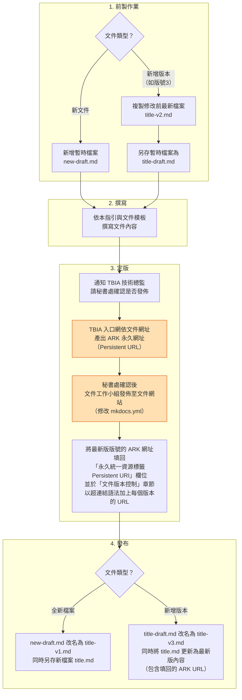

# TBIA文件指引

## 版權說明 Colophon
### 建議引用方式 Suggested Citation
臺灣生物多樣性資訊聯盟文件工作小組。2024。TBIA文件指引。第一版。臺灣生物多樣性資訊聯盟秘書處：臺北。

### 作者 Authors
柯智仁、李金穎、李思賢、張俊怡

### 貢獻者 Contributors
TBIA文件工作小組為本文件的這個版本做出了貢獻。

### 授權方式 Licence
本文件《TBIA文件指引》採用 創用CC 姓名標示-相同方式分享 4.0 國際 (CC BY-SA 4.0)。

### 永久統一資源標籤 Persistent URI
[https://pid.tbiadata.tw/ark:/35232/c165joui/v1](https://pid.tbiadata.tw/ark:/35232/c165joui/v1)

### 文件版本控制 Document Control
[第一版，2024年2月。](https://pid.tbiadata.tw/ark:/35232/c165joui/v1)

---

## 背景
TBIA文件指由TBIA撰寫，並以開放授權發佈的文件。TBIA撰寫與發佈這些文件的目的，是提供與生物多樣性資訊與開放資料有關的訊息，以支持臺灣相關社群的實作。TBIA文件的理念主要受[GBIF文件](https://docs.gbif.org/documentation-guidelines/en/)啟發。

本指引的目標則是提供撰寫TBIA文件的綱要與素材。透過提供一套具有一致性（consistent）、可靠性（reliable）、可再用性（reusable），以及版本管理特性（versioned）的綱要與素材，讓TBIA文件的建立與更新流程變得簡易順暢。藉此並逐步建立社群對文件的信任，以促成更廣大的採納與使用。


## 給文件作者們的指引 Guidelines for document authors

我們在這個系統採用的文件編碼語法是[Python-Markdown語法](https://python-markdown.github.io/#goals)。我們採用這個語法的原因是因為TBIA文件是以Python語法撰寫，而Python Markdown語法可以用多種方式將Markdown文字轉成HTML。

我們建議文件的作者欄位，優先以人名填寫（較不建議以單位名稱作為作者）。

### 完成一個文件的原則與步驟

#### 原則

- 每個文件正式發布後，至少會有2份檔案，一個是最新（沒有版號）檔案`title.md`，一個是帶版號內容固定不變的檔案 `title-v1.md`。
- 有新增版本時，結果會產生一個新的檔案，例如文件版號是3的話，就會有 `title-v1.md`、`title-v2.md` `title-v3.md`和`title.md` 4個檔案，其中 `title-v3.md` 跟 `title.md` 除了 [ARK永久網址（persistent URL）](https://docs.tbiadata.tw/document_guidelines-draft/#persistent-uri)會不同，其他文字內容是一模一樣的。
- md檔檔名的版本號是用dash標示，v也是用小寫v，例如「biodiversity_data_standard-v1」。
- 文件正式發佈後，md檔的名稱不可更動（否則ark連結會失效，若真的需要更動需再請文件小組調整）。
- 「沒有版本號」的md檔，內容是最新版的文件，但內文的Persistent URI的ark要放最新版的版本號。「文件版本控制」章節，要加上每個版本，且要用超連結語法加上URL。
- 文件修改過程（還未定版前）使用草稿markdown檔案：`title-draft.md`。

#### 步驟

舉例使用的的 `new` 與 `title` 可以替換成自行定義的名稱，但要符合以上指引原則。

1. **前製作業** 
   * 新文件：先新增1個暫時的markdown檔案。`new-draft.md`。
   * 新增版本(要新增版號3)：複製修改前最新檔案，如：`title-v2.md`，另存暫時檔案`title-draft.md`。
2. **撰寫** 
   * 根據本指引與文件模板撰寫該文件檔案。
3. **定版**
   1. 通知TBIA技術總監，請秘書處確認是否發佈。
   2. 秘書處確認後，由文件工作小組接續以下工作。
   3. 文件工作小組請TBIA入口網根據該文件網址，產出ARK永久網址（Persistent URL）。
   3. 文件工作小組將最新版版號的ARK網址填回文件md檔之「永久統一資源標籤 Persistent URI」欄位。「文件版本控制」章節，加上每個版本，用超連結語法加上URL。
4. **發布**
   * 全新檔案：改檔案名稱，把 `new-draft.md` 改成 `title-v1.md`，同時另存一個新檔案 `title.md`。
   * 新增版本：把 `title-draft.md` 改成 `title-v3.md`，同時也把 `title.md` 更新成最新版的內容（包含後來填回的ARK URL）。
   * 文件工作小組將文件正式發佈至文件網站（修改mkdocs.yml）。

#### 流程圖



!!! Note
    橘紅色區塊為TBIA 秘書處／文件工作小組處理


## 技術指引 Technical guidance
> 這裡要教學的就是用什麼語法寫以及如何做簡易的文件目錄編輯，以我們目前來說就是MD語法簡易教學以及GitHub的Mkdocs的編輯教學。參考並修改於[MarkDown語法大全
](https://hackmd.io/@mrcoding/ryZE7k8cN) 。

### 給文件作者們
#### 文件撰寫建議
1. 中文段落開頭的縮排建議一律省略。
2. 中文與英文、中文與數字間不留空格，英文與數字間則須留空格。
3. 標點符號建議以文件主體的語言決定全形或半形：
    - 文件主體語言為中文：全形
    - 文件主體語言為英文：半形


#### Markdown語法

##### 標題
不同階層的標題語法

```
# H1 階層一（標題一）
## H2 階層二（標題二）
### H3 階層三（標題三）
#### H4 階層四（標題四）
##### H5 階層五（標題五）
```

##### 字體效果

*斜體字*

**粗體字**

***斜粗體***

~~刪除線~~

_斜體2_

__斜粗2__

正常^上標^

正常~下標~

^^底線^^

==螢光標記==

{>>程式碼註解<<}

```
*斜體字*
**粗體字**
***斜體兼粗體***
~~刪除線~~
_斜體2_
__斜粗2__
正常^上標^
正常~下標~
^^底線^^
==螢光標記==
{>>程式碼註解<<}
```

##### 引文
縮排語法

>第一層
>>第二層
>>>第三層

```
>第一層
>>第二層
>>>第三層
```

##### 標號
###### 數字標號
1. 數字標號
2. 數字標號
3. 數字標號

```
1. 數字標號
2. 數字標號
3. 數字標號
```

###### 其他標號
- 其他標號
+ 其他標號
* 其他標號

```
- 其他標號
+ 其他標號
* 其他標號
```


##### 巢狀標號
###### 巢狀標號：無序清單

- 無序清單
- 無序清單
    - 無序清單子清單
        - 無序清單子子清單

```
- 無序清單
- 無序清單
    - 無序清單子清單
        - 無序清單子子清單
```

###### 巢狀標號：有序清單

1. 有序清單
2. 有序清單
    1. 有序清單子清單
        1. 有序清單子子清單

```
1. 有序清單
2. 有序清單
    1. 有序清單子清單
        1. 有序清單子子清單
```


##### 核取方塊

- [x] 這是一個預設勾選的選項
- [ ] 這是一個預設不勾選的選項
    * [x] In hac habitasse platea dictumst
    * [x] In scelerisque nibh non dolor mollis congue sed et metus
    * [ ] Praesent sed risus massa
- [ ] Aenean pretium efficitur erat, donec pharetra, ligula non scelerisque

```md
- [x] 這是一個預設勾選的選項
- [ ] 這是一個預設不勾選的選項
    * [x] In hac habitasse platea dictumst
    * [x] In scelerisque nibh non dolor mollis congue sed et metus
    * [ ] Praesent sed risus massa
- [ ] Aenean pretium efficitur erat, donec pharetra, ligula non scelerisque
```

##### 連結
[連結名稱](https://tbiadata.tw "游標顯示內容")

```
[連結名稱](https://tbiadata.tw "游標顯示內容")
```

##### 簡易超連結
<https://tbiadata.tw>

<tbianoti@gmail.com>

```
<網址或mail>
```


##### 分隔線
1.

---
2.
***
3.
- - -
4.
* * *

```
1.
空行
---
2.
***
3.
- - -
4.
* * *
---
```

##### 程式碼

```c title="這裡是示範"

#include <stdio.h>

int main(){

    printf("Hello World");

    return 0;
}
```

```` markdown title="這裡是程式碼"
```
#include <stdio.h>

int main(){

    printf("Hello World");

    return 0;
}
```
````


##### 圖片


```md

```

若希望圖片及下方說明文字置中，可參考下列語法範例：

```html
<p align="center">
    
    <br/>
    說明文字
</p>
```
!!! Note

    * 文件中使用的圖片請先上傳至本repository（即 https://github.com/TBIA/docs ）的[assets](https://github.com/TBIA/docs/tree/main/docs/assets)資料夾。
    * 上傳時請注意檔案名稱不要與既有檔案重複。
    * 需注意圖片位置連結依據不同語法，可能會有所差異。

##### 帶有連結的圖片
[](https://tbiadata.tw/)

```
[](點擊圖片會前往的連結)
```

##### 調整圖片大小

{ width="200" }

```markdown title="寬度: 200"
{ width="200" }
```

##### 調整圖片文字對齊

{ align=left }
Lorem ipsum dolor sit amet, consectetur adipiscing elit. Nulla et euismod nulla. Curabitur feugiat, tortor non consequat finibus, justo purus auctor massa, nec semper lorem quam in massa.

Lorem ipsum dolor sit amet, consectetur adipiscing elit. Nulla et euismod nulla. Curabitur feugiat, tortor non consequat finibus, justo purus auctor massa, nec semper lorem quam in massa.

```markdown title="左邊文繞圖(float:left)"
{ align=left }
text content 內文
```

{ align=right }
Lorem ipsum dolor sit amet, consectetur adipiscing elit. Nulla et euismod nulla. Curabitur feugiat, tortor non consequat finibus, justo purus auctor massa, nec semper lorem quam in massa.

Lorem ipsum dolor sit amet, consectetur adipiscing elit. Nulla et euismod nulla. Curabitur feugiat, tortor non consequat finibus, justo purus auctor massa, nec semper lorem quam in massa.

```markdown title="右邊文繞圖(float:right)"
{ align=right }
text content 內文
```
!!! note

    沒有中間對齊，因為這邊markdown語法是對映CSS的float: left/right。如果需置中的話，可以用上面圖片置中的語法。

##### 表格

| 欄位1 | 欄位2 | 欄位3 |
| :-- | --: |:--:|
| 置左  | 置右 | 置中 |
| $100 | $100 | $100 |
| $10 | $10  | $10 |
| $1  | $1  | $1 |

```
| 欄位1 | 欄位2 | 欄位3 |
| :-- | --: |:--:|
| 置左  | 置右 | 置中 |
```

!!! note

    * 或可參考[表格產生小工具](https://tableconvert.com/excel-to-markdown)，將表格內容匯入後自動產出對應markdown語法。
    * 不接受使用合併儲存格。若是將其他非Markdown文件轉成本網站的MD格式遇到合併儲存格，則建議以截圖方式處理。
    * 表格內文若有 `|` 或 `-`，須在前方加上跳脫字元 `\` 。


##### 短區塊
`內容`

\`內容`


##### 跳脫字元

\`\`\`


```
\+任意符號
```

#### Markdown擴充語法

原本Markdown支援的語法有限，無法處理比較複雜的文件排版，這邊使用的MkDocs系統支援[Python Markdown Extensions](https://facelessuser.github.io/pymdown-extensions/)，擴增了許多Markdown語法的功能，詳細參考 [Python Markdown Extensions - Material for MkDocs](https://squidfunk.github.io/mkdocs-material/setup/extensions/python-markdown-extensions/)。

##### admonition (警告文字框)

```
!!! note
    You should note that the title will be automatically capitalized.
```

!!! note
    You should note that the title will be automatically capitalized.


```
!!! danger "Don't try this at home"
```

!!! danger "Don't try this at home"
    ...

```
!!! important ""
    This is an admonition box without a title.
```

!!! important ""
    This is an admonition box without a title.


### 本文件網站的軟體架構與開發環境

請參考[此處README](https://github.com/TBIA/docs)。

